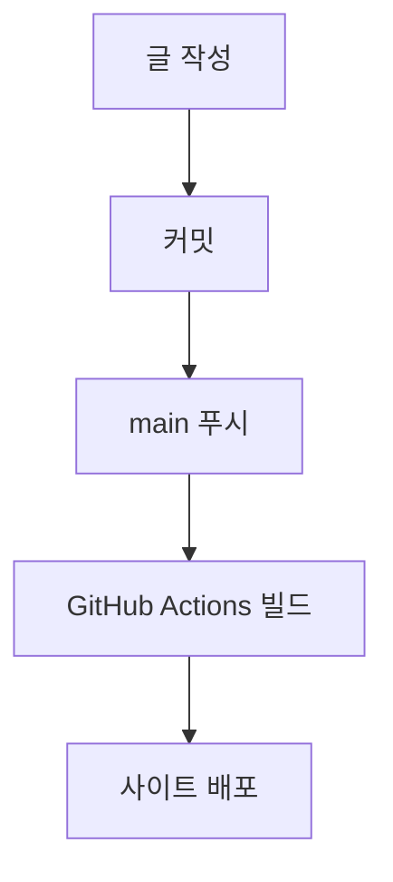

# 블로그 글쓰기 (Sadturtleman's blog)

**Chirpy 테마 Jekyll 블로그**에 새 글을 만든다. 아래 규칙과 체크리스트를 따른다.

## 0. 블로그 레포 위치 (중요)

블로그는 항상 이 절대 경로에 있다:

```
/Users/adamatia123/Documents/GitHub/sadturtleman.github.io
```

이 스킬은 **다른 레포에서 작업하다가도 발동될 수 있다.** 글은 어디서 발동되든 **반드시 위 블로그 레포의 `_posts/` 안에** 작성한다. 글 파일을 현재 작업 폴더에 만들지 않는다. 모든 경로(파일 생성, 커밋, 푸시)는 위 블로그 레포 기준이다.

### 다른 레포에서 글감이 생겼을 때 (교차 레포 워크플로)

사용자가 다른 프로젝트에서 "이거 블로그로 써줘" 같이 요청하면:

1. **현재 레포에서 재료를 모은다** — 관련 코드/파일, 최근 커밋(`git log`, `git diff`), 에러·해결 과정 등 글감을 현재 작업 디렉터리에서 읽어 정리한다.
2. **출처를 기록한다** — 현재 레포 이름과 GitHub URL을 확인(`git remote get-url origin`)하고, 글에서 참고한 파일/커밋을 링크하거나 코드 스니펫으로 인용한다. (예: `[user/repo](https://github.com/user/repo)`, 특정 파일은 `blob/<커밋>/경로` 링크)
3. **글을 블로그 레포에 쓴다** — `/Users/adamatia123/Documents/GitHub/sadturtleman.github.io/_posts/YYYY-MM-DD-제목.md` 로 생성한다(절대 경로).
4. **검증·발행** — 블로그 레포 안에서 빌드 확인 후, §7 절차대로 자동 배포·검수한다. (현재 작업 중인 레포에는 글을 커밋하지 않는다.)

> 코드/커밋을 인용할 때는 비공개 레포·민감정보(키, 토큰, 내부 경로)가 공개 블로그에 노출되지 않도록 한 번 더 점검한다.
{: .prompt-warning }

## 1. 글을 쓰기 전에 먼저 생각할 것 (사용자에게 물어보거나 스스로 정리)

머리말을 채우기 전에 이 다섯 가지를 먼저 정한다. 정보가 부족하면 한 번에 묶어서 물어본다.

1. **무엇을 / 누구에게** — 이 글의 핵심 한 문장은? 독자는 누구인가(미래의 나 / 입문자 / 동료)? 독자가 이미 아는 것과 모르는 것을 가정해 깊이를 맞춘다. **기본 가정은 "독자는 내 도메인을 모른다"** 이다(아래 4-(4)).
2. **읽고 나면 무엇이 남는가** — 독자가 얻어갈 결론·교훈·실행 가능한 것 한 가지. 이게 없으면 글의 목적이 흐려진다.
3. **구조** — 도입(왜 이 글을 읽어야 하나) → 본문(2~4개 소제목) → 마무리(정리/다음 단계). 긴 글은 `## 소제목`으로 끊어 TOC가 생기게 한다.
4. **제목** — 검색했을 때 클릭할 만한가? 내용을 구체적으로 드러내는가? (예: "에러 해결" ❌ → "Jekyll 빌드 시 htmlproofer 404 해결하기" ✅)
5. **분류** — 아래 규칙에 맞는 `categories` 1~2개와 `tags` 2~5개. 기존 글들의 분류와 일관되게.

## 2. 파일 생성 규칙 (반드시 지킬 것)

- 위치: **`_posts/`** 폴더
- 파일명: **`YYYY-MM-DD-제목.md`** — 날짜는 발행일, 제목은 영문/숫자/하이픈 권장(한글 파일명도 동작은 하나 URL이 지저분해짐)
  - 예: `_posts/2026-06-26-hello-jekyll.md`
- 인코딩 UTF-8, 확장자 `.md`

## 3. 머리말(front matter) 템플릿

```markdown
---
title: 글 제목
date: 2026-06-26 12:00:00 +0900
categories: [상위, 하위]
tags: [태그1, 태그2]
mermaid: true
---
```

규칙:
- **`date`** 는 반드시 `+0900`(KST) 오프셋을 붙인다. 시간을 모르면 현재 한국 시간을 쓴다. 미래 날짜로 두면 발행 전까지 사이트에 안 보인다.
- **`categories`** 는 **최대 2개**이며 `[상위, 하위]` 계층 구조다(Chirpy 규칙). 1개만 써도 된다. 첫 글자 대문자/명사형으로 일관되게.
- **`tags`** 는 개수 제한 없으나 **2~5개** 권장. 소문자/단어형. 글마다 새 태그를 남발하지 말고 기존 태그를 재사용한다.
- **`mermaid: true`** 는 **항상 포함한다**(모든 글에 다이어그램이 들어가므로 — 4번 참고).
- 선택 항목: `pin: true`(상단 고정), `image: { path: ..., alt: ... }`(대표 이미지), `math: true`(수식), `toc: false`(목차 끄기). 필요할 때만 추가.

## 4. 필수 포함 요소 (예외 없음)

모든 글에는 **반드시** 다음 두 가지를 포함한다. 주제상 어색하더라도 억지로 끼워넣지 말고, 주제를 설명·보강하는 형태로 자연스럽게 넣는다.

### (1) 예시 코드 — 최소 1개
- 펜스에 언어를 지정한 실제 동작하는 코드 블록을 넣는다. (` ```python `, ` ```bash `, ` ```js ` 등)
- 코드만 던지지 말고 한두 줄로 무엇을 하는 코드인지 설명을 붙인다.
- 코딩과 무관한 주제라도, 설정 예시·명령어·의사코드(pseudocode)·데이터 예시 형태로라도 코드 블록을 넣는다.

### (2) 다이어그램 — 최소 1개 (Mermaid)
- 머리말에 **`mermaid: true`** 를 반드시 추가한다(이게 없으면 렌더링되지 않음).
- 본문에 ` ```mermaid ` 코드 블록으로 다이어그램을 넣는다. 흐름/구조/관계/순서를 시각화한다.
- 주제에 맞는 종류를 고른다: 순서도(`flowchart`), 시퀀스(`sequenceDiagram`), 상태(`stateDiagram-v2`), 클래스/ERD, 간트 등.

예시:

````markdown

```mermaid
flowchart TD
    A[글 작성] --> B[커밋]
    B --> C[main 푸시]
    C --> D[GitHub Actions 빌드]
    D --> E[사이트 배포]
```
````

> 머리말에 `mermaid: true` 가 빠지면 다이어그램이 코드 텍스트 그대로 보인다. 항상 함께 추가할 것.
{: .prompt-warning }

### (3) 공식 문서 첨부
- 글이 특정 프레임워크·API·플랫폼 기능(예: WorkManager, FCM, launchMode, Health Connect)을 다루면 **해당 공식 문서 링크를 반드시 첨부**한다.
- 우선순위: 공식 레퍼런스(developer.android.com, firebase.google.com, kotlinlang.org 등) > 공식 블로그/릴리즈 노트 > 그 외. 개인 블로그·SO는 공식 문서가 없을 때만 보조로.
- 넣는 방식: 개념을 처음 소개하는 지점에 인라인 링크, 그리고/또는 글 말미 `## 참고 자료` 섹션에 목록으로.
- **URL은 반드시 실재 확인 후 첨부한다** — WebSearch/WebFetch로 현재 살아있는 공식 문서 URL을 찾아 확인하고, 기억에 의존해 URL을 지어내지 않는다. 죽은 링크는 없느니만 못하다.

### (4) 도메인을 몰라도 읽히게 쓴다

글감이 내가 한 작업에서 나오는 것은 맞다. 그게 이 블로그의 값어치다. 다만 **그 도메인을 모르는 독자가 두 번째 문단에서 튕기면 안 된다.** 글의 교훈은 대개 도메인과 무관한데, 서술만 도메인 안에 갇혀 있는 경우가 많다.

- **일반적인 문제로 연다.** 첫 문단은 "이런 상황 겪어 봤다면"으로 시작하고, 내 사례는 그 다음에 붙인다. 도메인 소개로 시작하지 않는다.
  - ❌ "점자 편집기의 판면은 모눈종이다. 조판 결과를 …"
  - ✅ "칸이 잔뜩 있는 화면(스프레드시트·캘린더·좌석 배치도)을 만들어 봤다면 익숙할 것이다. 내 경우는 점자 편집기였다."
- **치환 안내를 한 번 넣는다.** 독자가 자기 상황으로 옮겨 읽을 수 있게. (예: "스프레드시트라고 생각하고 읽어도 아무 차이가 없다")
- **도메인 용어는 처음 나올 때 한 줄로 정의하거나, 일반적인 말로 바꾼다.** 정의 없이 두 번째 등장부터 쓰지 않는다. 용어가 서너 개 넘어가면 본문 앞에 "용어를 셋만 맞추고 가자" 식으로 묶어 정리한다.
- **코드·다이어그램의 라벨에서도 도메인 용어를 뺀다.** 변수명이 도메인 것이면 주석으로 일반적인 뜻을 붙인다.
- 가능하면 **"이 방법이 통하는 조건"** 절을 둔다 — 도메인과 무관하게 언제 같은 처방이 듣는지 2~4개 조건으로. 독자가 가져갈 것이 여기서 분명해진다.

> **점검법**: 다 쓴 뒤 도메인 고유명사를 세어 본다. 정의 없이 쓰인 것이 하나라도 있으면 고친다. 도메인을 모르는 사람이 **본문 첫 화면(스크롤 없이 보이는 분량)** 만 읽고 "무슨 문제를 푸는 글인지" 답할 수 있어야 한다.
{: .prompt-tip }

## 5. 본문 작성 가이드

- **언어는 한국어**(사이트 `lang: ko-KR`). 자연스러운 문체로.
- 첫 문단에서 "이 글이 무엇이고 왜 읽어야 하는지"를 1~3문장으로 던진다.
- 소제목은 `## H2`부터 시작(`# H1`은 제목용이라 본문에서 쓰지 않는다).
- 코드는 펜스에 언어 지정: ` ```python `, ` ```bash ` 등 (구문 강조 + 줄번호가 자동).
- 이미지는 `assets/img/` 에 두고 `` 로 참조. 대체 텍스트 꼭 작성.
- Chirpy 프롬프트 박스 활용 가능:
  ```markdown
  > 팁 내용
  {: .prompt-tip }
  ```
  종류: `tip`(초록) / `info`(파랑) / `warning`(노랑) / `danger`(빨강)
- 링크·외부 참조는 정확히. (배포 시 htmlproofer가 깨진 내부 링크/이미지를 검사하므로 경로 오타에 주의)

## 6. 마무리 체크리스트

글을 완성한 뒤 확인:
- [ ] 파일명이 `_posts/YYYY-MM-DD-제목.md` 형식인가
- [ ] `date` 에 `+0900` 이 있고 발행 의도와 맞는가
- [ ] `categories` 가 1~2개(계층), `tags` 가 기존 것과 일관적인가
- [ ] 첫 문단이 글의 목적을 드러내는가
- [ ] **예시 코드 블록이 1개 이상 있고 언어가 지정**되어 있는가
- [ ] **Mermaid 다이어그램이 1개 이상 있고, 머리말에 `mermaid: true` 가 있는가**
- [ ] **주제 관련 공식 문서 링크가 첨부**되어 있고, URL이 실재 확인됐는가
- [ ] **도메인을 몰라도 읽히는가** — 첫 문단이 일반적인 문제로 열리고, 도메인 용어가 처음 나올 때 정의됐는가 (4-(4))
- [ ] 내부 링크/이미지 경로가 실제로 존재하는가

## 7. 발행 — 자동 배포 후 실사이트 검수 (필수 루프)

글 작성이 끝나면 **사용자에게 따로 묻지 않고 아래 순서를 끝까지 수행**한다. "파일 생성"이 아니라 "배포된 페이지가 읽기에 문제없음"까지가 이 스킬의 완료 조건이다.

### 7.1 로컬 빌드 검증
```bash
# 시스템 Ruby(4.x)는 Gemfile(~> 3.1)과 안 맞음 → homebrew ruby@3 사용
RUBY=/opt/homebrew/opt/ruby@3/bin
cd /Users/adamatia123/Documents/GitHub/sadturtleman.github.io
PATH="$RUBY:$PATH" bundle exec jekyll build   # 미래 날짜 글 검증은 --future 추가
```
- "has a future date" 로 스킵되면 date 확인(발행 의도된 미래 날짜인지, 시간이 몇 분 앞서간 실수인지).

### 7.2 자동 커밋·푸시
- 커밋 메시지: `post: <제목 요약>` (기존 컨벤션).
- `main` 푸시 → GitHub Actions가 자동 빌드·배포.

### 7.3 배포 완료 대기
```bash
gh run watch $(gh run list --repo Sadturtleman/sadturtleman.github.io --limit 1 --json databaseId --jq '.[0].databaseId') --repo Sadturtleman/sadturtleman.github.io --exit-status
```
(또는 1~2분 대기 후 다음 단계에서 페이지 존재로 확인)

### 7.4 실사이트 검수 — 배포된 페이지를 직접 읽는다
`https://sadturtleman.github.io/posts/<파일명의 제목부분>/` 을 WebFetch(또는 curl)로 가져와 **독자 입장에서** 점검한다:

- [ ] 글이 실제로 노출되는가 (404면 date/파일명 문제)
- [ ] **Mermaid가 그림으로 렌더링되는가** — HTML에 다이어그램 텍스트가 `<pre>` 코드로 그대로 남아 있으면 실패(머리말 `mermaid: true` 누락 또는 문법 오류)
- [ ] 코드 블록에 언어 하이라이트가 적용됐는가 (`language-kotlin` 등 클래스 존재)
- [ ] 표·프롬프트 박스·목차(TOC)가 깨지지 않았는가
- [ ] 제목/본문에 오타, 어색한 문장, 잘린 문단이 없는가
- [ ] **도메인을 모르는 독자로 읽어 본다** — 첫 화면만 보고 무슨 문제를 푸는 글인지 알 수 있는가, 정의 없이 등장하는 도메인 용어가 있는가
- [ ] 첨부한 링크(공식 문서 포함)가 전부 200인가

### 7.5 문제 발견 시 수정 루프
- 발견한 문제를 수정 → 재커밋·재푸시 → 7.3~7.4 재수행. 문제가 없어질 때까지 반복(통상 1회면 충분).
- 최종 보고에는 **배포 URL + 검수 결과(고친 것 포함)** 를 요약한다.

> 미래 날짜(예약 발행) 글은 배포 사이트에 아직 안 뜨므로 7.4를 수행할 수 없다. 이 경우 로컬 `--future` 빌드 산출물(`_site/posts/...`)로 동일 항목을 검수하고, "발행일에 push 트리거가 한 번 필요하다"는 사실을 사용자에게 고지한다.
{: .prompt-warning }
