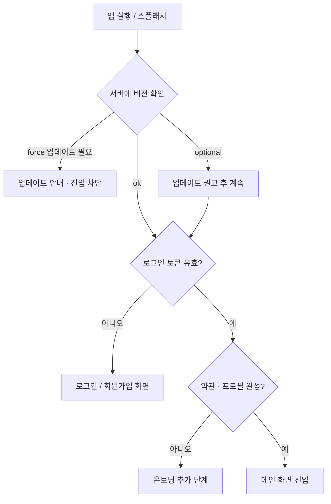

앱을 켜자마자 보이는 첫 화면, 즉 **온보딩(onboarding) 단계**에서 우리는 보통 두 가지를 먼저 확인합니다. 하나는 **유저 정보**(로그인 상태·약관 동의·프로필 완성 여부)이고, 다른 하나는 **앱 버전**입니다. "그냥 바로 메인 화면 띄우면 되지 왜 굳이?"라고 생각할 수 있지만, 이 두 체크를 건너뛰면 나중에 훨씬 비싼 비용을 치르게 됩니다. 이 글은 왜 이 두 가지를 온보딩에서 가장 먼저 처리해야 하는지를 정리합니다.

## 왜 유저 정보를 먼저 확인하는가

온보딩에서 유저 상태를 확인하지 않으면, 앱은 "이 사람이 누구인지" 모르는 채로 화면을 그립니다. 이건 여러 문제를 만듭니다.

- **잘못된 화면 분기**: 비로그인 유저에게 마이페이지를 띄우거나, 이미 가입한 유저에게 회원가입 화면을 다시 보여주는 사고가 납니다.
- **약관/필수 동의 누락**: 법적으로 필요한 동의를 받지 않은 채 서비스를 제공하면 컴플라이언스 문제가 됩니다.
- **개인화 실패**: 유저의 등급·권한·설정을 모르면 첫 화면부터 어긋난 데이터를 보여줍니다.

즉, 유저 정보 체크는 **이후 모든 화면 분기의 전제 조건**입니다. 토큰이 유효한지, 프로필이 완성됐는지, 동의가 끝났는지를 먼저 정리해야 그다음 흐름이 안전합니다.

## 왜 버전 체크가 중요한가

앱은 한 번 배포하면 끝이 아니라, 유저마다 **제각기 다른 버전을 설치한 채** 돌아갑니다. 버전 체크 없이 운영하면 이런 일이 벌어집니다.

- **강제 업데이트가 필요한 상황**: 보안 취약점이나 결제 로직 버그가 있는 구버전을 그대로 쓰게 두면 위험합니다.
- **서버 API 호환성**: 서버는 신버전 스펙으로 바뀌었는데 구버전 앱이 옛 API를 호출하면 크래시나 데이터 오류가 납니다.
- **점진적 권고 업데이트**: 당장 막을 정도는 아니지만 "업데이트하면 더 좋아요" 안내를 띄울 수 있습니다.

그래서 보통 버전을 세 가지로 나눠 다룹니다.

| 구분 | 의미 | 동작 |
|------|------|------|
| `force` | 최소 지원 버전 미만 | 업데이트 전까지 진입 차단 |
| `optional` | 권장 버전 미만 | 안내 후 계속 사용 가능 |
| `ok` | 최신/허용 버전 | 그대로 진입 |

## 유저 정보와 함께 기기 정보까지 받는 이유

온보딩에서 유저를 식별할 때, 단순히 아이디·토큰만 받는 게 아니라 **맥 주소(MAC)·유심(USIM) 정보·국가 코드** 같은 기기 정보도 함께 수집하는 경우가 많습니다. "왜 굳이 이런 것까지?"라는 의문이 들 수 있는데, 각각 분명한 목적이 있습니다.

- **국가 코드 / 통신사 정보(MCC·MNC, USIM)**: 어느 나라·통신사에서 접속하는지에 따라 서비스 가능 지역, 언어·통화, 법적 규제(예: 특정 국가에서 막아야 하는 기능)를 분기합니다. 유심에서 읽은 국가/통신사 코드는 로케일 설정보다 더 신뢰할 수 있는 지역 판별 근거가 됩니다.
- **기기 식별자(MAC, 기기 고유 ID)**: 한 계정에 묶인 기기를 구분하고, **다중 기기 로그인 관리·기기 변경 감지·이상 접속 탐지**에 씁니다. 예를 들어 평소와 다른 기기에서 로그인하면 추가 인증을 요구할 수 있습니다.
- **어뷰징·중복 가입 방지**: 한 사람이 여러 계정을 만들어 이벤트 보상을 가로채는 행위를 막을 때 기기 정보가 핵심 단서가 됩니다.
- **푸시·환경 최적화**: OS 버전, 기기 모델, 화면 해상도 등을 알면 그 기기에 맞는 리소스·기능을 내려줄 수 있습니다.

다만 이 정보들은 대부분 **개인정보 또는 식별 가능한 데이터**입니다. 따라서 수집하는 항목·목적을 약관에 명시하고 동의를 받아야 하며, 최신 OS에서는 MAC 주소를 무작위화하거나 접근을 제한하므로 **플랫폼이 허용하는 식별자 정책을 반드시 따라야** 합니다.

> 기기 정보는 "받을 수 있으니 다 받는" 게 아니라 **목적이 명확한 항목만 최소로** 받아야 합니다. 과도한 수집은 개인정보 규제(GDPR, 국내 개인정보보호법) 위반으로 이어질 수 있습니다.
{: .prompt-danger }

## 온보딩 흐름을 그려보면

두 체크는 보통 **버전 → 유저 정보** 순서로 배치합니다. 차단해야 할 구버전이라면 유저 정보를 확인할 필요조차 없기 때문입니다.



## 코드로 보는 체크 로직

아래는 온보딩 진입 시 버전과 유저 정보를 순서대로 검사해 다음 행동을 결정하는 의사코드입니다. 실제 구현에서는 서버에서 내려준 `minVersion`/`latestVersion`과 토큰 상태를 함께 본다는 점이 핵심입니다.

```typescript
type GateResult =
  | { type: "force_update" }
  | { type: "optional_update" }
  | { type: "need_login" }
  | { type: "need_onboarding" }
  | { type: "enter_home" };

async function resolveOnboarding(): Promise<GateResult> {
  // 1) 버전 체크가 가장 먼저
  const { minVersion, latestVersion } = await fetchVersionPolicy();
  const current = getAppVersion();

  if (isLower(current, minVersion)) {
    return { type: "force_update" }; // 진입 차단
  }

  // 2) 유저 정보 체크
  const token = await loadAuthToken();
  if (!token || !(await isTokenValid(token))) {
    return { type: "need_login" };
  }

  const user = await fetchUserProfile(token);
  if (!user.agreedTerms || !user.profileCompleted) {
    return { type: "need_onboarding" };
  }

  // 2-1) 기기 정보 수집 후 서버에 동기화 (어뷰징·지역 분기·이상 접속 탐지용)
  const device = {
    deviceId: getDeviceId(),       // 플랫폼 허용 식별자
    countryCode: getSimCountry(),  // 유심 기반 국가 코드 (MCC)
    carrier: getCarrierName(),     // 통신사 (MNC)
    osVersion: getOsVersion(),
    model: getDeviceModel(),
  };
  await syncDeviceInfo(token, device);

  // 3) optional 업데이트는 막지 않고 안내만
  if (isLower(current, latestVersion)) {
    return { type: "optional_update" };
  }

  return { type: "enter_home" };
}
```

> 버전 체크와 유저 체크는 **클라이언트 값만 믿지 말고 반드시 서버 응답을 근거로** 판단해야 합니다. 클라이언트에 박아둔 상수는 배포 후 바꿀 수 없고, 위·변조도 가능하기 때문입니다.
{: .prompt-warning }

## 정리

- **유저 정보 체크**는 이후 화면 분기·개인화·컴플라이언스의 전제 조건이다.
- **기기 정보**(맥 주소·유심·국가 코드 등)는 지역 분기·이상 접속 탐지·어뷰징 방지를 위해 받되, **목적이 명확한 항목만 최소로** 동의 하에 수집한다.
- **버전 체크**는 보안·API 호환성·운영 유연성을 위해 필요하며, `force`/`optional`/`ok`로 나눠 다룬다.
- 순서는 **버전 → 유저 정보**가 자연스럽다. 막아야 할 버전이면 유저 정보까지 갈 필요가 없다.
- 두 판단 모두 **서버 응답을 기준**으로 해야 배포 후에도 정책을 바꿀 수 있다.

온보딩은 단순한 시작 화면이 아니라, **잘못된 상태로 앱이 굴러가는 것을 막는 첫 번째 관문**입니다. 여기서 한 번 걸러주면 그 뒤의 모든 화면이 훨씬 단순하고 안전해집니다.
