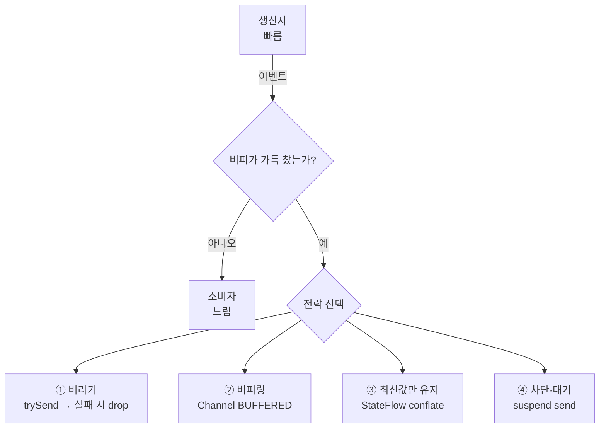
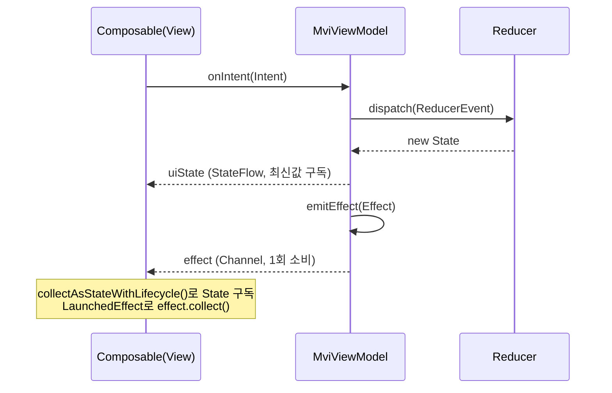

"버튼을 빠르게 두 번 누르면 같은 화면이 두 번 열려요." "스크롤할 때 로그가 폭주해서 UI가 버벅여요." 이런 버그의 뿌리에는 거의 항상 **백프레셔(backpressure)** 문제가 있습니다. 생산자(이벤트를 만드는 쪽)가 소비자(이벤트를 처리하는 쪽)보다 빠를 때, 그 속도 차이를 어떻게 다룰지 정하지 않으면 메모리가 새거나 이벤트가 밀리거나 UI가 멈춥니다. 이 글은 백프레셔가 왜 중요한지를 정리하고, 제가 작업 중인 안드로이드 앱([RuleUp-ASM/Android](https://github.com/RuleUp-ASM/Android))의 실제 코드로 **버리기 · 버퍼링 · 콘플레이션(최신값 유지) · 차단(suspend)** 네 가지 대응 전략을 보여줍니다.

## 백프레셔란 무엇인가

백프레셔는 한마디로 **"생산 속도 > 소비 속도일 때 누가 양보할 것인가"** 하는 문제입니다. 생산자가 초당 100개의 이벤트를 만드는데 소비자가 초당 10개만 처리할 수 있다면, 남는 90개를 어떻게 할지 결정해야 합니다. 선택지는 크게 네 가지입니다.



이걸 정하지 않으면 어떤 일이 벌어질까요? 무제한 버퍼를 쓰면 **OOM(메모리 부족)** 으로 앱이 죽고, 아무 제어 없이 메인 스레드에서 처리하면 **ANR(프레임 드랍·멈춤)** 이 납니다. 그래서 백프레셔는 "고급 주제"가 아니라 **이벤트를 다루는 모든 코드가 반드시 내려야 하는 기본 설계 결정**입니다.

## 전략 ①: 버리기 — 클릭 throttle

가장 직관적인 전략은 "넘치면 버린다"입니다. 대표적인 예가 **연타 방지(클릭 throttle)** 입니다. 사용자가 결제 버튼을 0.1초 간격으로 세 번 누르면, 첫 클릭만 처리하고 나머지는 버려야 합니다.

`SingleClickHelper`는 시간 창(time window)과 실행 중 플래그 두 겹으로 중복 클릭을 떨어뜨립니다. ([core/ui/.../SingleClickHelper.kt](https://github.com/RuleUp-ASM/Android/blob/develop/core/ui/src/main/kotlin/com/ruleup/ui/helper/SingleClickHelper.kt))

```kotlin
class SingleClickHelper(
    private val throttleMillis: Long = 500L,
) {
    private val _isRunning = MutableStateFlow(false)
    val isRunning = _isRunning.asStateFlow()
    private var lastClickTime = 0L

    fun launch(scope: CoroutineScope, block: suspend () -> Unit) {
        if (_isRunning.value) return   // 이미 실행 중인 작업이 있으면 드랍
        if (!pass()) return            // 직전 클릭으로부터 500ms 안이면 드랍
        scope.launch {
            _isRunning.value = true
            try { block() } finally { _isRunning.value = false }
        }
    }

    private fun pass(): Boolean {
        val now = SystemClock.elapsedRealtime()
        if (now - lastClickTime < throttleMillis) return false  // throttle 창
        lastClickTime = now
        return true
    }
}
```

이건 **leading-edge throttle**입니다 — 첫 이벤트는 즉시 처리하고, 그 뒤 일정 시간 안에 들어온 이벤트는 무시합니다. Flow의 `debounce`(마지막 입력 후 멈췄을 때 처리)나 `sample`(주기마다 가장 최근 값 처리)과는 처리 시점이 다르다는 점을 구분해 두면 좋습니다. 클릭처럼 "첫 액션이 가장 중요한" 경우엔 leading-edge가 맞습니다.

> 같은 "드랍" 전략을 ViewModel 레벨에서도 씁니다. MVI Intent를 처리할 때 `if (state.isRecommending) return`, `if (state.isCreating) return` 같은 가드로 이미 진행 중인 비동기 작업과 겹치는 Intent를 떨어뜨립니다. 흐름 단에서 `collectLatest`가 하는 일을 애플리케이션 코드로 직접 구현한 셈입니다.
{: .prompt-tip }

## 전략 ②·④: 버퍼링과 차단 — MVI Effect 채널

화면 전환·토스트 같은 **일회성 이벤트(one-shot effect)** 는 버리면 안 됩니다. 그래서 MVI 베이스 ViewModel은 상태는 `StateFlow`로, Effect는 버퍼를 가진 `Channel`로 노출합니다. ([core/ui/.../MviViewmodel.kt](https://github.com/RuleUp-ASM/Android/blob/develop/core/ui/src/main/kotlin/com/ruleup/ui/mvi/MviViewmodel.kt))

```kotlin
abstract class MviViewModel<I : MviIntent, S : UiState, E : ReducerEvent, F : MviEffect>(
    initialState: S,
) : ViewModel() {
    private val _uiState = MutableStateFlow(initialState)
    val uiState: StateFlow<S> = _uiState.asStateFlow()

    private val _effect = Channel<F>(Channel.BUFFERED)   // ② 버퍼링
    val effect: Flow<F> = _effect.receiveAsFlow()

    protected fun dispatch(event: E) {
        _uiState.update { current -> reduce(current, event) }
    }

    protected fun emitEffect(effect: F) {
        viewModelScope.launch { _effect.send(effect) }   // ④ suspend send (버퍼 차면 대기)
    }
}
```

여기서 `_effect.send`는 **suspend 함수**입니다. 버퍼가 가득 차면 던지거나 버리는 게 아니라 **소비자가 받을 때까지 코루틴을 대기시킵니다.** 즉 생산자가 스스로 속도를 늦추는 "차단(backpressure)"의 정석입니다. 일회성 이벤트는 단 하나도 유실되면 안 되므로(화면 전환을 놓치면 사용자가 멈춘 화면에 갇힘) 이 전략이 적절합니다.

전체 MVI 데이터 흐름을 시퀀스로 보면 이렇습니다.



## 전략 ③: 최신값만 유지 — StateFlow와 conflation

`StateFlow`는 그 자체로 **콘플레이션(conflation)** 백프레셔 전략을 내장합니다. 값을 빠르게 여러 번 갱신해도, 느린 소비자는 중간값을 건너뛰고 **항상 가장 최신 상태만** 받습니다. UI 상태는 "지금 화면이 어떤 모습인가"만 중요하지 중간 단계는 필요 없으므로, 중간값을 버리는 게 오히려 정답입니다.

`StateFlow`로 충분치 않을 때는 **경계가 있는 버퍼(bounded buffer)** 를 직접 만들기도 합니다. 디버그 로그 오버레이는 백그라운드 스레드에서 로그가 폭주하는 고빈도 생산자라서, 최근 200줄만 남기고 잘라냅니다. ([app/.../debug/DebugLogStore.kt](https://github.com/RuleUp-ASM/Android/blob/develop/app/src/main/java/com/ruleup/android_ruleup/debug/DebugLogStore.kt))

```kotlin
private const val MAX_LINES = 200

private val _logs = MutableStateFlow<List<Entry>>(emptyList())
val logs: StateFlow<List<Entry>> = _logs.asStateFlow()

@Synchronized
fun add(entry: Entry) {
    val next = (_logs.value + entry).takeLast(MAX_LINES)  // 200줄로 상한 → 오래된 로그 폐기
    _logs.value = next
}
```

`takeLast(MAX_LINES)`가 곧 백프레셔입니다. 무제한으로 쌓으면 메모리가 새지만, 상한을 두면 생산이 아무리 빨라도 메모리가 일정하게 유지됩니다. **버퍼에 상한을 두는 것 = 백프레셔를 거는 것**이라는 점을 기억하면 좋습니다.

## drop을 선택할 때는 "버렸다"고 로그를 남기자

마지막으로 실무 팁 하나. 드랍 전략을 쓸 때 조용히 버리면 디버깅이 지옥이 됩니다. 네비게이션·메시지 헬퍼는 `trySend`로 비차단 전송을 하되, 버퍼가 차서 실패하면 **반드시 로그를 남깁니다.** ([core/ui/.../NavigationHelperImpl.kt](https://github.com/RuleUp-ASM/Android/blob/develop/core/ui/src/main/kotlin/com/ruleup/ui/helper/NavigationHelperImpl.kt))

```kotlin
private val _navigationFlow = Channel<NavSignal>(capacity = Channel.BUFFERED)
override val navigationFlow: Flow<NavSignal> = _navigationFlow.receiveAsFlow()

private fun emit(navSignal: NavSignal) {
    val result = _navigationFlow.trySend(navSignal)
    if (result.isFailure) println("NavigationHelper dropped: $navSignal")  // 버린 사실을 기록
}
```

이렇게 해두면 "이벤트가 사라졌다"는 미스터리가 "버퍼가 넘쳐서 의도적으로 버렸다"는 추적 가능한 사실로 바뀝니다.

## 정리

- 백프레셔는 고급 주제가 아니라 **이벤트를 다루는 모든 코드의 기본 설계 결정**이다. 안 정하면 OOM 또는 ANR로 돌아온다.
- 전략은 데이터의 성격에 따라 고른다:
  - **버려도 되는 것**(연타 클릭) → 드랍/throttle (`SingleClickHelper`)
  - **하나도 잃으면 안 되는 것**(화면 전환·토스트) → 버퍼 + suspend send (`MviViewModel`)
  - **최신값만 중요한 것**(UI 상태) → 콘플레이션 (`StateFlow`)
  - **고빈도 폭주**(디버그 로그) → 경계 있는 버퍼 (`DebugLogStore`의 `takeLast`)
- 무엇을 선택하든 **버퍼에는 상한을, 드랍에는 로그를** 남겨라.

다음에 "이벤트가 두 번 처리돼요" 같은 버그를 만나면, 기능을 의심하기 전에 먼저 **"여기 생산자와 소비자의 속도 차이를 누가 책임지고 있나?"** 를 물어보세요. 답이 "아무도"라면, 그게 바로 버그입니다.
