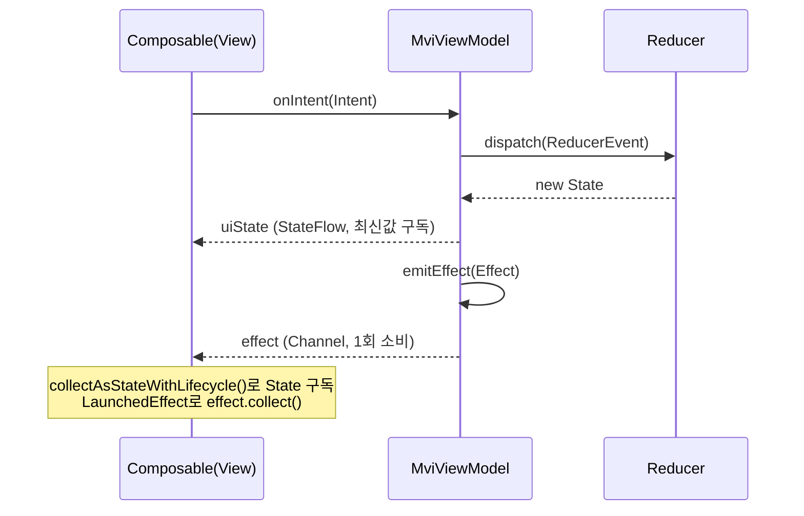

"버튼을 빠르게 두 번 누르면 같은 화면이 두 번 열려요." "스크롤할 때 로그가 폭주해서 UI가 버벅여요." 이런 버그의 뿌리에는 거의 항상 백프레셔(backpressure) 문제가 있습니다. 이벤트를 만드는 쪽이 처리하는 쪽보다 빠를 때, 그 속도 차이를 어떻게 다룰지 정해두지 않으면 메모리가 새거나 이벤트가 밀리거나 화면이 멈춥니다. 이 글은 백프레셔가 왜 중요한지를 정리하고, 제가 작업 중인 안드로이드 앱([RuleUp-ASM/Android](https://github.com/RuleUp-ASM/Android))의 코드로 버리기, 버퍼링, 최신값 유지, 차단 네 가지 전략을 보여줍니다.

## 백프레셔란 무엇인가

백프레셔는 생산 속도가 소비 속도보다 빠를 때 누가 양보할 것인가 하는 문제입니다. 생산자가 초당 100개의 이벤트를 만드는데 소비자가 초당 10개만 처리할 수 있다면, 남는 90개를 어떻게 할지 결정해야 합니다. 선택지는 크게 네 가지입니다.

<iframe src="/assets/diagrams/2026-06-29-backpressure-in-android-flow.html"
        title="생산이 소비보다 빠를 때의 네 가지 전략 다이어그램"
        loading="lazy" width="100%" height="620"
        style="border:1px solid var(--main-border-color); border-radius:6px;"></iframe>

> 잘려 보이면 [전체 화면으로 열기](/assets/diagrams/2026-06-29-backpressure-in-android-flow.html).
{: .prompt-tip }

정하지 않으면 결과는 둘 중 하나입니다. 무제한 버퍼를 쓰면 OOM(메모리 부족)으로 앱이 죽고, 아무 제어 없이 메인 스레드에서 처리하면 ANR이 나면서 화면이 멈춥니다. 백프레셔는 이벤트를 다루는 코드라면 어디서든 내려야 하는 기본 설계 결정입니다.

## 전략 ①: 버리기 (클릭 throttle)

가장 직관적인 전략은 넘치면 버리는 것입니다. 연타 방지가 여기에 해당합니다. 사용자가 결제 버튼을 0.1초 간격으로 세 번 누르면 첫 클릭만 처리하고 나머지는 버려야 합니다.

`SingleClickHelper`는 시간 창(time window)과 실행 중 플래그 두 겹으로 중복 클릭을 떨어뜨립니다. ([core/ui/.../SingleClickHelper.kt](https://github.com/RuleUp-ASM/Android/blob/develop/core/ui/src/main/kotlin/com/ruleup/ui/helper/SingleClickHelper.kt))

```kotlin
class SingleClickHelper(
    private val throttleMillis: Long = 500L,
) {
    private val _isRunning = MutableStateFlow(false)
    val isRunning = _isRunning.asStateFlow()
    private var lastClickTime = 0L

    fun launch(scope: CoroutineScope, block: suspend () -> Unit) {
        if (_isRunning.value) return   // 이미 실행 중인 작업이 있으면 드랍
        if (!pass()) return            // 직전 클릭으로부터 500ms 안이면 드랍
        scope.launch {
            _isRunning.value = true
            try { block() } finally { _isRunning.value = false }
        }
    }

    private fun pass(): Boolean {
        val now = SystemClock.elapsedRealtime()
        if (now - lastClickTime < throttleMillis) return false  // throttle 창
        lastClickTime = now
        return true
    }
}
```

이건 leading-edge throttle입니다. 첫 이벤트는 즉시 처리하고, 그 뒤 일정 시간 안에 들어온 이벤트는 무시합니다. Flow의 `debounce`(마지막 입력 후 멈췄을 때 처리)나 `sample`(주기마다 가장 최근 값 처리)과는 처리 시점이 다릅니다. 클릭처럼 첫 동작이 가장 중요한 경우에는 leading-edge가 맞습니다.

> 같은 드랍 전략을 ViewModel 레벨에서도 씁니다. MVI Intent를 처리할 때 `if (state.isRecommending) return`, `if (state.isCreating) return` 같은 가드로 이미 진행 중인 비동기 작업과 겹치는 Intent를 떨어뜨립니다. 흐름 단에서 `collectLatest`가 하는 일을 애플리케이션 코드로 직접 구현한 셈입니다.
{: .prompt-tip }

## 전략 ②·④: 버퍼링과 차단 (MVI Effect 채널)

화면 전환이나 토스트 같은 일회성 이벤트는 버리면 안 됩니다. 그래서 MVI 베이스 ViewModel은 상태를 `StateFlow` 로, Effect를 버퍼가 있는 `Channel` 로 노출합니다. ([core/ui/.../MviViewmodel.kt](https://github.com/RuleUp-ASM/Android/blob/develop/core/ui/src/main/kotlin/com/ruleup/ui/mvi/MviViewmodel.kt))

```kotlin
abstract class MviViewModel<I : MviIntent, S : UiState, E : ReducerEvent, F : MviEffect>(
    initialState: S,
) : ViewModel() {
    private val _uiState = MutableStateFlow(initialState)
    val uiState: StateFlow<S> = _uiState.asStateFlow()

    private val _effect = Channel<F>(Channel.BUFFERED)   // ② 버퍼링
    val effect: Flow<F> = _effect.receiveAsFlow()

    protected fun dispatch(event: E) {
        _uiState.update { current -> reduce(current, event) }
    }

    protected fun emitEffect(effect: F) {
        viewModelScope.launch { _effect.send(effect) }   // ④ suspend send (버퍼 차면 대기)
    }
}
```

여기서 `_effect.send` 는 suspend 함수입니다. 버퍼가 가득 차면 소비자가 받을 때까지 코루틴을 대기시킵니다. 생산자가 스스로 속도를 늦추는 차단 전략의 정석입니다. 일회성 이벤트는 하나만 유실돼도 사용자가 멈춘 화면에 갇히기 때문에 이 전략이 맞습니다.

전체 MVI 데이터 흐름을 시퀀스로 보면 이렇습니다.


```mermaid
sequenceDiagram
    participant V as Composable(View)
    participant VM as MviViewModel
    participant R as Reducer
    V->>VM: onIntent(Intent)
    VM->>R: dispatch(ReducerEvent)
    R-->>VM: new State
    VM-->>V: uiState (StateFlow, 최신값 구독)
    VM->>VM: emitEffect(Effect)
    VM-->>V: effect (Channel, 1회 소비)
    Note over V: collectAsStateWithLifecycle()로 State 구독<br/>LaunchedEffect로 effect.collect()
```

## 전략 ③: 최신값만 유지 (StateFlow의 콘플레이션)

`StateFlow` 는 콘플레이션(conflation)을 내장하고 있습니다. 값을 빠르게 여러 번 갱신해도 느린 소비자는 중간값을 건너뛰고 가장 최신 상태만 받습니다. UI 상태는 지금 화면이 어떤 모습인지만 중요하므로 중간값을 버리는 쪽이 맞습니다.

`StateFlow` 로 충분치 않을 때는 상한이 있는 버퍼를 직접 만들기도 합니다. 디버그 로그 오버레이는 백그라운드 스레드에서 로그가 폭주하는 고빈도 생산자라서, 최근 200줄만 남기고 잘라냅니다. ([app/.../debug/DebugLogStore.kt](https://github.com/RuleUp-ASM/Android/blob/develop/app/src/main/java/com/ruleup/android_ruleup/debug/DebugLogStore.kt))

```kotlin
private const val MAX_LINES = 200

private val _logs = MutableStateFlow<List<Entry>>(emptyList())
val logs: StateFlow<List<Entry>> = _logs.asStateFlow()

@Synchronized
fun add(entry: Entry) {
    val next = (_logs.value + entry).takeLast(MAX_LINES)  // 200줄로 상한 → 오래된 로그 폐기
    _logs.value = next
}
```

`takeLast(MAX_LINES)` 가 곧 백프레셔입니다. 무제한으로 쌓으면 메모리가 새지만, 상한을 두면 생산이 아무리 빨라도 메모리 사용량이 일정하게 유지됩니다. 버퍼에 상한을 두는 것이 곧 백프레셔를 거는 것입니다.

## 버릴 때는 버렸다고 로그를 남기자

드랍 전략을 쓰면서 조용히 버리면 디버깅이 지옥이 됩니다. 네비게이션과 메시지 헬퍼는 `trySend` 로 비차단 전송을 하되, 버퍼가 차서 실패하면 로그를 남깁니다. ([core/ui/.../NavigationHelperImpl.kt](https://github.com/RuleUp-ASM/Android/blob/develop/core/ui/src/main/kotlin/com/ruleup/ui/helper/NavigationHelperImpl.kt))

```kotlin
private val _navigationFlow = Channel<NavSignal>(capacity = Channel.BUFFERED)
override val navigationFlow: Flow<NavSignal> = _navigationFlow.receiveAsFlow()

private fun emit(navSignal: NavSignal) {
    val result = _navigationFlow.trySend(navSignal)
    if (result.isFailure) println("NavigationHelper dropped: $navSignal")  // 버린 사실을 기록
}
```

이렇게 해두면 이벤트가 사라졌다는 미스터리가 버퍼가 넘쳐서 버렸다는 추적 가능한 기록으로 바뀝니다.

## 정리

- 백프레셔는 이벤트를 다루는 코드의 기본 설계 결정이다. 정해두지 않으면 OOM이나 ANR로 돌아온다.
- 전략은 데이터의 성격에 따라 고른다.
  - 버려도 되는 값(연타 클릭)은 드랍과 throttle로 처리한다 (`SingleClickHelper`).
  - 하나도 잃으면 안 되는 값(화면 전환, 토스트)은 버퍼에 담고 suspend send로 보낸다 (`MviViewModel`).
  - 최신값만 중요한 값(UI 상태)은 콘플레이션에 맡긴다 (`StateFlow`).
  - 고빈도로 폭주하는 값(디버그 로그)은 상한 있는 버퍼에 담는다 (`DebugLogStore` 의 `takeLast`).
- 무엇을 고르든 버퍼에는 상한을 두고, 버릴 때는 로그를 남긴다.

이벤트가 두 번 처리된다는 버그를 만나면 기능을 의심하기 전에, 이 구간에서 생산자와 소비자의 속도 차이를 누가 책임지고 있는지 먼저 확인해 보세요. 책임지는 코드가 없다면 거기서부터 보면 됩니다.

## 참고 자료

- [Flows](https://kotlinlang.org/docs/coroutines-flow.html) : 콜드 플로우와 핫 플로우, 수집과 취소의 기본 동작
- [buffer 연산자](https://kotlinlang.org/api/kotlinx.coroutines/kotlinx-coroutines-core/kotlinx.coroutines.flow/buffer.html) : `SUSPEND`, `DROP_OLDEST`, `DROP_LATEST` 오버플로 전략
- [StateFlow and SharedFlow](https://developer.android.com/kotlin/flow/stateflow-and-sharedflow) : 상태 홀더로서의 `StateFlow` 와 `SharedFlow` 설정
