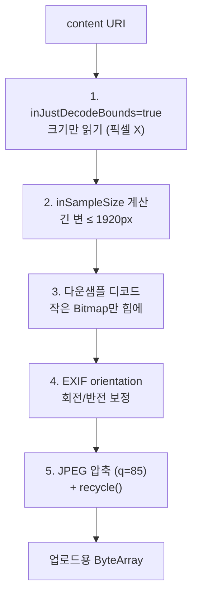

"갤러리에서 사진 하나 골라 업로드했을 뿐인데 저사양 기기에서 앱이 죽어요." 프로필 이미지나 인증 사진처럼 사용자가 고른 이미지를 서버로 올리는 흔한 기능에서, 무심코 짠 코드가 **OutOfMemoryError(OOM)** 의 원인이 되는 경우가 많습니다. 이 글은 제가 작업 중인 안드로이드 앱([RuleUp-ASM/Android](https://github.com/RuleUp-ASM/Android))에서 이미지 업로드 경로를 손보며 정리한 내용으로, **왜 원본을 통째로 읽으면 위험한지**와 **다운샘플·EXIF 회전·압축으로 안전하게 읽는 법**을 다룹니다. 읽고 나면 "업로드 전 이미지 읽기" 한 함수를 어떻게 짜야 하는지가 남습니다.

## 무엇이 문제인가: `readBytes()`의 함정

content URI에서 이미지를 읽어 멀티파트로 올리는 가장 짧은 코드는 보통 이렇게 생겼습니다.

```kotlin
// 안티패턴: 원본 바이트를 통째로 힙에 적재
suspend fun read(uri: Uri): ByteArray =
    withContext(Dispatchers.IO) {
        contentResolver.openInputStream(uri)?.use { it.readBytes() }
            ?: error("이미지를 읽을 수 없습니다")
    }
```

문제는 `readBytes()`가 **파일 원본 전체**를 메모리에 올린다는 점입니다. 요즘 스마트폰 카메라 원본은 한 장에 4,000×3,000 픽셀, 파일로 5~15MB에 이릅니다. 게다가 서버로 보내려고 `Bitmap`으로 디코드하는 순간에는 파일 크기가 아니라 **픽셀 수 × 4바이트(ARGB_8888)** 만큼의 힙이 필요합니다.

```text
4000 × 3000 × 4 byte ≈ 48 MB  (JPEG 파일은 4MB라도, 디코드된 비트맵은 48MB)
```

앱에 할당된 힙이 넉넉하지 않은 저사양 기기에서는 이 한 장으로 OOM이 터집니다. 파일이 작아 보여도 **디코드된 픽셀은 훨씬 크다**는 게 핵심입니다.

> 업로드 품질에 4,000px 원본이 필요한 서비스는 거의 없습니다. 대부분 긴 변 1,080~1,920px면 충분하고, 나머지는 대역폭 낭비입니다.
{: .prompt-info }

## 해법 1: 크기부터 읽고 다운샘플하기

`BitmapFactory`는 **픽셀을 올리지 않고 크기만 먼저 읽는** 옵션을 제공합니다. `inJustDecodeBounds = true`로 원본 해상도만 알아낸 뒤, `inSampleSize`(2의 거듭제곱)로 다운샘플해서 디코드합니다.

```kotlin
// 긴 변이 target 이하가 되는 최소 2의 거듭제곱 배수
private fun computeInSampleSize(width: Int, height: Int, target: Int): Int {
    var sample = 1
    var longest = maxOf(width, height)
    while (longest / 2 >= target) {
        longest /= 2
        sample *= 2
    }
    return sample
}
```

`inSampleSize = 4`면 가로·세로가 각각 1/4로 줄어 픽셀 수는 1/16이 됩니다. 48MB짜리가 3MB로 내려오는 셈이죠. 중요한 건 이 축소가 **디코드 시점에** 일어나므로, 큰 비트맵을 먼저 만든 뒤 줄이는 게 아니라 애초에 작은 비트맵만 힙에 올린다는 점입니다.

## 해법 2: EXIF 회전이라는 함정

여기서 놓치기 쉬운 함정이 하나 있습니다. `BitmapFactory.decodeStream`은 **EXIF 방향 정보를 반영하지 않습니다.** 카메라로 세로로 찍은 사진은 실제 픽셀은 가로로 저장되고 "90도 돌려서 보라"는 방향 태그만 붙어 있는 경우가 많은데, 다운샘플 디코드는 이 태그를 무시하므로 업로드된 사진이 **옆으로 누워** 버립니다.

원래 `readBytes()`로 원본 바이트를 그대로 올릴 때는 서버/뷰어가 EXIF를 해석해 줬지만, 우리가 픽셀을 다시 디코드하는 순간 그 책임은 우리에게 넘어옵니다. 그래서 방향 태그를 읽어 직접 회전/반전을 적용해야 합니다.

```kotlin
private fun Bitmap.applyExifOrientation(orientation: Int): Bitmap {
    val matrix = Matrix()
    when (orientation) {
        ExifInterface.ORIENTATION_ROTATE_90 -> matrix.postRotate(90f)
        ExifInterface.ORIENTATION_ROTATE_180 -> matrix.postRotate(180f)
        ExifInterface.ORIENTATION_ROTATE_270 -> matrix.postRotate(270f)
        ExifInterface.ORIENTATION_FLIP_HORIZONTAL -> matrix.postScale(-1f, 1f)
        ExifInterface.ORIENTATION_FLIP_VERTICAL -> matrix.postScale(1f, -1f)
        else -> return this
    }
    return Bitmap.createBitmap(this, 0, 0, width, height, matrix, true)
}
```

> `android.media.ExifInterface`의 `InputStream` 생성자는 API 24부터 쓸 수 있습니다. minSdk가 그 이상이면 별도 라이브러리 없이 바로 사용 가능합니다.
{: .prompt-tip }

## 전체 파이프라인

크기 조회 → 다운샘플 디코드 → EXIF 보정 → JPEG 압축의 흐름을 그림으로 보면 이렇습니다.



이 다섯 단계를 하나의 함수로 묶으면 아래와 같습니다. 원본 URI를 세 번 여는 건 (크기 조회 / 픽셀 디코드 / EXIF 읽기) 각각 스트림을 소비하기 때문이고, 어느 단계도 원본 전체 픽셀을 힙에 올리지 않습니다.

```kotlin
suspend fun read(uri: Uri): ByteArray = withContext(Dispatchers.IO) {
    val resolver = context.contentResolver

    // 1) 크기만 먼저
    val bounds = BitmapFactory.Options().apply { inJustDecodeBounds = true }
    resolver.openInputStream(uri)?.use { BitmapFactory.decodeStream(it, null, bounds) }

    // 2~3) 다운샘플 디코드
    val opts = BitmapFactory.Options().apply {
        inSampleSize = computeInSampleSize(bounds.outWidth, bounds.outHeight, MAX_DIMENSION)
    }
    val decoded = resolver.openInputStream(uri)?.use { BitmapFactory.decodeStream(it, null, opts) }
        ?: error("이미지를 읽을 수 없습니다")

    // 4) EXIF 회전 보정
    val orientation = resolver.openInputStream(uri)?.use {
        ExifInterface(it).getAttributeInt(
            ExifInterface.TAG_ORIENTATION, ExifInterface.ORIENTATION_NORMAL,
        )
    } ?: ExifInterface.ORIENTATION_NORMAL
    val oriented = decoded.applyExifOrientation(orientation)

    // 5) JPEG 압축 + 정리
    val out = ByteArrayOutputStream()
    oriented.compress(Bitmap.CompressFormat.JPEG, JPEG_QUALITY, out)
    if (oriented !== decoded) decoded.recycle()
    oriented.recycle()
    out.toByteArray()
}
```

> `Bitmap`은 GC가 즉시 회수하지 않는 큰 객체라, 다 쓴 비트맵은 `recycle()`로 명시적으로 놓아주는 편이 저사양 기기에서 안전합니다. 회전으로 새 비트맵을 만들었다면 원본과 새것 둘 다 정리해야 합니다.
{: .prompt-warning }

## 정리

- **파일 크기 ≠ 힙 사용량.** 디코드된 비트맵은 `가로 × 세로 × 4byte`다. 원본을 통째로 `readBytes()`/디코드하면 저사양 기기에서 OOM이 난다.
- **`inJustDecodeBounds`로 크기만 먼저 읽고 `inSampleSize`로 다운샘플**하면, 큰 비트맵을 만든 뒤 줄이는 게 아니라 처음부터 작게 올린다.
- **다운샘플 디코드는 EXIF를 무시**하므로 방향 태그를 직접 읽어 회전/반전해야 사진이 눕지 않는다.
- 마지막에 **JPEG로 압축**하면 OOM뿐 아니라 업로드 대역폭도 함께 줄어든다.

업로드 전에 "이미지를 어떻게 읽을 것인가"는 사소해 보여도, 저사양 기기에서의 크래시율과 직결되는 지점입니다. 다음 단계로는 이 파이프라인을 Coil/Glide 같은 로더의 트랜스포메이션으로 옮기거나, 매우 큰 이미지에 대해 `BitmapRegionDecoder`로 부분 디코딩하는 방법까지 확장해 볼 수 있습니다.
