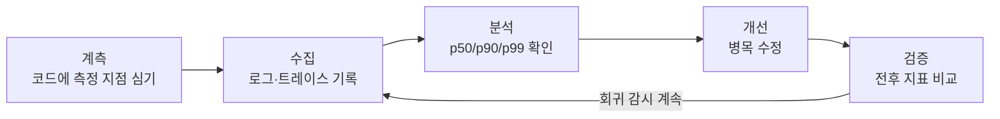

"앱이 느린 것 같아요"라는 제보를 받았을 때 가장 먼저 해야 할 일은 코드를 고치는 게 아니라 **어디가, 얼마나 느린지 숫자로 확인하는 것**입니다. 감으로 최적화하면 엉뚱한 곳을 고치고, 고친 뒤에도 좋아졌는지 확인할 방법이 없습니다. 이 글은 퍼포먼스 로깅이 왜 필요한지를 정리하고, 안드로이드에서 `measureTimeMillis`부터 `androidx.tracing`, 프로덕션 모니터링까지 단계별 사용 방법을 다룹니다. 읽고 나면 "느리다"는 말을 "온보딩 API가 p90 기준 1.8초 걸린다"로 바꿀 수 있게 됩니다.

## 퍼포먼스 로깅이 왜 필요한가

### 1. 측정하지 않으면 고칠 수 없다

성능 문제에서 개발자의 직감은 자주 틀립니다. "이미지 디코딩이 느릴 거야"라고 생각했는데 실제로는 그 앞의 DB 쿼리가 메인 스레드를 잡고 있는 경우가 흔합니다. 로깅 없이 최적화하면 두 가지 도박을 하게 됩니다.

- **어디를 고칠지**를 추측으로 정한다 → 병목이 아닌 곳을 고치면 체감 변화가 없습니다.
- **고쳐졌는지**를 느낌으로 판단한다 → "좀 빨라진 것 같은데?"는 플라시보일 수 있습니다.

숫자가 있으면 두 도박이 모두 사라집니다. 개선 전후의 측정값을 비교하면 됩니다.

### 2. 내 기기에서 빠르다고 사용자 기기에서 빠른 게 아니다

개발자는 보통 고사양 기기 + 좋은 네트워크에서 테스트합니다. 하지만 실제 사용자는 4년 된 보급형 기기에서 지하철 LTE로 앱을 씁니다. 로컬에서는 절대 재현되지 않는 느림이 프로덕션에는 존재하고, 이걸 볼 수 있는 유일한 방법이 **프로덕션 퍼포먼스 로깅**입니다.

### 3. 성능 회귀(regression)는 조용히 온다

성능은 한 번에 나빠지지 않습니다. 기능이 하나 추가될 때마다 시작 시간이 50ms씩 늘어나는 식으로, 열 번의 릴리스에 걸쳐 조금씩 나빠집니다. 각 릴리스만 보면 눈치챌 수 없고, 지표를 계속 기록하고 있어야만 "v1.4부터 콜드 스타트가 꺾였네"를 발견할 수 있습니다.

## 무엇을 측정할 것인가

전부 다 측정하려고 하면 시작을 못 합니다. 사용자 체감에 직결되는 것부터 우선순위를 정합니다.

| 지표 | 의미 | 목표 예시 |
|---|---|---|
| 콜드 스타트 | 앱 아이콘 탭 → 첫 화면 표시 | 2초 이내 |
| 화면 전환 (TTID) | 네비게이션 → 화면 그려짐 | 500ms 이내 |
| 네트워크 요청 | API 호출 → 응답 파싱 완료 | 엔드포인트별 p90 |
| 프레임 드랍 (jank) | 16ms를 넘긴 프레임 비율 | 1% 이하 |
| 무거운 작업 | 이미지 처리, DB 마이그레이션 등 | 작업별 소요 시간 |

여기서 중요한 원칙 하나: **평균보다 백분위(p50/p90/p99)를 보세요.** 평균 800ms라는 숫자는 "대부분 300ms인데 10%의 사용자가 5초를 기다린다"는 사실을 숨깁니다. 느린 꼬리(tail)에 있는 사용자가 바로 앱을 삭제하는 사용자입니다.



퍼포먼스 로깅은 한 번 하고 끝나는 작업이 아니라 위 그림처럼 **계측 → 수집 → 분석 → 개선 → 검증**을 도는 사이클입니다.

## 1단계: 가장 간단한 measureTimeMillis

개발 중에 "이 함수 얼마나 걸리지?"를 확인하는 가장 빠른 방법은 코틀린 표준 라이브러리의 `measureTimeMillis`입니다.

```kotlin
import kotlin.system.measureTimeMillis

val elapsed = measureTimeMillis {
    val user = userRepository.fetchUser()
    val challenges = challengeRepository.fetchChallenges(user.id)
}
Log.d("Perf", "onboarding load: ${elapsed}ms")
```

suspend 함수의 실제 소요 시간을 재려면 `measureTimeMillis`는 스레드가 멈춰 있던 시간까지 포함하므로, 코루틴에서는 `kotlin.time.measureTime`을 쓰는 편이 안전합니다.

```kotlin
import kotlin.time.measureTime

val duration = measureTime {
    syncUseCase()   // suspend 함수
}
Log.d("Perf", "sync took $duration")
```

이 방법의 한계는 명확합니다. **로그캣에 한 줄 찍히고 끝**이라 추이를 볼 수 없고, 측정 코드가 프로덕션에 남으면 로그만 지저분해집니다. 개발 중 일회성 확인용으로만 쓰고, 계속 추적할 지표는 다음 단계로 넘어갑니다.

## 2단계: androidx.tracing — 시스템 트레이스에 남기기

`androidx.tracing`을 쓰면 내 코드의 구간이 **Perfetto 시스템 트레이스에 이름 붙은 블록으로 표시**됩니다. 내 함수가 프레임 렌더링·GC·다른 스레드와 시간축 위에서 어떻게 겹치는지 한눈에 볼 수 있어서, "느린 건 알겠는데 왜 느리지?"를 파고들 때 가장 강력합니다.

```kotlin
// build.gradle.kts
dependencies {
    implementation("androidx.tracing:tracing-ktx:1.2.0")
}
```

```kotlin
import androidx.tracing.trace

fun bindChallengeList(items: List<Challenge>) = trace("bindChallengeList") {
    trace("sortItems") {
        items.sortedByDescending { it.createdAt }
    }
    trace("submitToAdapter") {
        adapter.submitList(items)
    }
}
```

이렇게 심어두고 Android Studio Profiler의 **System Trace**를 캡처하면(또는 [Perfetto UI](https://ui.perfetto.dev)에서 트레이스 파일을 열면), `bindChallengeList` 블록 안에 `sortItems`와 `submitToAdapter`가 중첩된 타임라인이 보입니다. 릴리스 빌드에서는 트레이싱이 기본적으로 비활성이라 오버헤드 걱정 없이 심어둘 수 있고, Macrobenchmark를 도입할 때도 이 트레이스 포인트가 그대로 측정 지점이 됩니다.

> `trace()` 블록은 시작과 끝이 반드시 짝을 이뤄야 합니다. ktx의 `trace("name") { }` 람다 버전을 쓰면 예외가 나도 자동으로 닫아주므로, `Trace.beginSection()`/`endSection()`을 직접 호출하는 것보다 람다 버전을 권장합니다.
{: .prompt-tip }

## 3단계: 프로덕션 — 실사용자 지표 수집

로컬 측정은 "내 기기의 지금"만 보여줍니다. 실사용자의 분포를 보려면 프로덕션에서 지표를 수집해야 합니다.

- **Firebase Performance Monitoring**: 콜드 스타트·화면 렌더링·네트워크 요청을 자동 수집하고, 커스텀 트레이스도 몇 줄로 추가할 수 있어 도입 비용이 가장 낮습니다.
- **JankStats**(`androidx.metrics`): 실사용자 기기에서 프레임 드랍을 측정해 어떤 화면에서 jank가 발생했는지 리포트합니다.
- **자체 로깅**: 이미 분석 파이프라인(BigQuery 등)이 있다면 소요 시간을 이벤트로 쏘는 방법도 있습니다.

Firebase 커스텀 트레이스 예시입니다.

```kotlin
import com.google.firebase.perf.FirebasePerformance

suspend fun uploadVerificationImage(uri: Uri) {
    val trace = FirebasePerformance.getInstance().newTrace("verification_image_upload")
    trace.start()
    try {
        val compressed = compressImage(uri)
        trace.putMetric("compressed_bytes", compressed.size.toLong())
        api.upload(compressed)
        trace.putAttribute("result", "success")
    } catch (e: Exception) {
        trace.putAttribute("result", "failure")
        throw e
    } finally {
        trace.stop()
    }
}
```

`putMetric`으로 수치를, `putAttribute`로 분류 기준(성공/실패, 네트워크 종류 등)을 함께 남기면 대시보드에서 "실패한 요청만", "특정 기기군만" 걸러서 백분위를 볼 수 있습니다.

> 프로덕션 로깅에는 비용이 따릅니다. 모든 함수에 트레이스를 심으면 오버헤드와 수집 비용이 커지므로, 위의 "무엇을 측정할 것인가" 표처럼 사용자 체감에 직결되는 핵심 경로에만 심으세요.
{: .prompt-warning }

## 어느 단계를 언제 쓰나

세 단계는 대체 관계가 아니라 역할 분담입니다.

1. **`measureTime`** — 개발 중 일회성 확인. "이거 얼마나 걸리지?" 수준의 빠른 답.
2. **`androidx.tracing` + Perfetto** — 병목 분석. "왜 느린지"를 시간축 위에서 파고들 때.
3. **Firebase Performance / JankStats** — 프로덕션 감시. 실사용자 분포를 보고 회귀를 조기에 잡을 때.

## 마무리

퍼포먼스 로깅의 핵심은 도구가 아니라 태도입니다. **"느린 것 같다"를 근거로 코드를 고치지 않고, 측정값을 근거로 고치고, 고친 뒤 다시 측정해서 검증한다** — 이 사이클만 지켜도 최적화의 절반은 성공입니다. 오늘 당장 시작한다면, 앱의 콜드 스타트와 가장 중요한 API 하나에 트레이스를 심고 일주일 뒤 p90 값을 확인해 보세요. 그 숫자가 여러분 앱 성능 개선의 기준선(baseline)이 됩니다.
