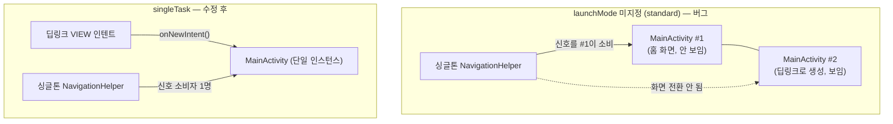

에뮬레이터로 앱을 검증하다가 이상한 버그를 만났다. 챌린지 생성 API는 200으로 성공했는데 화면은 확인 페이지에서 꼼짝하지 않고, 뒤에서는 홈 화면 API가 멀쩡히 재호출되고 있었다. `dumpsys activity` 를 열어보니 범인은 코드가 아니라 **매니페스트의 한 줄** — 정확히는 *없던* 한 줄, `launchMode` 였다. 이 글은 그 버그를 계기로 launchMode가 왜 필요한지, 4가지 종류가 각각 어떻게 다른지, 그리고 딥링크를 다루는 앱이 반드시 고려해야 할 점을 정리한다.

> 실제 사례는 공개 저장소 [RuleUp-ASM/Android](https://github.com/RuleUp-ASM/Android)의 [이슈 #94](https://github.com/RuleUp-ASM/Android/issues/94) / [PR #95](https://github.com/RuleUp-ASM/Android/pull/95)에서 볼 수 있다.
{: .prompt-info }

## launchMode는 왜 필요한가

안드로이드에서 액티비티는 **태스크(task)** 라는 스택에 쌓인다. 문제는 기본 동작이다. `launchMode` 를 지정하지 않으면 `standard` 가 적용되는데, standard는 **인텐트가 올 때마다 새 인스턴스를 만들어 스택 위에 쌓는다.** 같은 액티비티가 이미 떠 있어도 상관하지 않는다.

단일 액티비티 + Compose 내비게이션 구조라면 이게 곧바로 사고로 이어진다. 우리 앱의 상황이 정확히 그랬다:

- `MainActivity` 하나가 모든 화면을 Compose `NavHost` 로 렌더링
- 화면 이동은 싱글톤 `NavigationHelper` 가 Flow로 신호를 흘리고, `NavHost` 가 구독
- 카카오톡 초대 링크(딥링크, `VIEW` 인텐트)로 진입 → **기존 인스턴스 위에 두 번째 `MainActivity` 생성**
- 이제 `NavHost` 가 두 개다. 싱글톤이 흘린 내비게이션 신호를 **아래에 깔린(안 보이는) 인스턴스가 소비**하면, 눈에 보이는 화면은 전환되지 않는다

증상은 제각각이지만 원인은 하나였다. 생성 완료 후 홈 이동 실패, 웜 스타트 시 스플래시 고착, 딥링크 진입 후 화면 무반응 — 전부 인스턴스 중복이었다.



즉 launchMode는 "액티비티 인스턴스를 **몇 개까지, 어느 태스크에** 만들 것인가"를 시스템에 알려주는 계약이다. 이 계약을 안 정하면 시스템은 매번 새로 만든다는 가장 단순한(그리고 종종 틀린) 답을 고른다.

## 4가지 launchMode

| 모드 | 인스턴스 | 재진입 시 동작 | 대표 용도 |
|---|---|---|---|
| `standard` (기본) | 무제한 | 항상 새 인스턴스를 스택에 push | 문서 편집기처럼 같은 화면이 여러 장 필요할 때 |
| `singleTop` | 무제한 | **스택 맨 위에 있을 때만** 재사용(`onNewIntent`), 아니면 새로 생성 | 알림 탭으로 같은 화면 연속 진입 |
| `singleTask` | 태스크당 1개 | 어디에 있든 재사용(`onNewIntent`) + **그 위의 액티비티는 모두 제거** | 단일 액티비티 앱의 루트, 딥링크 진입점 |
| `singleInstance` | 시스템 전체 1개 | 전용 태스크에 홀로 존재, 다른 액티비티가 같은 태스크에 못 들어옴 | 전화 수신 화면 같은 극단적 특수 케이스 |

몇 가지 뉘앙스를 덧붙이면:

- `singleTop` 은 "맨 위에 있을 때만"이라는 조건이 함정이다. 홈 → 상세 → (딥링크로 홈 재진입) 상황에선 홈이 맨 위가 아니므로 새 인스턴스가 또 생긴다.
- `singleTask` 의 재사용에는 대가가 있다. 스택 중간에 있던 인스턴스를 앞으로 가져오면서 **그 위에 쌓여 있던 액티비티를 전부 파괴**한다(clear top). 단일 액티비티 구조에선 위에 쌓일 게 없어 무해하지만, 다중 액티비티 구조라면 사용자가 보던 화면이 날아갈 수 있다.
- API 31부터는 `singleInstancePerTask` 도 추가됐다(태스크마다 1개, 멀티 윈도우/멀티 태스크 대응). 일반 앱에서 쓸 일은 드물다.
- 매니페스트의 launchMode 말고도 호출 측에서 `Intent.FLAG_ACTIVITY_NEW_TASK`, `FLAG_ACTIVITY_SINGLE_TOP`, `FLAG_ACTIVITY_CLEAR_TOP` 플래그로 비슷한 동작을 만들 수 있다. 외부 앱(브라우저, 카카오톡)이 딥링크를 쏠 때는 보통 `NEW_TASK` 플래그가 붙어서 오는데, 이때 우리 매니페스트가 standard면 그대로 인스턴스가 중복된다 — **내가 제어할 수 없는 호출자에 대비하는 방법이 매니페스트의 launchMode다.**

## 실전: 딥링크 앱은 singleTask + onNewIntent

수정은 매니페스트 한 줄이다. 딥링크(`VIEW`)든 런처 재실행이든 항상 기존 인스턴스로 들어오게 강제한다.

```xml
<!-- singleTask: 딥링크(VIEW)·재실행이 항상 기존 인스턴스의 onNewIntent 로 들어오게 한다. -->
<activity
    android:name=".MainActivity"
    android:exported="true"
    android:launchMode="singleTask"
    android:theme="@style/Theme.AndroidRuleUp">
```

단, singleTask는 반쪽짜리 약속이다. 인스턴스를 재사용하는 순간 `onCreate` 는 다시 불리지 않으므로, **새 인텐트를 받는 통로인 `onNewIntent` 를 구현하지 않으면 딥링크가 조용히 무시된다.** 우리 프로젝트는 다행히 이 부분이 이미 구현돼 있었고(허용 경로 화이트리스트 검증 포함), launchMode가 없어서 이 코드가 **한 번도 불리지 않고** 있었다:

```kotlin
// 앱이 떠 있는 동안 들어온 딥링크(ruleup://app/...) 처리. 미등록 path 는 무시된다.
override fun onNewIntent(intent: Intent) {
    super.onNewIntent(intent)
    setIntent(intent) // 이후 getIntent()가 최신 인텐트를 돌려주도록 갱신
    intent.data
        ?.let { resolveNewIntentRoute(it) } // 허용 목록 검증 + NavRoute 변환
        ?.let { navigationHelper.navigateByRoute(it) }
}
```

수정 후 검증 결과: 앱 실행 중 딥링크 진입 시 기존 인스턴스에서 즉시 화면 전환, `dumpsys` 기준 인스턴스 1개 유지, 웜 스타트 고착 해소.

## 고려해야 하는 점

launchMode를 고를 때(특히 singleTask로 바꿀 때) 확인할 것들:

1. **`onNewIntent` 구현 + `setIntent` 호출.** singleTask/singleTop 재사용 경로의 필수 짝. `setIntent` 를 빼먹으면 이후 `getIntent()` 가 처음 인텐트를 돌려줘서 화면 회전·프로세스 복원 시 옛 딥링크가 재처리되는 류의 버그가 생긴다.
2. **clear top 부작용.** singleTask 재진입은 위에 쌓인 액티비티를 파괴한다. 다중 액티비티 구조라면 작성 중이던 화면이 날아가는지 점검하라. 단일 액티비티 구조라면 이 걱정이 없다는 것 자체가 singleTask를 택할 이유다.
3. **싱글톤과 다중 인스턴스의 조합을 의심하라.** 우리 버그의 본질은 launchMode가 아니라 "싱글톤(NavigationHelper)이 흘린 이벤트를 여러 소비자(NavHost)가 나눠 먹은 것"이다. launchMode로 인스턴스를 하나로 강제하는 게 1차 수정이고, 구조적으로는 이벤트 버스형 싱글톤이 다중 구독에 안전한지도 함께 봐야 한다.
4. **외부 호출자는 통제할 수 없다.** 카카오톡·브라우저가 어떤 플래그로 인텐트를 쏠지는 우리 소관이 아니다. 딥링크 진입점 액티비티는 매니페스트 수준에서 방어하라.
5. **재현 테스트는 "앱이 떠 있는 상태"로.** 콜드 스타트만 테스트하면 이 부류의 버그는 절대 안 잡힌다. 앱을 띄워둔 채 `adb` 로 딥링크를 쏘고 인스턴스 수를 세어보자.

```bash
# 앱 실행 중 딥링크 발사 후 인스턴스 수 확인
adb shell am start -a android.intent.action.VIEW -d "ruleup://app/watchers/invitation?token=..."
adb shell dumpsys activity activities | grep -c "Hist  #.*MainActivity"  # 1이어야 정상
```

> 단일 액티비티 + Compose 내비게이션 앱이라면 `singleTask` + `onNewIntent` 조합을 사실상 기본값으로 두자. standard가 유리한 경우(같은 화면 다중 창)는 의도적으로 선택했을 때만 의미가 있다.
{: .prompt-tip }

## 마무리

- launchMode는 "인스턴스를 몇 개까지, 어디에 만들 것인가"에 대한 매니페스트 수준의 계약이고, 안 정하면 standard(매번 새로)가 적용된다.
- 4종 중 딥링크 진입점에는 대부분 `singleTask` 가 답이며, `onNewIntent`(+`setIntent`)와 반드시 짝으로 구현해야 한다.
- 인스턴스 중복 버그는 증상이 제각각(화면 고착, 이벤트 무반응)이라 원인을 못 찾기 쉽다 — `dumpsys activity` 로 인스턴스 수부터 세어보면 빠르다.

한 줄짜리 수정이었지만, "API는 성공하는데 화면이 안 바뀐다"는 증상에서 태스크 스택까지 파고들게 해준 좋은 버그였다.
