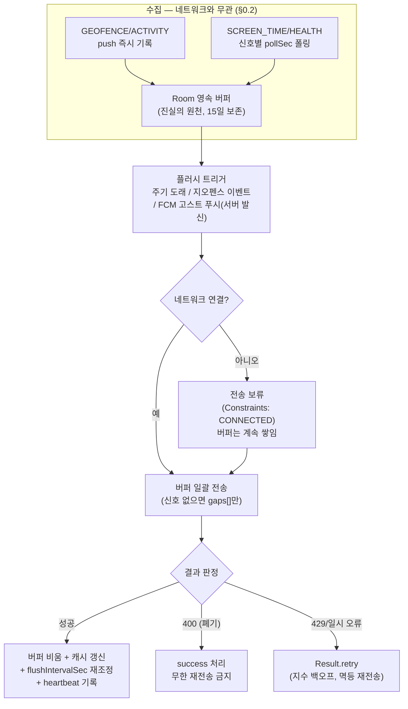

습관 인증 앱을 만들면서 "기기에서 모은 인증 신호를 주기적으로 서버로 동기화"하는 백그라운드 폴링을 WorkManager로 구현했다. 단순해 보이는 요구사항인데 실제로는 세 가지 벽에 부딪혔다 — **초기화를 왜 명시적으로 해야 하는가**, **폴링 주기를 왜 하나로 고정하면 안 되는가**, 그리고 **서버에 의존하는 폴링은 무엇이 위험한가**. 이 글은 팀 전송 테크 스펙(§0.x로 인용)과 실제 코드로 그 세 가지를 어떻게 풀었는지 정리한다.

> 코드는 공개 저장소 [RuleUp-ASM/Android](https://github.com/RuleUp-ASM/Android)의 `verification` 모듈 (`VerificationSyncWorker`, `VerificationSyncSchedulerImpl`)에서 가져왔다. §0.x 표기는 팀 내부 전송 스펙 문서의 절 번호다.
{: .prompt-info }

## 1. 왜 명시적(on-demand) 초기화를 해야 하는가

WorkManager는 아무 설정도 하지 않으면 **앱 프로세스가 뜨는 순간 `androidx.startup` 의 `InitializationProvider` 가 자동으로 초기화**한다. 편해 보이지만 두 가지 문제가 있다.

첫째, **Worker에 의존성을 주입할 수 없다.** 자동 초기화는 기본 `WorkerFactory` 를 쓰는데, 기본 팩토리는 `(Context, WorkerParameters)` 두 개짜리 생성자만 호출할 줄 안다. 우리 Worker는 UseCase·저장소·로거 등 8개의 의존성을 Hilt로 주입받는 `@HiltWorker` 다. 자동 초기화가 먼저 일어나면 Hilt의 `HiltWorkerFactory` 가 등록될 기회 자체가 없고, 주기 작업이 발화하는 순간 Worker 인스턴스화에 실패한다.

둘째, **초기화 시점을 통제할 수 없다.** ContentProvider는 `Application.onCreate()` 보다도 먼저 실행된다. DI 그래프가 만들어지기 전에 WorkManager가 세팅을 끝내버리는 순서 역전이 일어난다.

해결은 두 단계다. 매니페스트에서 자동 초기화 항목을 **제거**하고:

```xml
<!-- WorkManager 기본 이니셜라이저 제거 → App(Configuration.Provider)로 on-demand 초기화 -->
<provider
    android:name="androidx.startup.InitializationProvider"
    android:authorities="${applicationId}.androidx-startup"
    android:exported="false"
    tools:node="merge">
    <meta-data
        android:name="androidx.work.WorkManagerInitializer"
        android:value="androidx.startup"
        tools:node="remove" />
</provider>
```

`Application` 이 `Configuration.Provider` 를 구현해 **첫 `getInstance()` 호출 시점에** 우리가 만든 팩토리로 초기화되게 한다:

```kotlin
@HiltAndroidApp
class App : Application(), Configuration.Provider {
    // @HiltWorker 들을 인스턴스화하는 HiltWorkerFactory 를 등록한다.
    @Inject lateinit var workerFactory: HiltWorkerFactory

    override val workManagerConfiguration: Configuration
        get() = Configuration.Builder()
            .setWorkerFactory(workerFactory)
            .build()
}
```

이제 Worker가 생성자 주입을 마음껏 받을 수 있다:

```kotlin
@HiltWorker
class VerificationSyncWorker @AssistedInject constructor(
    @Assisted appContext: Context,
    @Assisted params: WorkerParameters,
    private val runSyncUseCase: RunSyncUseCase,
    private val syncScheduler: SyncScheduler,
    // ... 진행률 캐시, 설정 저장소, 애널리틱스 로거 등
) : CoroutineWorker(appContext, params)
```

> 자동 초기화를 제거했는데 `Configuration.Provider` 구현을 빼먹으면, 첫 `getInstance()` 에서 `IllegalStateException: WorkManager is not initialized` 로 죽는다. 둘은 반드시 세트다.
{: .prompt-warning }

## 2. 폴링 주기를 왜 하나로 고정하면 안 되는가

처음엔 "30분마다"로 끝인 줄 알았다. 그런데 스펙을 쓰면서 보니 폴링 주기는 **하나가 아니라 두 층**이고, 각 층 안에서도 상황마다 달라야 했다.

### 2-1. 전송 주기 — 서버가 정책으로 지시한다 (스펙 §0.3)

전송(sync) 주기를 클라이언트에 하드코딩하면 서버가 통제 수단을 잃는다. 진행 중인 챌린지가 없는 사용자에겐 30분 폴링이 낭비고, 트래픽이 몰릴 때 "천천히 와라"라고 말할 방법도 없다. 그래서 스펙은 **client-initiated + server-policy** 모델을 택했다 — 전송은 클라가 시작하되, 주기는 서버가 관리한다.

주기의 최초 값부터 서버가 정한다. 로그인 시 클라가 기기 정보(`sdkInt`·`model`·`lowRam`·배터리 최적화 상태)를 올리면 **서버가 기기 스펙에 맞는 주기를 산정해 내려준다** — 취약 기기는 완화된 주기, 좋은 기기는 짧은 주기. 이 정책(settings)은 리프레시 토큰 갱신 주기(1주)마다 재수신해서, 앱 업데이트나 OS 업그레이드로 기기 특성이 바뀌어도 최대 1주 안에 따라온다. 이후에는 sync 응답(ACK)마다 `flushIntervalSec` 가 전체값으로 내려온다:

```json
{
  "syncedAt": "2026-06-26T12:00:01Z",
  "flushIntervalSec": 1800,
  "updatedChallenges": [
    { "challengeId": "C1", "todayStatus": "SUCCESS", "progressRate": 25.0 }
  ],
  "ignoredSignalTypes": []
}
```

Worker는 성공할 때마다 이 값으로 다음 주기를 갈아끼운다:

```kotlin
override suspend fun doWork(): Result {
    val result = runSyncUseCase(scope, collectedAt)
    if (result != null) {
        progressCacheStore.upsert(result.updatedChallenges) // 로컬 캐시 갱신
        syncScheduler.reschedule(result.nextSyncAfterSec)   // 서버 flushIntervalSec 로 주기 재설정
    }
    return Result.success()
}
```

```kotlin
override fun reschedule(nextSyncAfterSec: Int) {
    // WorkManager 최소 주기 15분 floor 적용.
    val minutes = (nextSyncAfterSec / 60L).coerceAtLeast(15L)
    WorkManager.getInstance(context).enqueueUniquePeriodicWork(
        WORK_NAME,
        ExistingPeriodicWorkPolicy.UPDATE, // 실행 중인 주기 작업의 간격만 교체
        buildRequest(minutes),
    )
}
```

여기서 두 가지 제약을 알아야 한다. WorkManager의 **주기 작업 최소 간격은 15분**이라 서버가 그보다 짧게 지시해도 floor를 걸어야 하고(안 걸면 WorkManager가 조용히 15분으로 올린다), 주기 변경은 `ExistingPeriodicWorkPolicy.UPDATE` 로 해야 대기열을 갈아엎지 않고 간격만 바뀐다. 최초 예약은 `KEEP` 이다 — 앱을 켤 때마다 `REPLACE` 로 리셋하면 주기의 기준 시각이 계속 밀려서 영원히 실행되지 않는 폴링이 될 수 있다.

### 2-2. 수집 폴링 — 신호마다 주기가 달라야 하는 이유 (스펙 §0.3)

전송과 별개로, 기기 안에서 신호를 **수집**하는 폴링이 있다. 스펙의 settings 정책 초안이 신호별로 다른 주기를 잡아둔 이유가 각각 명확하다:

```json
"collection": {
  "GEOFENCE":    { "enabled": true },                  // push 방식 — cadence 무관
  "SCREEN_TIME": { "enabled": true, "pollSec": 900 },  // OS purge 보다 짧게
  "WAKE":        { "enabled": true, "pollSec": 900 },  // 매일 아침 1회 보장
  "HEALTH":      { "enabled": true, "pollSec": 1800 }  // read quota 보수적
}
```

- **SCREEN_TIME(앱 사용 이벤트)** — `UsageStatsManager` 이벤트는 OS가 일정 기간 뒤 **purge(영구 삭제)** 한다. 폴링 주기가 purge 주기보다 길면 데이터가 그냥 증발한다. 그래서 **더 짧게, 더 자주**.
- **HEALTH(Health Connect)** — 반대로 백그라운드 read에 **quota(호출 한도)** 가 있다. 자주 부르면 `RateLimitException` 으로 다음 flush까지 밀린다. 그래서 **보수적으로 드물게**, 챌린지 활성 시간대에만.
- **WAKE(기상 판정)** — 하루 중 의미 있는 순간이 아침뿐이다. 상시 폴링이 아니라 **기상 시간대 직후 1회 보장**이 요구사항.
- **GEOFENCE/ACTIVITY** — 애초에 폴링이 아니라 BroadcastReceiver **push** 로 들어오므로 주기 자체가 없다.

즉 "폴링 주기"를 하나의 상수로 두는 순간, purge에 데이터를 잃거나(너무 느림) quota에 걸리거나(너무 빠름) 둘 중 하나를 반드시 겪는다. **주기는 신호의 소멸 특성과 API 제약이 결정하는 값**이지, 앱이 정하는 취향이 아니었다.

## 3. 서버에 의존하는 폴링의 위험성, 그리고 대응

주기를 서버가 지시한다는 건 곧 **"다음 실행 계획이 서버 응답에 인질로 잡혀 있다"** 는 뜻이다. 여기에 모바일 환경의 근본 제약이 겹친다:

1. **네트워크가 꺼져 있을 수 있다** — 비행기 모드, 지하철, 데이터 소진. 폴링이 발화해도 요청 자체가 불가능하다.
2. **OS가 실행을 미룬다** — Doze / App Standby 는 백그라운드 작업을 유예 구간으로 몰아넣는다.
3. **서버가 아플 수 있다** — 400/413/429. 실패했다고 다음 주기까지 아무것도 안 하면 데이터가 밀리고, 무작정 재시도하면 아픈 서버를 더 때린다.
4. **응답이 영영 안 올 수 있다** — `flushIntervalSec` 를 못 받으면 재조정 루프가 끊긴다.
5. **클라가 아예 침묵할 수 있다** — Doze·전원 꺼짐·장기 오프라인이면 폴링 자체가 기동되지 않는다. 클라 혼자서는 이 상태를 벗어날 트리거가 없다.



**① 네트워크: 수집과 전송을 분리한다(스펙 §0.2 "수집 ≠ 전송").** 이 스펙의 가장 중요한 문장은 "**버퍼가 진실의 원천, 전송은 단순 배치**"다. 신호는 발생/폴링 시점에 Room 영속 버퍼에 먼저 쌓이고(수집 워커는 네트워크 제약 없이 돈다), 전송 워커만 `Constraints` 에 `NetworkType.CONNECTED` 를 건다. 오프라인이면 WorkManager가 전송을 **보류**했다가 연결이 복구되는 순간 실행하고, 그동안 버퍼는 계속 쌓인다. 즉 네트워크가 꺼져 있어도 잃는 것은 "즉시성"뿐, 데이터가 아니다.

```kotlin
private fun buildRequest(intervalMinutes: Long): PeriodicWorkRequest =
    PeriodicWorkRequest
        .Builder(VerificationSyncWorker::class.java, intervalMinutes, TimeUnit.MINUTES)
        .setConstraints(
            Constraints.Builder()
                .setRequiredNetworkType(NetworkType.CONNECTED) // 전송 워커에만
                .build(),
        ).build()
```

밀린 버퍼를 몰아서 재전송하면 중복이 걱정되는데, 스펙은 **멱등을 신호 단위로 설계**했다 — Health Connect는 `recordId`, 없는 신호는 `(userId, signalType, observedAt)` 조합으로 서버가 dedup 한다. 오프라인 재전송이 중복 판정을 만들지 않는다는 보장이 있어야 클라가 겁 없이 재시도할 수 있다. 배치가 너무 커져 `413 SYNC_PAYLOAD_TOO_LARGE` 가 오면 분할 재전송한다.

**② Doze: exact 알람과 싸우지 않는다(스펙 §0.6).** 스펙 자체가 상시 Foreground Service를 금지하고 "expedited WorkManager로 중요 구간만 보호"를 실행 모델로 못 박았다. 부정확(inexact) 주기 작업을 받아들이는 대신, 적시성이 필요한 순간(지오펜스 진입 이벤트)에는 **expedited OneTimeWork로 catch-up** 을 쏜다. 쿼터가 소진되면 일반 작업으로 강등되도록 `RUN_AS_NON_EXPEDITED_WORK_REQUEST` 를 걸고, `ExistingWorkPolicy.KEEP` 으로 이벤트 연쇄 발화 시 폭주를 막는다.

```kotlin
fun enqueueCatchUp(context: Context, policy: ExistingWorkPolicy = ExistingWorkPolicy.KEEP) {
    val request = OneTimeWorkRequest.Builder(VerificationSyncWorker::class.java)
        .setExpedited(OutOfQuotaPolicy.RUN_AS_NON_EXPEDITED_WORK_REQUEST) // 쿼터 소진 시 강등
        .setConstraints(/* CONNECTED 동일 */)
        .build()
    WorkManager.getInstance(context)
        .enqueueUniqueWork(CATCH_UP_WORK_NAME, policy, request)
}
```

**③ 서버 오류: 실패를 세 갈래로 분류한다.** 모든 예외를 `retry` 로 던지면 잘못된 페이로드(400)를 영원히 재전송하는 좀비가 되고, 모든 예외를 `success` 로 삼키면 일시 장애에 데이터를 잃는다. 예외를 순수 함수로 판정해 **폐기(DISCARD)와 재시도(RETRY)를 구분**했다 — `400 INVALID_SIGNAL_PAYLOAD` 는 폐기 후 success(무한 재전송 금지), `429 SYNC_TOO_FREQUENT`·네트워크 오류는 `Result.retry()` 로 지수 백오프에 태운다.

```kotlin
internal fun syncOutcomeFor(error: Throwable?): SyncOutcome =
    when (error) {
        null -> SyncOutcome.SUCCESS
        is InvalidSignalPayloadException -> SyncOutcome.DISCARD // 400: 폐기, 무한 재전송 금지
        is SyncTooFrequentException -> SyncOutcome.RETRY        // 429: 백오프 재시도
        else -> SyncOutcome.RETRY
    }
```

**④ 침묵을 신호로 만든다(스펙 §0.5, §0.7).** 서버 의존 폴링의 가장 고약한 실패는 "조용한 실패"다 — 서버 입장에선 신호가 안 오는 게 *인증을 안 한 것*인지 *폴링이 죽은 것*인지 구분이 안 된다. 스펙은 이걸 두 겹으로 방어한다. 첫째, **보낼 신호가 없어도 sync는 치고 `gaps[]` 에 공백 사유를 담아 보낸다** — `PERMISSION_MISSING`(권한 회수), `USAGE_PURGED`(OS가 이벤트 삭제), `BUFFER_EVICTED`(15일 초과) 같은 enum으로, 서버가 신호 부재를 `NO_SIGNAL` 로 처리하기 전에 사유를 보고 유예/제외를 판단한다. 둘째, envelope에 **worker heartbeat**(마지막 성공 flush 시각, `standbyBucket`, 배터리 최적화 예외 여부)를 동봉해 "이 기기의 폴링이 언제부터, 왜 밀렸는지"를 서버가 진단할 수 있게 한다. 사용자 화면은 서버 응답이 아니라 **로컬 진행률 캐시**를 먼저 읽으므로 서버가 잠시 죽어도 마지막 성공 상태를 보여준다.

**⑤ 그래도 클라가 침묵하면: 서버가 FCM으로 깨운다(고스트 푸시).** ①~④는 전부 "클라가 언젠가는 깨어난다"를 전제한다. 그런데 Doze가 깊거나 전원이 오래 꺼져 있으면 그 전제 자체가 무너진다 — 폴링 기반 아키텍처의 마지막 구멍이다. 스펙은 이 경우 방향을 뒤집는다. heartbeat로 "이 기기의 sync가 밀렸다"를 아는 쪽은 서버이므로, **서버가 해당 기기를 타게팅해 FCM 데이터 메시지(알림 UI 없는 고스트 푸시)를 쏘고**, 클라는 이를 받아 expedited WorkManager를 기동해 버퍼 누적분을 일괄 전송한다:

```text
서버 정책(기기별 주기)
  → 정상 경로: 클라가 주기마다 스스로 sync
  → 클라 미기동(Doze·오프라인): 서버가 FCM 데이터 메시지(타게팅) 발사
      → FCM wake → expedited WorkManager 기동 → 버퍼 누적분 일괄 전송 → ACK + 정책 델타
```

즉 **폴링(클라 주도)이 기본, 푸시(서버 주도)는 폴링이 죽었을 때의 복구 채널**이다. 푸시를 기본으로 삼지 않는 이유는 명확하다 — FCM 데이터 메시지는 전달 보장이 없고(Doze에서 배칭·유예됨), 매 주기를 푸시로 돌리면 서버가 모든 기기의 스케줄러가 되어버린다. 반대로 폴링만 쓰면 죽은 클라를 살릴 수 없다. 둘을 "기본 + 폴백"으로 겹쳐야 어느 한쪽의 실패가 전체 실패가 되지 않는다. 앞서 본 catch-up 워커(`enqueueCatchUp`)가 지오펜스 이벤트뿐 아니라 이 FCM 트리거의 도착지로도 설계된 이유다 — Hilt 그래프에 접근 못 하는 수신기(BroadcastReceiver/FCM 서비스)도 static 호출로 동일한 sync 작업을 큐잉할 수 있다.

> 이 FCM 복구 경로는 스펙에 정의된 설계이고, 클라이언트의 FCM 수신부는 아직 후속 구현 항목이다. 폴링 기반 앱을 설계한다면 "서버가 클라를 깨울 수단"을 처음부터 아키텍처에 자리 잡아두는 것을 권한다.
{: .prompt-info }

## 마무리

WorkManager 주기 폴링에서 챙긴 것들:

- **초기화는 명시적으로** — 자동 초기화 제거 + `Configuration.Provider` + `HiltWorkerFactory`. Worker에 DI를 쓰려면 선택이 아니라 필수다.
- **주기는 두 층이고 전부 가변** — 전송 주기는 서버 정책(`flushIntervalSec`, 15분 floor, `KEEP`/`UPDATE`), 수집 주기는 신호의 특성이 결정(purge보다 짧게 / quota보다 드물게 / 아침 1회).
- **폴링은 실패를 전제로 설계** — 수집≠전송 분리(버퍼가 진실의 원천), 멱등 키 재전송, 오류 3분류(폐기/재시도), 공백은 `gaps[]` 로 · 생존은 heartbeat로 보고.
- **폴링이 죽으면 푸시가 살린다** — 클라 미기동 시 서버가 FCM 고스트 푸시로 타게팅 wake → expedited catch-up. 폴링(기본) + 푸시(복구)의 이중화.

"주기적으로 서버에 물어보기"는 한 줄짜리 요구사항이지만, 기기의 전원·네트워크·OS 정책과 서버의 사정이 전부 변수인 환경에서는 **폴링이 안 도는 경우를 기본값으로 놓고, 안 돌았다는 사실조차 서버가 알 수 있게** 설계해야 한다는 게 이번 구현의 가장 큰 교훈이었다.
