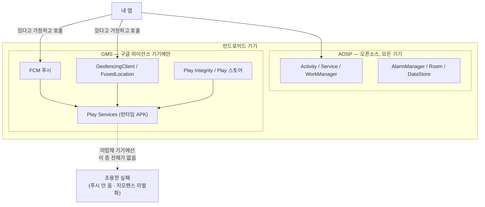
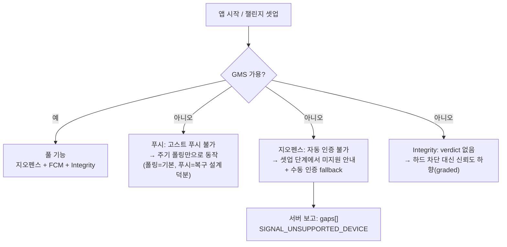

FCM 푸시 인프라를 설계하다가 당연하게 여기던 전제를 다시 보게 됐다. FCM은 "안드로이드 기능"이 아니라 **GMS(Google Mobile Services) 기능**이다. 우리 앱은 이미 지오펜스(`GeofencingClient`)를 쓰고 있고 FCM과 Play Integrity를 추가할 예정인데, 정작 **GMS가 있는 기기인지 확인하는 코드는 한 줄도 없었다.** 국내 타깃이라면 큰 문제가 아닐 수 있지만, 글로벌로 나가는 순간 이 전제는 꽤 자주 무너진다. 이 글은 GMS가 무엇이고, 무엇이 GMS에 묶여 있으며, 어떤 시장에서 왜 확인해야 하는지, 그리고 없을 때 어떻게 대응할지를 정리한다.

## 1. GMS는 안드로이드가 아니다

"안드로이드"라고 부르는 것은 사실 두 층이다.

- **AOSP(Android Open Source Project)** — 오픈소스 OS 본체. 누구나 가져다 기기에 올릴 수 있다. 액티비티, 서비스, WorkManager, Room 같은 것들이 여기 있다.
- **GMS(Google Mobile Services)** — 구글의 **사유(proprietary) 서비스 묶음**. Play 스토어, Play Services(런타임 APK), FCM, 지도, FusedLocation, Play Integrity 등. **구글과 라이선스 계약을 맺고 인증(CTS/GMS 인증)을 통과한 제조사만** 탑재할 수 있다.



중요한 건 GMS 기능 대부분이 앱에 번들되는 라이브러리가 아니라 **기기에 설치된 Play Services APK에 위임하는 얇은 클라이언트**라는 점이다. 그래서 GMS가 없는 기기에서는 컴파일도 설치도 멀쩡히 되고, **런타임에 호출한 기능만 조용히 실패한다.** 크래시라도 나면 알아차릴 텐데, 푸시는 그냥 안 오고 지오펜스는 그냥 발화하지 않는다.

## 2. 무엇이 GMS에 묶여 있나 — 우리 앱 기준

습관 인증 앱([RuleUp-ASM/Android](https://github.com/RuleUp-ASM/Android))의 의존성을 GMS 관점으로 분해해 보면:

| 기능 | 사용 API | GMS 의존 | GMS 없으면 |
|---|---|---|---|
| 지오펜스 인증 (헬스장 체류) | `GeofencingClient` (`play-services-location`) | **예** | 전환 이벤트 자체가 안 옴 → 위치 인증 불가 |
| 푸시 (고스트 푸시·감시자 알림, 예정) | FCM (`firebase-messaging`) | **예** | 서버가 기기를 깨울 수 없음, 알림 미도달 |
| 기기 무결성 (어뷰징 방어, 스펙) | Play Integrity | **예** | verdict 획득 불가 |
| 30분 주기 sync | `WorkManager` | 아니오 (AOSP/Jetpack) | 정상 동작 |
| 인증 신호 버퍼 | `Room` | 아니오 | 정상 동작 |
| 지도 표시 | Kakao Maps SDK | 아니오 (자체 SDK) | 정상 동작 |
| 건강 데이터 | Health Connect | 부분적* | 14+ OS 내장, 이하는 provider 앱 필요 |

*Health Connect는 GMS 자체는 아니지만 provider 설치 경로가 Play 스토어라 GMS 부재 기기에선 사실상 함께 막히는 경우가 많다.

이렇게 표로 만들어 보면 **"코어 기능(수집·동기화·판정)은 AOSP만으로 돌고, 위치 인증·푸시·무결성이 GMS에 걸려 있다"** 는 지형이 드러난다. 이 지형도를 그려보는 것 자체가 GMS 점검의 절반이다.

## 3. 왜 "글로벌"에서 문제가 되나

국내에서 파는 삼성·구글 기기는 전부 GMS 인증 기기라 체감할 일이 없다. 글로벌은 다르다:

- **Huawei (2019~)** — 미국 제재 이후 신규 기기에 GMS를 탑재할 수 없다. 자체 **HMS(Huawei Mobile Services)** + AppGallery 생태계로 대체했다. 유럽·중동·남미에서 여전히 유의미한 점유율.
- **중국 본토** — GMS 탑재 기기여도 구글 서버 접속이 차단되어 **FCM이 사실상 동작하지 않는다.** 중국 시장은 제조사별 푸시(샤오미 Mi Push, 화웨이 HMS Push 등)나 서드파티 통합 푸시가 표준.
- **Amazon Fire OS** — AOSP 기반 포크. Play 스토어 대신 Amazon Appstore, FCM 대신 ADM(Amazon Device Messaging).
- **de-Googled ROM** — GrapheneOS·일부 LineageOS 사용자는 의도적으로 GMS를 제거하거나 샌드박스화한다. 프라이버시 민감 사용자층과 겹친다.
- **신흥 시장 초저가 기기** — GMS 인증을 받지 않은 화이트라벨 AOSP 기기가 유통되는 지역이 있다.

즉 "안드로이드 점유율 = 내 앱이 온전히 동작하는 기기 비율"이 아니다. **타깃 시장에 따라 GMS 커버리지가 몇 %인지가 별도의 변수**이고, 이걸 모른 채 출시하면 특정 국가에서만 "푸시가 안 와요", "위치 인증이 안 돼요" 같은 리뷰가 쌓이는데 개발 환경에선 영원히 재현이 안 된다.

## 4. 확인하고, 우아하게 물러나기

### 4-1. 런타임 가용성 체크

첫걸음은 한 줄이다. GMS 기능을 쓰기 전에 `GoogleApiAvailability` 로 기기 상태를 확인한다:

```kotlin
import com.google.android.gms.common.ConnectionResult
import com.google.android.gms.common.GoogleApiAvailability

/** 이 기기에서 GMS 기능(FCM·지오펜스·Integrity)을 쓸 수 있는가. */
fun Context.isGmsAvailable(): Boolean =
    GoogleApiAvailability.getInstance()
        .isGooglePlayServicesAvailable(this) == ConnectionResult.SUCCESS

// 사용 예: 지오펜스 등록 전 게이트
if (!context.isGmsAvailable()) {
    // 위치 자동 인증 미지원 기기로 마킹하고, 아래 4-2의 폴백 경로로.
    return SetupResult.UnsupportedDevice(reason = "GMS_UNAVAILABLE")
}
```

결과가 `SERVICE_MISSING`(아예 없음)인지 `SERVICE_VERSION_UPDATE_REQUIRED`(업데이트로 복구 가능)인지도 구분된다 — 후자는 `makeGooglePlayServicesAvailable()` 로 사용자에게 업데이트를 유도할 수 있어서, "없음"과 "낡음"을 같은 실패로 뭉개지 않는 게 좋다.

### 4-2. 기능별 강등(degradation) 경로를 설계한다

체크는 시작일 뿐이고, 진짜 설계는 "없을 때 무엇으로 물러나는가"다. 우리 앱의 경우 (의도했든 아니든) 스펙 구조가 강등에 유리하게 짜여 있었다:



- **푸시** — 폴링(기본) + FCM(복구) 이중화 구조라, FCM이 없어도 30분 주기 sync라는 코어는 산다. 잃는 것은 "죽은 클라를 서버가 깨우는 능력"뿐이다. 푸시를 유일한 전달 경로로 설계했다면 여기서 전면 장애가 됐을 것이다.
- **지오펜스** — AOSP에는 대체물이 없다(지오펜싱은 Play Services 기능). 대신 스펙의 **수동 인증 fallback**(자동 불가 시 "수동으로 증명하기" + 방장 승인)이 구제 경로가 된다. 셋업 단계에서 미지원 기기임을 미리 알려 기대치를 조정하는 게 핵심이다.
- **관측** — 전송 스펙의 gap reason에 이미 `SIGNAL_UNSUPPORTED_DEVICE`(기기 capability 영구 부재)가 정의돼 있다. GMS 부재를 이 채널로 보고하면 서버가 "인증 실패"와 "기기가 원래 못 하는 것"을 구분할 수 있고, 운영 입장에선 **시장별 GMS 부재 비율이 데이터로 잡힌다.**
- **더 나가면** — 중국·Huawei 시장이 진짜 타깃이라면 HMS Push/제조사 푸시 어댑터, AppGallery 배포 트랙까지 가야 한다. 이건 "체크"가 아니라 별도의 포팅 프로젝트이므로, 시장 우선순위가 정해진 뒤에 판단할 일이다.

> 최소한의 원칙: **GMS API를 호출하는 모든 지점 앞에 가용성 게이트를 두고, 실패를 침묵이 아니라 보고로 만들 것.** 어느 시장에서 얼마나 강등이 일어나는지 모르면, 대응할지 말지도 결정할 수 없다.
{: .prompt-tip }

## 마무리

- FCM·지오펜스·Play Integrity는 안드로이드 기능이 아니라 **GMS 기능**이고, GMS는 라이선스 기기에만 있다.
- GMS 부재 기기에서 이들은 크래시가 아니라 **조용한 실패**로 나타난다 — 개발 환경에선 재현되지 않는다.
- Huawei·중국 본토·Fire OS·de-Googled ROM 등 **시장별 GMS 커버리지는 별도의 변수**다. 글로벌 출시 전 타깃 시장의 커버리지부터 확인하자.
- 대응은 3단계: **① `GoogleApiAvailability` 게이트 → ② 기능별 강등 경로 설계(코어는 AOSP만으로 돌게) → ③ 부재를 서버에 보고해 데이터화.**

우리 앱의 다음 액션도 명확해졌다 — FCM 인프라 작업에 GMS 가용성 게이트를 함께 넣고, 지오펜스 셋업 플로우에 미지원 기기 분기를 추가하는 것. "글로벌 대응"은 거창한 포팅이 아니라 이 작은 게이트 하나에서 시작한다.

## 참고 자료

- [Google Play services 개요 — Google Developers](https://developers.google.com/android/guides/overview) : GMS/Play Services 구조와 가용성 체크 공식 가이드
- [GoogleApiAvailability 레퍼런스 — Google Developers](https://developers.google.com/android/reference/com/google/android/gms/common/GoogleApiAvailability) : `isGooglePlayServicesAvailable` / `makeGooglePlayServicesAvailable`
- [Android에서 FCM 메시지 수신 — Firebase](https://firebase.google.com/docs/cloud-messaging/android/receive)
- [Health Connect 가이드 — Android Developers](https://developer.android.com/health-and-fitness/guides/health-connect) : provider 가용성(getSdkStatus) 분기
