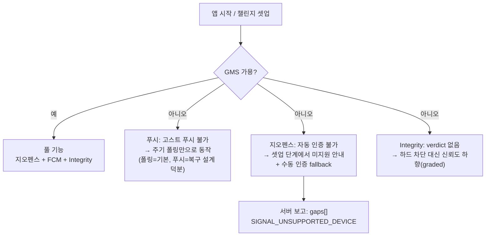

FCM 푸시 인프라를 설계하다가 당연하게 여기던 전제를 다시 보게 됐다. FCM은 안드로이드 기능이 아니라 GMS(Google Mobile Services) 기능이다. 우리 앱은 이미 지오펜스를 쓰고 있고 FCM과 Play Integrity를 추가할 예정인데, GMS가 있는 기기인지 확인하는 코드는 한 줄도 없었다. 국내 타깃이라면 큰 문제가 아닐 수 있지만 글로벌로 나가는 순간 이 전제는 꽤 자주 무너진다. 이 글은 GMS가 무엇이고 무엇이 GMS에 묶여 있으며, 어떤 시장에서 왜 확인해야 하는지, 없을 때 어떻게 대응할지를 정리한다.

## 1. GMS는 안드로이드가 아니다

"안드로이드"라고 부르는 것은 사실 두 층이다.

- AOSP(Android Open Source Project)는 오픈소스 OS 본체다. 누구나 가져다 기기에 올릴 수 있다. 액티비티, 서비스, WorkManager, Room 같은 것들이 여기 있다.
- GMS(Google Mobile Services)는 구글의 사유 서비스 묶음이다. Play 스토어, Play Services 런타임 APK, FCM, 지도, FusedLocation, Play Integrity 같은 것들이다. 구글과 라이선스 계약을 맺고 인증을 통과한 제조사만 탑재할 수 있다.

<iframe src="/assets/diagrams/2026-07-14-android-gms-global-service.html"
        title="기기에 따라 사라지는 서비스 층 구조 다이어그램"
        loading="lazy" width="100%" height="640"
        style="border:1px solid var(--main-border-color); border-radius:6px;"></iframe>

> 잘려 보이면 [전체 화면으로 열기](/assets/diagrams/2026-07-14-android-gms-global-service.html).
{: .prompt-tip }

GMS 기능 대부분은 앱에 번들되는 라이브러리가 아니라, 기기에 설치된 Play Services APK로 넘기는 얇은 클라이언트다. 그래서 GMS가 없는 기기에서도 컴파일과 설치는 멀쩡히 되고, 런타임에 호출한 기능만 조용히 실패한다. 크래시라도 나면 알아차릴 텐데 푸시는 그냥 안 오고 지오펜스는 그냥 발화하지 않는다.

## 2. 무엇이 GMS에 묶여 있나

습관 인증 앱([RuleUp-ASM/Android](https://github.com/RuleUp-ASM/Android))의 의존성을 GMS 관점으로 분해해 보면 이렇다.

| 기능 | 사용 API | GMS 의존 | GMS 없으면 |
|---|---|---|---|
| 지오펜스 인증 (헬스장 체류) | `GeofencingClient` (`play-services-location`) | 예 | 전환 이벤트가 오지 않아 위치 인증 불가 |
| 푸시 (고스트 푸시, 감시자 알림, 예정) | FCM (`firebase-messaging`) | 예 | 서버가 기기를 깨울 수 없고 알림이 도달하지 않음 |
| 기기 무결성 (어뷰징 방어, 스펙) | Play Integrity | 예 | verdict 획득 불가 |
| 30분 주기 sync | `WorkManager` | 아니오 (AOSP/Jetpack) | 정상 동작 |
| 인증 신호 버퍼 | `Room` | 아니오 | 정상 동작 |
| 지도 표시 | Kakao Maps SDK | 아니오 (자체 SDK) | 정상 동작 |
| 건강 데이터 | Health Connect | 부분적* | 14+ OS 내장, 이하는 provider 앱 필요 |

*Health Connect는 GMS 자체는 아니지만 provider 설치 경로가 Play 스토어라 GMS 부재 기기에선 사실상 함께 막히는 경우가 많다.

표로 만들어 보면 지형이 드러난다. 수집과 동기화, 판정 같은 코어 기능은 AOSP만으로 돌고 위치 인증과 푸시, 무결성이 GMS에 걸려 있다. 이 지형도를 그려보는 것 자체가 GMS 점검의 절반이다.

## 3. 왜 "글로벌"에서 문제가 되나

국내에서 파는 삼성과 구글 기기는 전부 GMS 인증 기기라 체감할 일이 없다. 글로벌은 다르다.

- Huawei는 2019년 미국 제재 이후 신규 기기에 GMS를 탑재할 수 없다. 자체 HMS와 AppGallery 생태계로 대체했고, 유럽과 중동, 남미에서 여전히 의미 있는 점유율을 갖는다.
- 중국 본토는 GMS 탑재 기기여도 구글 서버 접속이 막혀 FCM이 사실상 동작하지 않는다. 제조사별 푸시나 서드파티 통합 푸시가 표준이다.
- Amazon Fire OS는 AOSP 기반 포크다. Play 스토어 대신 Amazon Appstore, FCM 대신 ADM을 쓴다.
- GrapheneOS나 일부 LineageOS 사용자는 의도적으로 GMS를 제거하거나 샌드박스에 가둔다. 프라이버시에 민감한 사용자층과 겹친다.
- 신흥 시장에는 GMS 인증을 받지 않은 화이트라벨 AOSP 기기가 유통되는 지역이 있다.

안드로이드 점유율이 곧 내 앱이 온전히 동작하는 기기 비율은 아니다. 타깃 시장에 따라 GMS 커버리지가 몇 퍼센트인지가 별도의 변수다. 이걸 모른 채 출시하면 특정 국가에서만 푸시가 안 온다거나 위치 인증이 안 된다는 리뷰가 쌓이는데, 개발 환경에서는 영원히 재현되지 않는다.

## 4. 확인하고, 우아하게 물러나기

### 4-1. 런타임 가용성 체크

첫걸음은 한 줄이다. GMS 기능을 쓰기 전에 `GoogleApiAvailability` 로 기기 상태를 확인한다.

```kotlin
import com.google.android.gms.common.ConnectionResult
import com.google.android.gms.common.GoogleApiAvailability

/** 이 기기에서 GMS 기능(FCM·지오펜스·Integrity)을 쓸 수 있는가. */
fun Context.isGmsAvailable(): Boolean =
    GoogleApiAvailability.getInstance()
        .isGooglePlayServicesAvailable(this) == ConnectionResult.SUCCESS

// 사용 예: 지오펜스 등록 전 게이트
if (!context.isGmsAvailable()) {
    // 위치 자동 인증 미지원 기기로 마킹하고, 아래 4-2의 폴백 경로로.
    return SetupResult.UnsupportedDevice(reason = "GMS_UNAVAILABLE")
}
```

결과가 `SERVICE_MISSING` 인지 `SERVICE_VERSION_UPDATE_REQUIRED` 인지도 구분된다. 후자는 `makeGooglePlayServicesAvailable()` 로 사용자에게 업데이트를 유도할 수 있으므로, 없음과 낡음을 같은 실패로 뭉개지 않는 편이 좋다.

### 4-2. 기능별 강등(degradation) 경로를 설계한다

체크는 시작일 뿐이고, 설계의 본론은 없을 때 무엇으로 물러나는가다. 우리 앱은 스펙 구조가 강등에 유리하게 짜여 있었다.


```mermaid
flowchart TD
    S[앱 시작 / 챌린지 셋업] --> C{GMS 가용?}
    C -- "예" --> FULL["풀 기능<br/>지오펜스 + FCM + Integrity"]
    C -- "아니오" --> D1["푸시: 고스트 푸시 불가<br/>→ 주기 폴링만으로 동작<br/>(폴링=기본, 푸시=복구 설계 덕분)"]
    C -- "아니오" --> D2["지오펜스: 자동 인증 불가<br/>→ 셋업 단계에서 미지원 안내<br/>+ 수동 인증 fallback"]
    C -- "아니오" --> D3["Integrity: verdict 없음<br/>→ 하드 차단 대신 신뢰도 하향(graded)"]
    D2 --> R["서버 보고: gaps[]<br/>SIGNAL_UNSUPPORTED_DEVICE"]
```

- 푸시는 폴링이 기본이고 FCM이 복구인 이중화 구조라, FCM이 없어도 30분 주기 sync라는 코어는 산다. 잃는 것은 죽은 클라를 서버가 깨우는 능력뿐이다. 푸시를 유일한 전달 경로로 설계했다면 여기서 전면 장애가 됐을 것이다.
- 지오펜스는 AOSP에 대체물이 없다. 대신 스펙의 수동 인증 경로가 구제책이 된다. 자동 인증이 불가능할 때 직접 증명하고 방장이 승인한다. 셋업 단계에서 미지원 기기임을 미리 알려 기대치를 조정하는 것이 중요하다.
- 관측 쪽은 전송 스펙의 gap reason에 `SIGNAL_UNSUPPORTED_DEVICE` 가 이미 정의돼 있다. GMS 부재를 이 채널로 보고하면 서버가 인증 실패와 기기가 원래 못 하는 것을 구분할 수 있고, 운영 입장에서는 시장별 부재 비율이 데이터로 잡힌다.
- 더 나가면, 중국이나 Huawei 시장이 진짜 타깃일 때는 제조사 푸시 어댑터와 AppGallery 배포 트랙까지 가야 한다. 이건 체크가 아니라 별도의 포팅 프로젝트라 시장 우선순위가 정해진 뒤에 판단할 일이다.

> 최소한의 원칙은 이렇다. GMS API를 호출하는 모든 지점 앞에 가용성 게이트를 두고, 실패를 침묵 대신 보고로 만든다. 어느 시장에서 얼마나 강등이 일어나는지 모르면 대응할지 말지도 결정할 수 없다.
{: .prompt-tip }

## 마무리

- FCM과 지오펜스, Play Integrity는 안드로이드 기능이 아니라 GMS 기능이고, GMS는 라이선스 기기에만 있다.
- GMS가 없는 기기에서 이들은 크래시가 아니라 조용한 실패로 나타나고, 개발 환경에서는 재현되지 않는다.
- 시장별 GMS 커버리지는 별도의 변수다. 글로벌 출시 전에 타깃 시장의 커버리지부터 확인하자.
- 대응은 세 단계다. `GoogleApiAvailability` 로 게이트를 두고, 기능별 강등 경로를 설계해 코어는 AOSP만으로 돌게 하고, 부재를 서버에 보고해 데이터로 만든다.

우리 앱의 다음 할 일도 정해졌다. FCM 인프라 작업에 가용성 게이트를 함께 넣고, 지오펜스 셋업 흐름에 미지원 기기 분기를 추가하는 것이다. 글로벌 대응은 거창한 포팅이 아니라 이 작은 게이트 하나에서 시작한다.

## 참고 자료

- [Google Play services 개요](https://developers.google.com/android/guides/overview) : GMS와 Play Services 구조, 가용성 체크 공식 가이드
- [GoogleApiAvailability 레퍼런스](https://developers.google.com/android/reference/com/google/android/gms/common/GoogleApiAvailability) : `isGooglePlayServicesAvailable` 과 `makeGooglePlayServicesAvailable`
- [Android에서 FCM 메시지 수신](https://firebase.google.com/docs/cloud-messaging/android/receive)
- [Health Connect 가이드](https://developer.android.com/health-and-fitness/guides/health-connect) : provider 가용성 분기
