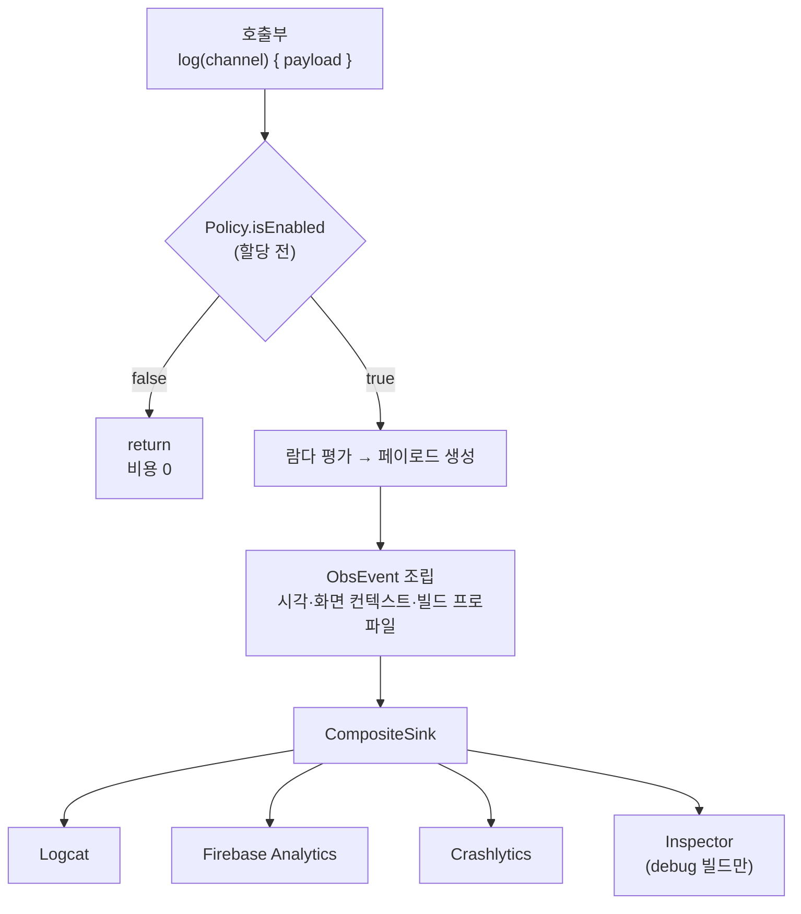

앱에 `Timber`, `AnalyticsLogger`, `CrashReporter` 세 개의 로그 출구가 있었다. 각각 게이트도 포맷도 달라서 *"이 로그가 왜 안 찍히지"* 에 답할 방법이 없었고, 성능 지표는 아예 없었다. 이걸 관측 파이프라인 하나로 합치면서 배운 것을 정리한다. 핵심은 하나다 — **게이트를 어디에 두느냐가 성능과 추적성을 동시에 결정한다.** 작업한 코드는 [RuleUp-ASM/Android](https://github.com/RuleUp-ASM/Android) 에 있다.

## 출구가 셋이면 생기는 일

출구가 갈라져 있을 때 진짜 문제는 코드 중복이 아니다. **"안 찍힌다"의 원인을 좁힐 수 없다는 것**이다.

로그가 안 보일 때 후보는 최소 넷이다. 호출부가 아예 없거나, 레벨 필터에 걸렸거나, 그 출구가 이 빌드에 배선되지 않았거나, 백엔드 전송이 실패했거나. 출구가 셋이면 이 넷을 각각 세 번 확인해야 한다. 그러다 보면 결국 아무도 확인하지 않고 `Log.d` 를 하나 더 박는다.

그래서 진입점을 **둘**로 줄였다.

```kotlin
// 진단 텍스트
observability.log(Severity.WARN, tag = "HttpClient") { "재시도 $attempt 회차 실패" }

// 구조화 페이로드 (비즈니스·성능 채널)
observability.log(Channel.BUSINESS) {
    BusinessPayload.ScreenView(screen = screen, referrer = referrer)
}
```

## 게이트는 페이로드가 만들어지기 **전에** 돌아야 한다

로깅 파사드에서 가장 흔한 실수는 이 순서다.

```kotlin
// 이렇게 하면 버려질 이벤트도 비용을 다 치른다
fun log(payload: ObsPayload) {
    if (!policy.isEnabled(payload.channel, payload.severity, payload.tag)) return
    sink.emit(...)
}
```

게이트가 `payload` 를 인자로 받는 순간, **판단하기 전에 페이로드가 이미 만들어져 있다.** 문자열 연결, 데이터 클래스 할당, 속성 맵 구성이 전부 끝난 뒤에 버린다. 스크롤 중 `UserAction` 이나 프레임 콜백에서 오는 성능 이벤트처럼 초당 수십 번 도는 경로에서는 이게 그대로 GC 압력이 된다.

그래서 페이로드를 **람다로** 받고, 함수를 `inline` 으로 선언했다.

```kotlin
inline fun log(
    channel: Channel,
    severity: Severity = Severity.INFO,
    tag: String? = null,
    payload: () -> ObsPayload,
) {
    if (!policy.isEnabled(channel, severity, tag)) return
    val built = payload()
    checkGateConsistency(channel, severity, tag, built)
    logInternal(built)
}
```

`inline` 이라 람다 객체 자체도 할당되지 않는다([Kotlin 공식 문서](https://kotlinlang.org/docs/inline-functions.html)). 게이트에 걸리면 `isEnabled` 호출과 `return` 이 전부다.

대신 대가가 있다. 게이트 인자(`channel`, `severity`, `tag`)를 페이로드보다 먼저 받아야 하므로, **람다가 만드는 값과 어긋날 수 있다.** 채널이 어긋나면 게이트는 A 기준으로 통과시키고 기록은 B 로 남아서, 정확히 이 글의 첫 문제로 되돌아간다. 그래서 개발·QA 빌드에서만 도는 검사를 뒀다.

```kotlin
@PublishedApi
internal fun checkGateConsistency(channel: Channel, severity: Severity, tag: String?, payload: ObsPayload) {
    if (profile == BuildProfile.PRODUCTION) return
    require(payload.channel == channel && payload.severity == severity && payload.tag == tag) {
        "게이트는 $channel/$severity/$tag 로 판단했는데 페이로드는 " +
            "${payload.channel}/${payload.severity}/${payload.tag} 다."
    }
}
```

> `inline` 함수가 접근하는 `internal` 멤버에는 `@PublishedApi` 가 필요하다. 인라이닝된 코드가 모듈 밖 호출부에 복사되기 때문이다.
{: .prompt-info }

## 전체 흐름



도메인이 아는 출구는 `Sink` **하나**다. 여러 백엔드로 나눠 보내는 것도, 하나가 실패해도 나머지를 살리는 것도 전부 배선의 관심사다.

## 채널별 floor 를 독립시키지 않으면 분석이 통째로 사라진다

이건 설계 중에 발견한 함정이다. 프로덕션에서 로그 레벨 하한(floor)을 `WARN` 으로 올리는 건 흔한 설정이다. 그런데 게이트가 채널을 구분하지 않으면 어떻게 되는가?

비즈니스·성능 페이로드는 심각도 개념이 없어서 전부 `INFO` 다. 그래서 **`WARN` floor 하나로 화면 조회·전환 시간·jank 지표가 통째로 죽는다.** "프로덕션 로그를 줄였더니 대시보드가 비었다"가 되는 것이다.

그래서 floor 를 채널별로 독립시키고, 설정에 없는 채널은 제한 없음으로 본다. 새 채널이 조용히 죽는 것보다 새는 편이 낫다.

```kotlin
override fun isEnabled(channel: Channel, severity: Severity, tag: String?): Boolean {
    val config = snapshot.get()   // 불변 스냅샷을 지역변수로 한 번만 읽는다
    if (channel in config.disabledChannels) return false
    val floor = tag?.let { config.tagOverrides[it] }
        ?: config.channelFloors[channel]
        ?: Severity.VERBOSE
    return severity atLeast floor
}
```

스냅샷을 지역변수로 **한 번만** 읽는 것도 의도적이다. 여러 번 읽으면 판단 도중 설정이 교체되어 존재한 적 없는 조합으로 판정할 수 있고, 인스펙터가 보여주는 설정과도 갈라진다. 설정 갱신은 `AtomicReference` 참조 교체라 읽기 경로에 락이 없다.

## 도메인에 try/catch 를 하나도 두지 않았다

"로깅이 앱을 죽이면 안 된다"는 명제는 맞다. 문제는 그걸 **어디서** 보장하느냐다.

파사드에서 전부 감싸고 싶은 충동이 들지만, `Sink.emit` 은 논블로킹이다. 즉 **진짜 실패(업로드·쿼터·재시도)는 비동기로 일어나 호출자에게 도달조차 하지 않는다.** 파사드의 try/catch 는 잡지도 못하는 걸 잡는 시늉만 하면서 도메인에 인프라 정책을 끌어들인다.

그래서 모든 포트에 "던지지 않는다"를 계약으로 못박고, 격리는 실제로 볼 수 있는 곳 — 합성 싱크 — 에 뒀다.

```kotlin
private inline fun forEachChild(action: (Sink) -> Unit) {
    var failure: Throwable? = null
    for (index in children.indices) {
        try { action(children[index]) }
        catch (t: Throwable) {
            if (t is CancellationException) throw t   // 코루틴 취소는 흐름 제어다
            if (t is VirtualMachineError) throw t     // OOM 을 삼키면 안 된다
            report(children[index], t)
            if (failure == null) failure = t
        }
    }
    // 프로덕션은 삼키고, DEV/QA 는 다시 던져 계약 위반을 즉시 드러낸다
    if (profile != BuildProfile.PRODUCTION) failure?.let { throw it }
}
```

`CancellationException` 을 통과시키는 건 중요하다. 코루틴에서 취소는 예외 얼굴을 한 흐름 제어라, 삼키면 취소가 전파되지 않는다.

## 에뮬레이터에 올리기 전엔 몰랐던 것들

빌드가 통과하고 테스트가 초록이어도 못 잡는 종류가 있었다.

**jank 측정 창이 214초로 찍혔다.** 5초 단위로 프레임을 모아 p95 를 내는 코드였는데, 프레임 콜백은 **화면이 그려질 때만 온다.** 사용자가 화면을 보고만 있으면 콜백이 멈추고, 다시 움직이는 순간 이전 창이 그대로 이어져 창 길이가 부풀었다. 1초 이상 간격이 벌어지면 창을 끊도록 고쳤다. 참고로 안드로이드는 700ms 이상 걸린 프레임을 [frozen frame](https://developer.android.com/topic/performance/vitals/render) 으로 따로 집계한다 — 창 길이가 부풀면 이 구분이 무의미해진다.

**앱이 시작하자마자 `lateinit property observability has not been initialized` 로 죽었다.** `MainActivity.onCreate` 에서 딥링크를 파싱하며 로그를 남겼는데, 그 호출이 `super.onCreate()` 보다 **위에** 있었다. Hilt 주입은 `super.onCreate()` 안에서 일어난다. 순서만 바꾸면 되는 문제지만, 정적 분석으로는 절대 안 잡힌다.

> 관측 코드는 "앱을 죽이지 않는 것"이 존재 이유의 절반이다. 그런데 그 코드가 앱을 죽였다. 반드시 실기기·에뮬레이터에서 한 번은 돌려봐야 한다.
{: .prompt-warning }

## 가장 많이 한 일은 지우는 일이었다

설계 초안에는 이런 것들이 있었다. `Decision`(수용/억제/폐기 3분기), `EventSchema`(이벤트 스키마 검증), `Sanitizer`(PII 마스킹), `DedupSink`(중복 제거), `EventId`/`SessionId`.

전부 지웠다. 이유는 하나씩 달랐다.

- **`EventSchema`** — 페이로드 팩토리의 시그니처가 이미 스키마다. 타입 시스템이 하는 일을 런타임에 한 번 더 하는 셈이었다.
- **`Decision`** — 수용과 억제가 결국 같은 동작(내보낸다)이었다. 분기가 이름만 셋이었다.
- **`Sanitizer`** — 키 이름에 `lat` 이 들어가면 좌표로 보고 지우는 규칙이었는데, `latency`·`p95_latency`·`platform`·`latest`·`translate` 가 전부 조용히 사라졌다. **관측 도구가 관측값을 지우고 있었다.**
- **`DedupSink`** — 같은 이벤트라도 원인과 결과가 다르다. 합치면 정보가 준다.

기준은 단순했다. **지금 소비자가 없는 추상화는 넣지 않는다.** 나중에 필요하면 그때 넣는 게, 반쯤 맞는 추상화를 우회하며 사는 것보다 싸다.

## 정리

- 게이트는 **페이로드 생성 전**에. `inline` + 람다면 버려질 이벤트의 비용이 0 이 된다. 대신 게이트 인자와 페이로드가 어긋날 수 있으니 개발 빌드에서 검사한다.
- **floor 는 채널별로 독립**시킨다. 안 그러면 진단 로그를 줄이는 설정 하나가 분석 지표를 통째로 지운다.
- try/catch 는 **실패를 실제로 볼 수 있는 곳**에 둔다. 도메인 파사드는 그 자리가 아니다.
- 소비자 없는 추상화는 지운다. 특히 관측 도구에서 "똑똑한" 필터링은 관측값을 지우는 방향으로 실패한다.

Firebase 전송 경로 검증과 인스펙터 모듈 테스트는 아직 남아 있다. 이건 다음 글로.

## 참고 자료

- [Inline functions — Kotlin Documentation](https://kotlinlang.org/docs/inline-functions.html)
- [Slow rendering — Android Developers](https://developer.android.com/topic/performance/vitals/render) (slow frame / frozen frame 기준)
- [JankStats Library — Android Developers](https://developer.android.com/topic/performance/jankstats)
- [Multibindings — Dagger](https://dagger.dev/dev-guide/multibindings) (`@IntoSet` 으로 싱크 체인 조립)
- [Customize your Crashlytics crash reports — Firebase](https://firebase.google.com/docs/crashlytics/customize-crash-reports?platform=android) (`recordException` 비치명적 예외 기록)
- 관련 PR: [RuleUp-ASM/Android#159](https://github.com/RuleUp-ASM/Android/pull/159)
