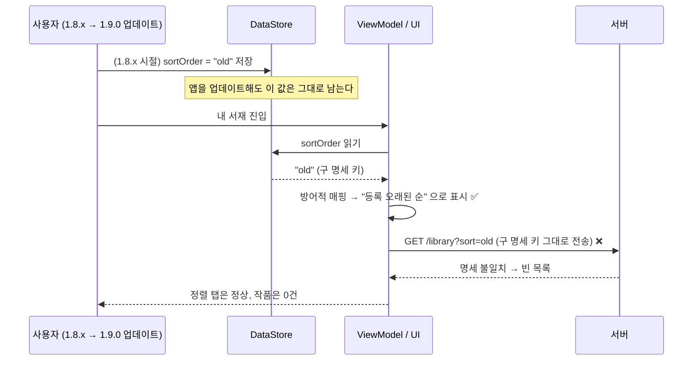
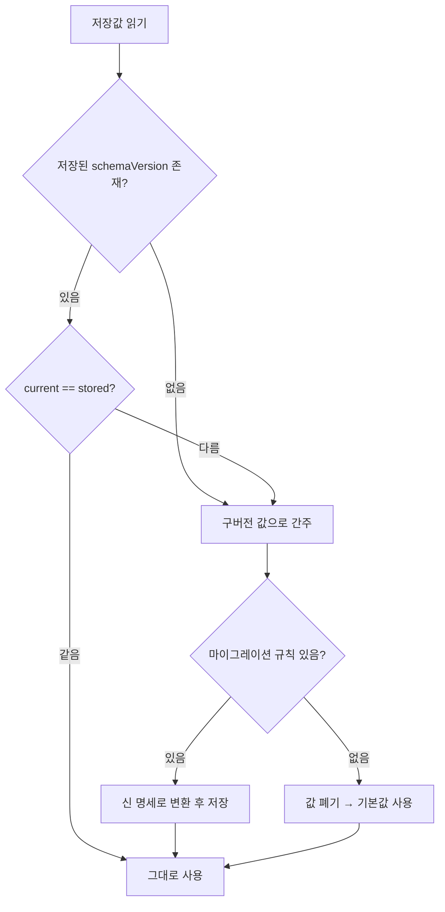

캐시 관련 작업을 끝내고, 로컬에서도 QA에서도 이상 없는 걸 확인하고 1.9.0 을 배포했다. 그런데 배포 직후부터 **"내 서재에 작품이 안 보인다"** 는 제보가 들어왔다. 원인은 새로 짠 캐시 코드가 아니라, **앱이 예전 버전에 저장해둔 값 하나**였다. 이 글은 그 사고의 원인과 임시 조치, 그리고 "영속 데이터에는 버전을 같이 적어야 한다"는 결론까지의 기록이다.

## 무슨 일이 있었나

정렬 기준은 사용자가 앱을 껐다 켜도 유지돼야 하는 값이라, [Preferences DataStore](https://developer.android.com/topic/libraries/architecture/datastore) 에 저장하고 있었다. 기존 명세는 `recent`, `old` 두 개였다.

1.9.0 에서 정렬 타입 명세가 바뀌었다. 그런데 **이미 설치된 기기의 DataStore 에는 구 버전 키(`old`)가 그대로 남아 있었고**, 앱은 그 값을 읽어 그대로 서버에 실어 보냈다. 서버는 신 명세에 없는 정렬 키를 받았고, 적재된 컬럼 값이 명세와 맞지 않아 목록 응답이 정상적으로 내려오지 않았다.

더 고약한 건 화면이었다. UI 레이어에는 방어적 코딩이 들어가 있어서, 알 수 없는 값이 오면 `old` 를 "등록 오래된 순"으로 매핑해 정렬 상태를 그려줬다. **화면상으로는 아무 문제가 없어 보였다.** 실제로 실패한 건 네트워크 요청 쪽이었는데, 그 실패는 조용히 빈 목록으로 흘러들어왔다.



> 신규 설치 기기에는 저장된 값이 없어서 기본값이 들어간다. 그래서 **개발·QA 환경에서는 절대 재현되지 않았다.** "업데이트 설치" 경로를 테스트하지 않으면 이 클래스의 버그는 배포 직후에만 모습을 드러낸다.
{: .prompt-warning }

## 진짜 원인은 캐시가 아니라 "코드보다 오래 사는 데이터"

이번 사고의 교훈을 한 줄로 줄이면 이렇다.

> **코드는 배포하면 전부 교체되지만, 저장된 데이터는 교체되지 않는다.**

앱 코드는 업데이트되는 순간 100% 신 버전이다. 하지만 DataStore, SharedPreferences, Room, 파일 캐시에 들어 있는 값은 **몇 년 전 버전의 앱이 쓴 그대로** 남아 있다. 즉 영속 저장소는 언제나 "여러 버전의 앱이 남긴 값이 섞여 있는 공간"이고, 새 코드는 그 값을 **신뢰할 수 없는 외부 입력**으로 다뤄야 한다.

나는 정렬 키를 그냥 내부 값처럼 취급했다. 명세를 바꾸면서 코드 안의 `enum` 만 바꿨고, 이미 디스크에 적힌 문자열은 손대지 않았다.

## 방어적 코딩이 오히려 사고를 키웠다

가장 뼈아팠던 지점이다. UI 에는 fallback 이 있었다.

```kotlin
// UI 레이어: 모르는 값이 와도 화면은 그린다 — 문제를 "숨기는" 방어
fun String.toSortLabel(): SortLabel = when (this) {
    "recent" -> SortLabel.RECENT
    "old"    -> SortLabel.OLDEST      // 구 키를 그대로 받아준다
    else     -> SortLabel.RECENT      // 알 수 없으면 기본값
}
```

이 코드 덕분에 크래시는 나지 않았다. 대신 **증상이 사라졌다.** 화면은 "등록 오래된 순"이라고 멀쩡히 표시되는데 목록만 비어 있으니, 사용자도 나도 원인을 정렬 키로 의심하지 못했다.

방어적 코딩 자체가 나쁜 게 아니다. 문제는 **방어를 UI 경계에만 두고, 네트워크 경계에는 두지 않았다**는 것이다. 값이 바깥으로 나가는 지점(= API 요청)에는 방어가 아니라 **변환 또는 실패**가 있어야 했다.

- UI 경계의 fallback → 사용자에게 화면은 보여준다 (관대하게)
- 네트워크 경계 → 신 명세로 **매핑**하거나, 매핑 불가면 **기본값으로 강제**한다 (엄격하게)

## 조치 1 — 급한 불: 서버 쪽 명세를 임시로 맞췄다

핫픽스는 구 키를 서버에서 임시로 받아주는 방향으로 진행했다. 앱 배포는 심사 + 사용자 업데이트까지 시간이 걸리지만, 서버는 즉시 반영되기 때문이다. 장애 대응으로는 맞는 선택이었다고 생각한다.

다만 이건 명백히 부채다. 서버에 구 명세가 남는 순간 "언제 지워도 되는가"가 영원히 애매해진다. 그래서 임시 조치를 넣을 때 **제거 조건**을 같이 적어두는 게 중요하다. (예: *구 키 요청 비율이 0.1% 미만으로 떨어지고 최소 지원 버전이 1.9.0 이상이 되면 제거*)

## 조치 2 — 제대로 된 해법: 나가기 전에 매핑한다

앱 쪽 정공법은 **저장값을 읽은 직후, API 로 나가기 전에 신 키로 변환**하는 것이다.

```kotlin
enum class SortType(val apiKey: String) {
    LATEST("latest"),
    OLDEST("oldest");

    companion object {
        // 구 명세 키 → 신 명세 키. 저장소에서 읽은 값은 전부 이 문을 통과한다.
        private val LEGACY = mapOf(
            "recent" to LATEST,
            "old" to OLDEST,
        )

        fun fromStored(raw: String?): SortType =
            entries.firstOrNull { it.apiKey == raw }
                ?: LEGACY[raw]
                ?: LATEST // 알 수 없는 값은 기본값으로 강제
    }
}
```

`entries` 는 Kotlin 1.9 부터 쓸 수 있는 [enum 항목 목록](https://kotlinlang.org/docs/enum-classes.html) 접근 방식이다. 핵심은 **저장소에서 읽은 문자열이 그대로 API 요청에 흘러가는 경로를 없애는 것**이다.

## 앞으로는 — 저장할 때 스키마 버전을 같이 적는다

이번 일을 겪고 내린 결론은 이거다. **DataStore든 SharedPreferences든 로컬 DB든, 값만 저장하지 말고 "그 값을 쓴 스키마 버전"을 같이 저장하자.** 읽을 때 버전이 다르면 마이그레이션하거나, 마이그레이션 규칙이 없으면 **과감히 버리고 기본값을 쓴다.**



DataStore 에는 이걸 위한 공식 훅이 있다. `DataStore` 를 만들 때 `migrations` 에 [`DataMigration`](https://developer.android.com/reference/kotlin/androidx/datastore/core/DataMigration) 을 넘기면, **첫 read/write 이전에 반드시 한 번 실행**된다. 읽는 쪽마다 방어 코드를 흩뿌리는 것보다 훨씬 안전하다.

```kotlin
private val SORT_ORDER = stringPreferencesKey("sort_order")
private val SCHEMA_VERSION = intPreferencesKey("schema_version")
private const val CURRENT_SCHEMA = 2 // 정렬 명세가 바뀔 때마다 올린다

private val sortMigration = object : DataMigration<Preferences> {

    override suspend fun shouldMigrate(currentData: Preferences): Boolean =
        currentData[SCHEMA_VERSION] != CURRENT_SCHEMA

    override suspend fun migrate(currentData: Preferences): Preferences =
        currentData.toMutablePreferences().apply {
            val stored = currentData[SORT_ORDER]
            // 규칙이 있으면 변환, 없으면 키 자체를 지워 기본값을 쓰게 한다
            when (stored) {
                "recent" -> this[SORT_ORDER] = SortType.LATEST.apiKey
                "old"    -> this[SORT_ORDER] = SortType.OLDEST.apiKey
                null     -> Unit
                else     -> remove(SORT_ORDER)
            }
            this[SCHEMA_VERSION] = CURRENT_SCHEMA
        }

    override suspend fun cleanUp() = Unit
}

val Context.settings: DataStore<Preferences> by preferencesDataStore(
    name = "settings",
    produceMigrations = { listOf(sortMigration) },
)
```

앱 `versionCode` 를 그대로 넣어도 되지만, 나는 **데이터 스키마 전용 버전**을 따로 두는 쪽을 권한다. 앱 버전은 데이터와 무관하게 매 릴리스마다 올라가서, 매번 마이그레이션이 도는 낭비가 생기기 때문이다. 앱 버전은 [versionCode / versionName 문서](https://developer.android.com/studio/publish/versioning) 대로 릴리스 식별에 쓰고, 저장소는 자기 스키마 번호를 따로 관리하면 된다.

Room 이 이미 이 모델을 쓰고 있다는 점도 참고할 만하다. `@Database(version = ...)` 를 올리고 [Migration](https://developer.android.com/training/data-storage/room/migrating-db-versions) 을 주지 않으면 앱이 **바로 크래시**한다. 조용히 잘못된 값을 흘려보내는 것보다, 개발자가 마이그레이션을 강제로 인지하게 만드는 설계다. Key-Value 저장소에는 그런 강제가 없으니, 규율은 내가 만들어야 한다.

> `SharedPreferences` 에서 넘어오는 경우라면 [`SharedPreferencesMigration`](https://developer.android.com/reference/kotlin/androidx/datastore/migrations/SharedPreferencesMigration) 이 이미 준비돼 있다. 직접 읽어 옮기지 말 것.
{: .prompt-tip }

## 정리 — 다음부터 지킬 것

1. **영속 저장소의 값은 외부 입력이다.** 파싱하고 검증한 뒤에 쓴다.
2. **저장할 때 스키마 버전을 같이 저장한다.** 버전이 다르면 마이그레이션하거나 버린다.
3. **명세를 바꿀 때는 "이미 저장된 값"을 체크리스트에 올린다.** enum 만 바꾸고 끝내지 않는다.
4. **방어적 코딩은 사용자에게 보이는 경계에만.** 값이 시스템 밖으로 나가는 경계에서는 매핑하거나 실패시킨다.
5. **QA 시나리오에 "이전 버전에서 업데이트" 경로를 넣는다.** 신규 설치만 테스트하면 이 버그는 100% 놓친다.
6. **임시 조치에는 제거 조건을 같이 적는다.**
7. 위험한 명세 변경은 [단계적 출시](https://support.google.com/googleplay/android-developer/answer/6346149)로 노출 범위를 먼저 좁힌다.

캐시를 새로 만드는 작업이었는데 정작 발목을 잡은 건 **몇 달 전 버전이 남긴 문자열 하나**였다. 앞으로 로컬에 뭔가를 저장할 일이 있으면, 값보다 먼저 버전을 어디에 적을지부터 정하려고 한다.

## 참고 자료

- [DataStore — App Architecture (Android Developers)](https://developer.android.com/topic/libraries/architecture/datastore)
- [`DataMigration` API 레퍼런스](https://developer.android.com/reference/kotlin/androidx/datastore/core/DataMigration)
- [`SharedPreferencesMigration` API 레퍼런스](https://developer.android.com/reference/kotlin/androidx/datastore/migrations/SharedPreferencesMigration)
- [Room 데이터베이스 마이그레이션](https://developer.android.com/training/data-storage/room/migrating-db-versions)
- [앱 버전 지정 (versionCode / versionName)](https://developer.android.com/studio/publish/versioning)
- [Google Play 단계적 출시](https://support.google.com/googleplay/android-developer/answer/6346149)
- [Kotlin — Enum classes](https://kotlinlang.org/docs/enum-classes.html)
- 관련 글: [온보딩에서 유저 정보와 버전 체크가 꼭 필요한 이유]()
