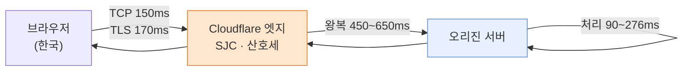
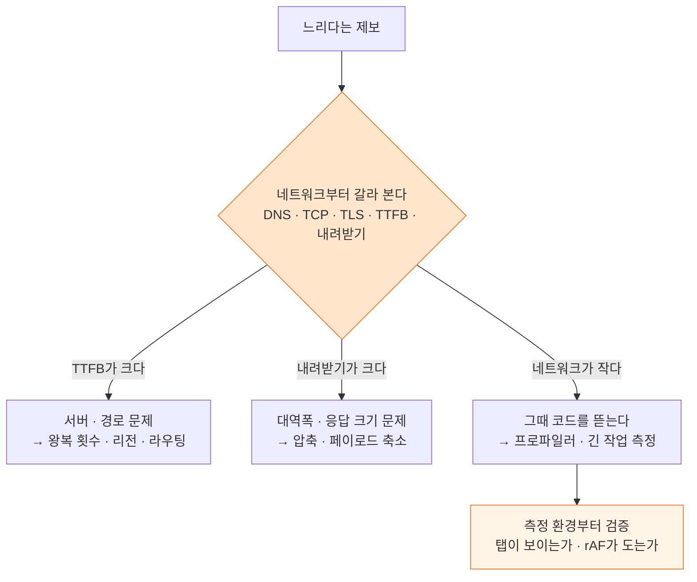

점자 점역 데스크톱 앱에 "무거운 PDF를 넣으면 렉이 걸린다"는 제보가 들어왔다. 나는 곧장 코드를 뜯었고, 실제로 병목을 두 개 찾아 고쳤다. 조작 한 번에 200ms씩 멈추던 것이 0ms가 됐다. 그런데 사용자가 체감하는 가장 큰 대기 — **파일 하나 여는 데 5~10초** — 는 그대로였다. 마지막에 TTFB를 계층별로 갈라 보고서야 알았다. 그 10초 중 코드가 쓴 시간은 거의 없었다.

이 글은 그 과정에서 **내가 틀렸던 지점까지 포함해** 정리한다. 결론부터 말하면 순서가 잘못됐었다. 느릴 때는 코드를 뜯기 전에 네트워크를 먼저 갈라야 한다.

작업한 코드는 [Semojum/FE](https://github.com/Semojum/FE) 에 있다.

## 코드에서 찾은 병목 — 이건 진짜였다

먼저 코드에도 문제가 있었다는 점은 분명히 해 두자. 두 가지를 찾았다.

**하나. 파일 업로드가 IPC에서 막혔다.** 데스크톱 셸(Tauri)의 HTTP 플러그인은 요청 본문을 네이티브로 넘기기 전에 이렇게 만든다.

```js
// @tauri-apps/plugin-http 2.5.9 — dist-js/index.js
const buffer = await req.arrayBuffer();
const data = buffer.byteLength !== 0
  ? Array.from(new Uint8Array(buffer))   // 22MB → 원소 2,200만 개짜리 JS 배열
  : null;
```

22MB PDF 하나가 원소 2,200만 개짜리 배열이 되고, 그게 다시 JSON으로 직렬화된다. 브라우저 콘솔에서 직접 재 봤다.

```js
const buf = await (await fetch('/sample.pdf')).arrayBuffer();
const t0 = performance.now();
const arr = Array.from(new Uint8Array(buf));   // 1,558ms
const t1 = performance.now();
const json = JSON.stringify({ data: arr });    // 470ms, 7,687만 자
console.log(Math.round(t1 - t0), Math.round(performance.now() - t1), json.length);
```

**2초 넘게 메인 스레드가 통째로 멈춘다.** 서버가 CORS로 웹뷰 오리진을 허용하고 있어서, 바이너리 본문만 웹뷰 fetch로 보내도록 바꿨다. 배열 변환도, 77MB JSON도, IPC도 통째로 사라졌다.

**둘. 결과 격자가 매 조작마다 통째로 다시 그려졌다.** 점자 판면은 26줄 × 32칸이고, 10쪽 문서면 판면이 38면이라 셀이 **31,616개**다. 이걸 그리는 컴포넌트에 메모도 가상화도 없어서, 커서를 옮기든 마우스를 얹든 3만 개가 전부 다시 조정됐다. 면 단위 `React.memo` + 셀 핸들러 위임 + `content-visibility: auto` 로 조작당 200ms를 0ms로 내렸다.

여기까지는 교과서적인 프런트 최적화다. 문제는 **이걸로 사용자가 말한 증상이 안 없어졌다는 것**이다.

## 내가 틀린 지점 — 측정 환경이 결과를 오염시켰다

중간에 나는 엉뚱한 범인을 지목했다. 한글 PDF가 안 그려지는 버그를 잡다가, pdf.js에 CMap 파일을 주지 않은 것을 발견했다. 글자가 통째로 안 그려지는 건 사실이었고 그건 고쳐야 했다. 그런데 나는 여기에 **"렌더가 6,331ms → 164ms, 38배"** 라는 수치를 붙여 "느림의 원인도 이것"이라고 보고했다.

틀렸다. 그 6초는 pdf.js가 쓴 시간이 아니라 **내 측정 환경이 만든 숫자**였다.

pdf.js는 캔버스를 `requestAnimationFrame` 으로 나눠 그린다. 그런데 [백그라운드 탭에서는 rAF가 호출되지 않는다](https://developer.mozilla.org/en-US/docs/Web/API/Window/requestAnimationFrame). 자동화 브라우저의 탭이 뒤에 있는 동안 시계만 흘렀고, 나는 그 값을 렌더 시간으로 읽었다. 탭을 앞으로 꺼내 다시 재니 **CMap이 있든 없든 19ms**였다.

그래서 그 뒤로는 모든 측정 앞에 이 가드를 넣었다.

```js
// 숨은 탭에서 잰 값은 버린다 — rAF가 멈춰 있어 렌더가 몇 초로 보인다
if (document.visibilityState !== 'visible') {
  throw new Error('탭이 숨겨져 있음 — 측정 무효');
}
const rafAlive = await new Promise((resolve) => {
  const timer = setTimeout(() => resolve(false), 1000);
  requestAnimationFrame(() => { clearTimeout(timer); resolve(true); });
});
console.assert(rafAlive, 'rAF가 돌지 않는다 — 이 측정은 신뢰할 수 없다');
```

> 성능 수치를 보고하기 전에 "이 숫자가 내 측정 도구 때문에 나온 건 아닌가"를 한 번 물어야 한다. 나는 이걸 건너뛰고 38배라는 그럴듯한 숫자를 그대로 옮겼다.
{: .prompt-warning }

## 그래서 네트워크를 갈랐다

코드를 다 고쳐도 "파일 열기 5~10초"가 남아 있었다. 이번엔 순서를 바꿔서, 무엇이 오래 걸리는지부터 봤다. 브라우저는 요청 하나를 구간별로 쪼개서 알려 준다 — [PerformanceResourceTiming](https://developer.mozilla.org/en-US/docs/Web/API/PerformanceResourceTiming) 이다.

```js
// 요청 하나를 DNS / TCP / TLS / 서버 대기 / 내려받기로 나눈다
const split = (e) => ({
  DNS: Math.round(e.domainLookupEnd - e.domainLookupStart),
  TCP: Math.round((e.secureConnectionStart || e.connectEnd) - e.connectStart),
  TLS: e.secureConnectionStart
    ? Math.round(e.connectEnd - e.secureConnectionStart)
    : 0,
  서버대기: Math.round(e.responseStart - e.requestStart), // TTFB
  내려받기: Math.round(e.responseEnd - e.responseStart),
  전체: Math.round(e.duration),
});

performance
  .getEntriesByType('resource')
  .filter((e) => e.name.includes('/pages/'))
  .map(split);
```

10건 평균은 이랬다.

| 구간 | 시간 |
| --- | --- |
| 큐 대기 | 1ms |
| DNS / TCP / TLS | 0ms *(개발 서버 프록시 경유)* |
| **서버 대기 (TTFB)** | **1,056ms** |
| 내려받기 | 193ms |
| 응답 크기 | 17~58KB |

**수십 KB짜리 응답인데 첫 바이트까지 1초.** 대역폭 문제가 아니라는 건 여기서 확정됐다. 다만 개발 서버는 프록시를 거치므로 DNS/TCP/TLS가 0으로 나온다. 진짜 경로를 보려면 실서버에 직접 물어야 한다.

```bash
# curl은 구간별 시각을 그대로 찍어 준다
FMT='%{time_namelookup} %{time_connect} %{time_appconnect} %{time_starttransfer} %{time_total}\n'
curl -s -o /dev/null -w "$FMT" https://api.example.com/api/public/app-version
```

**213바이트짜리 가장 단순한 공개 엔드포인트**를 재 봤다.

| 구간 | 새 연결 | 연결 재사용 |
| --- | --- | --- |
| DNS | 2~3ms | 0 |
| **TCP 핸드셰이크** | **147~157ms** | 0 |
| **TLS 핸드셰이크** | **155~181ms** | 0 |
| **TTFB** | 548~746ms | **529~553ms** |
| 전체 | 860~1,087ms | 530~553ms |

TCP 핸드셰이크가 150ms라는 건 **왕복 지연(RTT)이 150ms**라는 뜻이다. 그리고 응답 헤더가 나머지를 말해 줬다.

```
cf-ray: …-SJC                          ← 엣지가 산호세
x-envoy-upstream-service-time: 90~276  ← 애플리케이션이 실제로 쓴 시간
TTFB(총): 721~924ms
```

이제 셋으로 갈린다.



- **지리적 거리 — 약 300ms**: 한국에서 접속하는데 엣지가 산호세다.
- **엣지 ↔ 오리진 왕복 — 450~650ms**: TTFB 900ms에서 앱 처리 276ms를 뺀 나머지.
- **애플리케이션 처리 — 90~276ms**: 정상 범위. 여기는 손댈 데가 없었다.

**즉 서버 코드가 느린 게 아니라, 요청 하나가 태평양을 왕복하고 있었다.** 그리고 우리 앱은 문서를 열 때 쪽마다 이 왕복을 반복했다.

## 프런트가 할 수 있는 것과 없는 것

원인을 알고 코드를 다시 보니 이게 보였다.

```ts
// 10쪽이면 왕복 10번을 줄줄이 기다린다
for (let page = 1; page <= job.totalPages; page += 1) {
  pageData = await getJobPage(token, job.jobId, page);
}
```

왕복 한 번이 1초쯤이니 10쪽짜리는 그것만으로 10초다. 쪽끼리는 서로 기다릴 이유가 없으므로 몇 개씩 겹쳐 부르도록 바꿨다.

```ts
const CONCURRENCY = 5;
let next = 0;
const worker = async () => {
  for (;;) {
    const idx = next++;
    if (idx >= pages.length) return;
    results[idx] = [pages[idx], await getJobPage(token, jobId, pages[idx])];
  }
};
await Promise.all(
  Array.from({ length: Math.min(CONCURRENCY, pages.length) }, worker),
);
```

| | 시간 |
| --- | --- |
| 순차 — 12건 합계 | **14,641ms** |
| 5개씩 겹침 — 실제 벽시계 | **5,607ms** |

2.6배. 하지만 이건 **증상 완화**지 원인 제거가 아니다. 왕복 하나가 1초인 건 그대로다. 근본 처방은 프런트 밖에 있다.

- 오리진 리전을 사용자 가까이 옮기거나, [Argo Smart Routing](https://developers.cloudflare.com/argo-smart-routing/) 같은 걸로 엣지↔오리진 경로를 줄인다 — 요청당 0.5초 이상
- 그게 어려우면 **한 번에 여러 쪽을 주는 API**로 왕복 횟수를 10 → 1로 줄인다

프런트가 동시 실행을 더 올리는 건(5 → 10) 좋은 답이 아니다. 서버가 이미 요청당 1초를 쓰고 있어서 한꺼번에 때리면 TTFB가 같이 늘어난다.

## 순서를 바꿔라

이번 일의 교훈은 기술이 아니라 순서다.



나는 이 순서를 거꾸로 갔다. 코드를 먼저 뜯었고, 진짜 병목 두 개를 찾긴 했지만 사용자가 말한 증상은 그대로였다. 중간에는 측정 오염을 검증하지 않아 엉뚱한 원인을 자신 있게 지목하기까지 했다.

정리하면 이렇다.

- **네트워크 계층을 먼저 갈라라.** TTFB와 내려받기를 나누는 데 5분이면 된다. 이 5분이 며칠짜리 코드 최적화의 방향을 정한다.
- **TTFB가 크면 코드는 대개 죄가 없다.** 응답 크기가 작은데 TTFB가 크면 그건 경로거나 서버다. `x-envoy-upstream-service-time` 같은 업스트림 헤더가 있으면 앱 처리 시간과 경로 시간을 바로 가를 수 있다.
- **왕복 횟수는 프런트가 정한다.** 경로가 느린 걸 못 고쳐도, N번을 1번으로 줄이는 건 대개 프런트 몫이다.
- **측정 도구를 먼저 의심하라.** 백그라운드 탭, 개발 빌드, 콜드 캐시 — 전부 몇 배씩 부풀린다. 나는 이걸 건너뛰고 38배라는 숫자를 보고했다가 정정해야 했다.

## 참고 자료

- [PerformanceResourceTiming — MDN](https://developer.mozilla.org/en-US/docs/Web/API/PerformanceResourceTiming) · [`responseStart`](https://developer.mozilla.org/en-US/docs/Web/API/PerformanceResourceTiming/responseStart)
- [Resource Timing — W3C](https://www.w3.org/TR/resource-timing/)
- [`Timing-Allow-Origin` — MDN](https://developer.mozilla.org/en-US/docs/Web/HTTP/Reference/Headers/Timing-Allow-Origin) — 교차 출처 요청의 구간별 시각을 보려면 필요하다
- [Long animation frame timing — MDN](https://developer.mozilla.org/en-US/docs/Web/API/Performance_API/Long_animation_frame_timing) — 긴 프레임의 원인 스크립트까지 알려 준다
- [`requestAnimationFrame` — MDN](https://developer.mozilla.org/en-US/docs/Web/API/Window/requestAnimationFrame) — 백그라운드 탭에서의 동작
- [Argo Smart Routing — Cloudflare](https://developers.cloudflare.com/argo-smart-routing/)
- [Tauri HTTP 플러그인](https://v2.tauri.app/plugin/http-client/)
