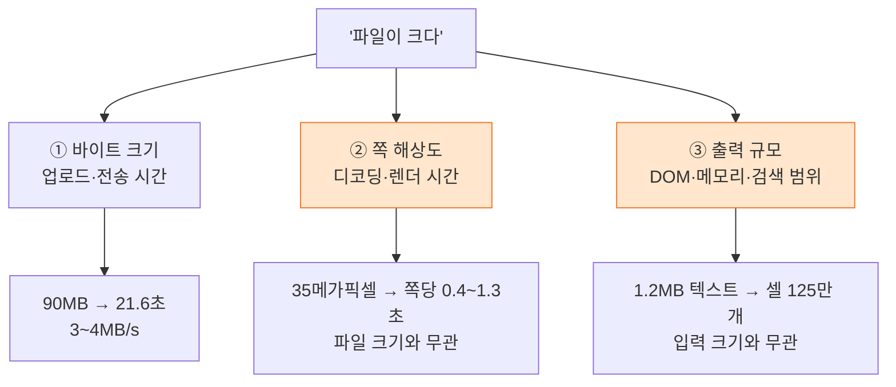

"대용량 고화질 파일을 넣으면 기능이 거의 다 깨진다"는 제보를 받았다. 재현이 안 됐다. 내가 가진 테스트 파일이 22MB였고 그건 멀쩡하게 돌았기 때문이다. 그래서 **90MB짜리 600dpi 스캔본을 직접 만들어 넣어 봤다.**

결과는 예상과 달랐다. 기능은 안 깨졌고, 대신 **다른 것**이 드러났다 — "크다"는 말이 세 가지 다른 축을 뭉뚱그린 표현이었다는 것, 그리고 경계값에서만 나오는 결함이 하나 있었다는 것.

이 글은 왜 큰 파일을 굳이 만들어서 넣어 봐야 하는지, 그리고 어떻게 만드는지에 대한 기록이다. 작업한 코드는 [Semojum/FE](https://github.com/Semojum/FE) 에 있다.

## 테스트 파일부터 만들어야 한다

"큰 파일"을 구하는 게 생각보다 번거롭다. 실사용 파일은 민감하고, 인터넷 샘플은 우리 도메인과 다르다. 나는 **이미 가진 문서를 고해상도로 다시 렌더해 이미지 PDF로 재조립**했다. 문제집 스캔본과 같은 구조(쪽마다 전면 JPEG)가 나온다.

```bash
# 실제 문서를 600dpi로 렌더 → A4 한 쪽이 4959×7017 픽셀, 약 1.8MB
pdftoppm -jpeg -jpegopt quality=90 -r 600 원본.pdf hi
```

이 JPEG들을 라이브러리 없이 PDF로 묶었다. 재압축이 없으니 **원본 JPEG 크기의 합이 곧 파일 크기**가 되어 목표 용량을 정확히 맞출 수 있다.

```python
# JPEG를 /DCTDecode 이미지 XObject로 그대로 품는 PDF를 쓴다 (핵심 부분만)
def build(images, out, dpi=200):
    for path in images:
        w, h, comps = jpeg_size(path)        # SOF 마커에서 크기를 읽는다
        raw = open(path, 'rb').read()
        img_id = add(
            b'<< /Type /XObject /Subtype /Image /Width %d /Height %d '
            b'/ColorSpace /DeviceRGB /BitsPerComponent 8 '
            b'/Filter /DCTDecode /Length %d >>\nstream\n' % (w, h, len(raw))
            + raw + b'\nendstream'
        )
        pw, ph = w * 72.0 / dpi, h * 72.0 / dpi   # 픽셀 → 포인트
        content = b'q %.2f 0 0 %.2f 0 0 cm /Im0 Do Q' % (pw, ph)
        # ... Page 객체에 XObject와 Contents를 연결
```

같은 이미지를 여러 바퀴 반복해 붙이면 원하는 크기가 나온다.

| 파일 | 크기 | 쪽수 | 용도 |
| --- | --- | --- | --- |
| 01 | 18MB | 10 | 실사용 규모의 고화질판 |
| 02 | 54MB | 30 | 중간 |
| 03 | 90MB | 50 | 상한(95MiB) 직전 |
| 04 | 108MB | 60 | **거부되는지 확인용** |

> 마지막 한 줄이 중요하다. 상한을 **넘는** 파일을 넣어 보지 않으면 거부 경로는 영원히 테스트되지 않는다. 그리고 실제로 거기서 결함이 나왔다.
{: .prompt-tip }

## "크다"에는 축이 세 개 있다

측정해 보니 흔히 한 덩어리로 말하는 "대용량"이 서로 다른 세 가지였다.



**① 바이트 크기**는 업로드에만 영향을 준다. 18MB 6.7초, 54MB 17.8초, 90MB 21.6초. 선형이고 예측 가능하다.

**② 쪽 해상도**는 완전히 다른 축이다. 재 보니 문서를 여는 비용은 18MB 155ms, 54MB 37ms, 90MB 64ms로 **파일 크기와 아무 상관이 없었다.** 반면 쪽 하나를 그리는 데는 크기와 무관하게 일정하게 400~1,300ms가 걸렸다. 원인은 4959×7017 = **35메가픽셀 JPEG 디코딩**이다. 화면에는 1.2메가픽셀만 쓰는데 35메가픽셀을 다 풀어야 한다.

**③ 출력 규모**가 제일 뜻밖이었다. 우리 서비스는 문서를 점자 판면(26줄 × 32칸)으로 바꾼다. 그래서 **입력이 작아도 출력이 폭발할 수 있다.**

| 입력 | 출력 판면 | 격자 셀 | DOM 요소 |
| --- | --- | --- | --- |
| 90MB PDF (50쪽) | 107면 | 89,024 | 98,630 |
| **1.2MB 텍스트** | **1,505면** | **1,252,160** | **1,384,826** |

1.2MB짜리 텍스트 파일이 90MB PDF보다 **14배 큰 화면**을 만들었다. 만약 내가 "큰 파일 = 큰 용량"으로만 생각하고 PDF만 키웠다면 이 축은 끝까지 못 봤을 것이다.

## 옵션으로 못 고치는 것과 고칠 수 있는 것

②를 줄이려고 pdf.js 옵션을 하나씩 켜 봤다. [pdf.js API 문서](https://mozilla.github.io/pdf.js/api/)에 있는 `enableHWA`(캔버스 하드웨어 가속)와 캔버스 배율을 조합해 같은 쪽을 반복 측정했다.

| 설정 | 워커(파싱·디코드) | 그리기 |
| --- | --- | --- |
| 현재 (배율 2) | 502ms | 464ms |
| `enableHWA: true` | 435ms | 435ms |
| 배율 1 | 382ms | 423ms |
| 둘 다 | 392ms | 416ms |

전부 오차 범위였다. 이유를 확인해 보니 pdf.js 5.x는 이미 [WebCodecs의 `ImageDecoder`](https://developer.mozilla.org/en-US/docs/Web/API/ImageDecoder), 즉 **브라우저 네이티브 디코더**를 쓰고 있었다. 느린 JS 디코더를 쓰는 게 아니라 35메가픽셀을 푸는 비용 자체였던 것이다. 플래그로 줄일 여지가 없었다.

그런데 같은 측정에서 이게 나왔다.

| | 시간 |
| --- | --- |
| 처음 보는 쪽 그리기 | **497ms** |
| **이미 본 쪽 다시 그리기** | **43ms** |

pdf.js가 디코드 결과를 문서 안에 캐시한다. 그러니 남는 비용은 "처음 보는 쪽"뿐이고, **이웃 쪽을 화면 밖에서 미리 한 번 그려 두면** 넘기는 순간엔 43ms 경로만 탄다. 옵션이 아니라 순서를 바꾸는 것이 답이었다.

```ts
// 지금 쪽을 다 그린 뒤, 앞뒤 쪽을 화면 밖 캔버스에 한 번 그려 둔다.
// 실패해도 그만이다 — 그 쪽으로 갈 때 정식 경로가 다시 그린다.
for (const n of [currentPage + 1, currentPage - 1]) {
  if (n < 1 || n > pdf.numPages) continue;
  const page = await pdf.getPage(n);
  const base = page.getViewport({ scale: 1 });
  const viewport = page.getViewport({ scale: (width * dpr) / base.width });
  const canvas = document.createElement('canvas');
  canvas.width = viewport.width;
  canvas.height = viewport.height;
  await page.render({
    canvasContext: canvas.getContext('2d', { alpha: false })!,
    viewport,
  }).promise;
}
```

③은 이미 손을 써 둔 상태였다. 판면을 면 단위로 메모하고 셀 핸들러를 컨테이너로 위임하고 [`content-visibility: auto`](https://developer.mozilla.org/en-US/docs/Web/CSS/content-visibility)로 화면 밖 면의 배치·그리기를 건너뛰게 해 뒀다. 그 덕에 DOM 138만 개짜리 문서에서 **13,802건 모두 바꾸기까지 메인 스레드 멈춤이 0ms**였다.

## 무엇으로 판정할 것인가 — 긴 작업

"버벅인다"를 눈으로 판정하면 사람마다 다르다. 나는 [Long Tasks API](https://developer.mozilla.org/en-US/docs/Web/API/PerformanceLongTaskTiming)로 **메인 스레드를 50ms 넘게 붙잡은 작업**만 세었다. 사람이 끊김을 느끼는 경계가 대략 100ms라, 이 값이 그대로 판정 기준이 된다.

```js
// 조작 하나가 UI를 얼마나 붙잡는지 잰다
const stalls = [];
new PerformanceObserver((list) => {
  for (const e of list.getEntries()) {
    stalls.push({ t: Math.round(e.startTime), ms: Math.round(e.duration) });
  }
}).observe({ entryTypes: ['longtask'] });

const since = (t0) => stalls.filter((s) => s.t >= t0).reduce((sum, s) => sum + s.ms, 0);
```

전체 시험(모드 두 개 × 파일 여섯 개)에서 긴 작업은 **7건, 최대 141ms**였다. 숫자가 있으니 "괜찮아 보인다"가 아니라 "괜찮다"고 말할 수 있다.

## 정작 결함은 경계에서 나왔다

기능은 안 깨졌다. 대신 **108MB 파일을 넣었을 때** 결함이 하나 나왔다.

업로드 요청은 정상적으로 안 나갔다(용량 검사는 동작했다). 그런데 화면이 이랬다.

- 상단 탭과 원본 칸에 **파일명이 그대로 표시**됨 — 올라간 것처럼 보인다
- 결과 칸에는 **"업로드 실패"만** 뜨고 이유가 없다
- 원본 칸은 "불러오지 못했습니다" + 스피너가 계속 돈다

원인은 검사 위치였다. 용량 검사가 **업로드 단계**에만 있어서, 그 전에 파일이 이미 화면 상태로 올라간 뒤였다. [파일을 받는 시점](https://developer.mozilla.org/en-US/docs/Web/API/File_API/Using_files_from_web_applications)으로 검사를 앞당기고, 안내 문구도 실제 임계값에 맞췄다.

```ts
// 용량은 **받는 자리에서** 거른다. 업로드 단계에서만 보면 이미 화면에 올라간 뒤다.
const sizeError = fileSizeMessage(file);
if (sizeError) {
  setFileState((prev) => {
    if (prev.previewUrl) URL.revokeObjectURL(prev.previewUrl);
    return { ...EMPTY_STATE, error: sizeError };
  });
  return;
}
```

덤으로 문구 자체도 틀려 있었다. 안내는 "100MB까지"인데 실제 임계값은 95MiB라, 97MB 파일이 왜 막히는지 알 수 없었다. 지금은 이렇게 나온다.

```
업로드할 수 있는 파일 크기는 95MB까지입니다. (넣으신 파일 108MB)
```

**이 결함은 상한을 넘는 파일을 실제로 넣어 보지 않으면 절대 안 나온다.** 정상 범위 파일로는 그 코드 경로에 진입조차 하지 않는다.

## 정리

큰 파일을 굳이 만들어 넣어 봐야 하는 이유는 네 가지다.

- **경계 경로는 경계값으로만 열린다.** 상한 초과, 0바이트, 잘린 파일 — 정상 파일 100개보다 경계 파일 1개가 더 많은 걸 찾는다.
- **"크다"의 축을 분리해야 병목이 보인다.** 바이트 크기·해상도·출력 규모는 각각 다른 곳에서 비용을 만든다. 한 축만 키우면 나머지는 그대로 숨는다.
- **입력 크기와 출력 규모는 비례하지 않는다.** 1.2MB 텍스트가 90MB PDF보다 14배 큰 화면을 만들었다. 변환하는 서비스라면 출력을 기준으로도 시험해야 한다.
- **숫자로 판정해야 한다.** 긴 작업 합계 같은 기준을 정해 두면 "느린 것 같다"가 "최대 141ms"가 된다.

그리고 이번에도 확인한 것 하나 — 나는 22MB 파일로 "문제없다"고 결론 내릴 뻔했다. 재현이 안 될 때 가장 먼저 의심할 것은 **내가 쓰는 입력이 사용자의 입력과 다르다**는 가능성이다.

## 참고 자료

- [Long Tasks API — MDN](https://developer.mozilla.org/en-US/docs/Web/API/PerformanceLongTaskTiming) · [W3C 명세](https://w3c.github.io/longtasks/)
- [`ImageDecoder` (WebCodecs) — MDN](https://developer.mozilla.org/en-US/docs/Web/API/ImageDecoder)
- [`content-visibility` — MDN](https://developer.mozilla.org/en-US/docs/Web/CSS/content-visibility)
- [pdf.js API](https://mozilla.github.io/pdf.js/api/)
- [웹 애플리케이션에서 파일 다루기 — MDN](https://developer.mozilla.org/en-US/docs/Web/API/File_API/Using_files_from_web_applications)
