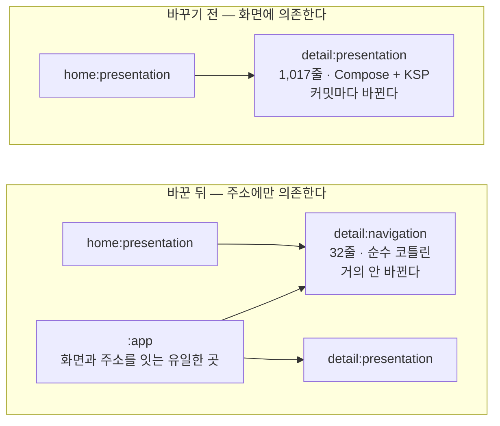
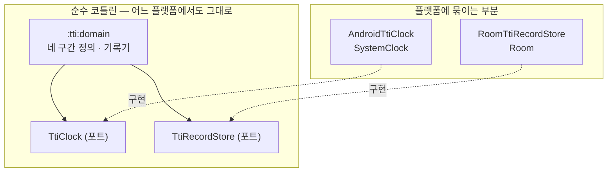

**코드를 여러 모듈로 쪼개 본 적 있다면** 이런 기대를 했을 것이다. 기능마다 모듈을 따로 두면 내가 건드린 곳만 다시 빌드되고, 팀원끼리 파일이 덜 겹치고, 나중에 떼어내기도 쉬울 거라고.

그런데 막상 나눠 놓으면 **빌드가 생각만큼 안 빨라진다.** 화면 하나를 고쳤는데 관계없어 보이는 모듈들이 줄줄이 다시 컴파일된다. 웹 모노레포의 패키지든, 백엔드의 멀티 모듈이든, 안드로이드의 feature 모듈이든 증상은 같다.

내 경우는 안드로이드 샘플 앱이었다. [Now in Android](https://github.com/android/nowinandroid) 와 [권장 아키텍처 가이드](https://developer.android.com/topic/architecture)를 참고해 멀티 모듈로 짜면서 두 군데가 걸렸고, 둘 다 **"무엇에 의존할 것인가"를 잘못 고른 문제**였다. 이 글은 그 둘을 재고 고친 기록이다. 코드는 [Sadturtleman/EveryMuseum](https://github.com/Sadturtleman/EveryMuseum) 에 있다.

결론부터: 의존 대상을 **자주 바뀌는 것에서 잘 안 바뀌는 것으로** 옮겼다. 첫 번째는 화면 → 라우트, 두 번째는 플랫폼 API → 포트다.

## 용어를 셋만 맞추고 가자

- **feature 모듈**: 화면 한 덩어리를 담는 모듈. 이 앱에는 `home` · `search` · `detail` · `store` 넷이 있고, 각각 안에서 `presentation`(화면) · `domain`(규칙) · `data`(구현)로 또 나뉜다.
- **라우트(route)**: 화면의 주소와 인자. `"/detail"` + `{id: "123"}` 같은 것. 웹의 URL 경로와 같다고 보면 된다.
- **ABI**: 모듈이 밖으로 드러내는 공개 API의 모양. 함수 시그니처나 상수처럼 **다른 모듈이 컴파일할 때 쳐다보는 것**이다. 함수 몸통만 고치면 ABI는 그대로다.

## 문제 1 — 다른 화면으로 가려면 그 화면 모듈을 알아야 한다

feature로 코드를 가르면 곧바로 부딪히는 벽이 있다. **홈에서 상세 화면으로 가는 코드**를 어디에 두느냐다.

가장 자연스러운 답은 홈이 상세를 참조하는 것이다.

```kotlin
// home/presentation/build.gradle.kts — 흔히 이렇게 된다
implementation(project(":detail:presentation"))   // DetailScreen 을 부르려고
```

이러면 동작은 한다. 대신 **홈이 상세 화면의 구현 전체에 묶인다.** 상세 화면의 컴포저블 시그니처가 바뀌면, 상세와 아무 상관없는 홈까지 다시 컴파일된다.

머릿속으로만 짐작하지 말고 재 봤다. 홈이 상세 화면 모듈을 직접 의존하도록 잠깐 바꾸고, 상세 화면 파일의 공개 함수를 하나 추가했다.

```bash
# :home:presentation 만 빌드 요청했는데
./gradlew :home:presentation:compileDebugKotlin

> Task :detail:presentation:compileDebugKotlin    # 상세 화면이 다시 컴파일되고
> Task :home:presentation:compileDebugKotlin      # 홈까지 따라온다
BUILD SUCCESSFUL in 4s
```

작은 앱이라 4초지만, 여기서 다시 컴파일된 `:detail:presentation` 은 **Compose 컴파일러와 KSP(어노테이션 처리)가 붙은 모듈**이다. 이런 모듈이 수십 개인 실제 프로젝트에서는 이 연쇄가 그대로 대기 시간이 된다.

그리고 이 연쇄는 **가장 자주 바뀌는 것을 타고 퍼진다.** 화면 코드야말로 매일 고치는 곳이니까.

## 처방 — 라우트만 따로 낸다

화면끼리 실제로 주고받는 건 뭘까. `DetailScreen` 이라는 컴포저블 자체가 아니라 **`/detail` 로 `id`를 들고 가라는 사실**뿐이다. 그 사실만 담은 모듈을 따로 냈다.

```kotlin
// detail/navigation/src/.../DetailPage.kt — 이 모듈에 있는 유일한 파일, 32줄
object DetailPage {
    const val PATH = "/detail"

    data class Args(val id: String = "") : Page {
        // 이동할 때: typed 인자 → 문자열 맵
        override fun toRoute(): NavRoute = NavRoute(PATH, mapOf("id" to id))

        companion object {
            // 도착해서: 문자열 맵 → typed 인자 (딥링크의 쿼리 파라미터도 같은 경로로 들어온다)
            fun from(args: Map<String, String>): Args = Args(id = args["id"].orEmpty())
        }
    }
}
```

```kotlin
// detail/navigation/build.gradle.kts — 안드로이드도, Compose도 없다
plugins { alias(libs.plugins.kotlin.jvm) }
dependencies { api(project(":common:navigation")) }
```

이제 홈은 상세의 **화면**이 아니라 **주소**만 안다.

```kotlin
// home/presentation/build.gradle.kts
implementation(project(":detail:navigation"))   // 32줄짜리 순수 코틀린 모듈
implementation(project(":search:navigation"))
implementation(project(":store:navigation"))
```

화면과 주소를 실제로 이어 붙이는 곳은 앱 모듈 한 곳뿐이다. 모든 feature의 화면을 아는 모듈은 여기 하나로 몰린다.

```kotlin
// app/src/.../AppRouteRegistry.kt — 새 화면이 생기면 여기 한 줄을 더한다
val appRoutes: List<AppRoute> = listOf(
    AppRoute(path = HomePage.PATH,   render = { HomeScreen(hiltViewModel()) }),
    AppRoute(path = DetailPage.PATH, render = { DetailScreen(hiltViewModel()) }),
    // ...
)
```



## 재 봤다

같은 실험을 처방 적용 후에 다시 돌렸다.

**상세 화면 코드를 고쳤을 때** — 홈은 손도 안 댄다. `:detail:presentation` 은 아예 빌드 그래프에 들어오지도 않는다.

```bash
./gradlew :home:presentation:compileDebugKotlin

> Task :detail:navigation:compileKotlin UP-TO-DATE
> Task :home:presentation:compileDebugKotlin UP-TO-DATE   # 다시 안 함
BUILD SUCCESSFUL in 4s
```

**라우트 모듈의 공개 API를 바꿨을 때** — 이때는 홈이 따라온다.

```bash
# DetailPage 에 const val 하나를 추가 (= ABI 변경)
> Task :detail:navigation:compileKotlin
> Task :home:presentation:compileDebugKotlin              # 다시 함
```

> **"라우트 모듈에 의존하면 재빌드가 아예 없다"는 건 과장이다.** 재빌드를 유발하는 방아쇠가 *매일 고치는 파일*에서 *거의 안 고치는 파일*로 옮겨 갔을 뿐이다. 게다가 라우트 모듈이라도 주석이나 함수 몸통만 고치면 ABI가 그대로라 [컴파일 회피](https://kotlinlang.org/docs/gradle-compilation-and-caches.html)가 걸려 downstream은 `UP-TO-DATE` 로 넘어간다.
{: .prompt-warning }

그래서 중요한 건 **그 방아쇠가 실제로 얼마나 자주 당겨지느냐**다. 커밋 이력으로 확인했다.

| | `:detail:navigation` | `:detail:presentation` |
|---|---|---|
| 코드량 | 32줄 / 1파일 | 1,017줄 / 6파일 |
| 빌드 성격 | 순수 코틀린(JVM) | Android + Compose + Hilt + KSP |
| 지금까지 바뀐 커밋 수 | **1회** | **5회** (feature를 건드린 모든 커밋) |

화면은 커밋마다 바뀌었고, 라우트는 처음 만들 때 한 번 바뀌고 끝이었다. `"/detail"` 이라는 주소와 `id` 인자는 운영 중에 바뀔 일이 거의 없다. **바뀌지 않는 쪽에 의존을 걸었으니 연쇄가 끊긴다.**

> 이 결론은 내 것만이 아니다. 구글도 Navigation 3 문서에서 같은 분리를 권한다 — feature마다 `api`(라우트 키)와 `impl`(화면)을 나누고, "다른 feature의 `api` 에만 의존하게 하라"고. [Modularize navigation code](https://developer.android.com/guide/navigation/navigation-3/modularize) 에 나온다. 나는 이걸 나중에 봤는데, 같은 문제를 재 보면 같은 답이 나온다는 뜻으로 읽었다.
{: .prompt-tip }

## 문제 2 — 공통 모듈이 플랫폼에 묶여 있다

두 번째는 결이 다르지만 뿌리가 같다.

앱에 **TTI(Time To Interactive) 계측**을 붙였다. 화면 하나가 "이제 쓸 수 있는 상태"가 되기까지 걸린 시간을 재는 것이다. 화면 진입 → 데이터 요청 → 다시 그리기 → 큰 이미지 로딩, 이렇게 네 구간으로 나눠 잰다. 이런 계측은 앱이 커지면 거의 반드시 들어간다.

처음 구현은 이랬다.

```kotlin
// 계측 로직 한가운데에 안드로이드가 박혀 있다
val startedAt = SystemClock.elapsedRealtime()   // android.os
dao.insertSpan(...)                             // androidx.room
Log.w(TAG, "기록 실패", e)                        // android.util
```

동작에는 문제가 없다. 문제는 **이 모듈이 안드로이드 밖으로 못 나간다**는 것이다.

요즘 [Kotlin Multiplatform](https://kotlinlang.org/docs/multiplatform-expect-actual.html)이 자리를 잡고 있고, 국내에서도 React Native나 Flutter로 빠르게 만드는 선택을 흔히 한다. 그런데 **계측처럼 어느 플랫폼에서든 똑같이 필요한 모듈**이 플랫폼 API에 묶여 있으면, 플랫폼마다 같은 로직을 처음부터 다시 쓰게 된다. 구간을 언제 열고 닫을지, 언제 완성으로 볼지 같은 규칙은 안드로이드와 아무 상관이 없는데도.

## 처방 — 플랫폼이 필요한 지점만 포트로 뽑는다

모듈을 셋으로 갈랐다.

| 모듈 | 빌드 | 담당 |
|---|---|---|
| `:tti:domain` | **순수 코틀린(JVM)** | 무엇을 언제 재는가 |
| `:tti:data` | Android + Room + Hilt | 시각·저장의 안드로이드 구현 |
| `:tti:presentation` | Android + Compose | 화면에서 구간을 열고 닫는 helper |

핵심은 domain이 플랫폼에 요구하는 것을 **인터페이스 두 개로 좁힌 것**이다.

```kotlin
// :tti:domain — 안드로이드 import 가 하나도 없다
interface TtiClock {
    fun elapsedMillis(): Long    // 구간 길이를 재는 단조 시각(뒤로 가지 않는 시계)
    fun wallTimeMillis(): Long   // 오래된 기록을 버릴 때만 쓰는 벽시계
}

interface TtiRecordStore {
    suspend fun openSpan(tti: Tti, pageName: String, createdAt: Long, timeline: TtiTimeline, startedAt: Long)
    suspend fun closeSpan(tti: Tti, timeline: TtiTimeline, endedAt: Long)
    suspend fun findAll(): List<TtiRecord>
    suspend fun delete(ttis: List<Tti>)
}
```

안드로이드 구현은 `:tti:data` 로 내려가고, 조립은 Hilt가 한다.

```kotlin
// :tti:data — 여기서만 안드로이드를 안다
internal class AndroidTtiClock @Inject constructor() : TtiClock {
    // 벽시계가 아니라 elapsedRealtime 을 쓰는 이유: 사용자가 시각을 바꾸면 측정값이 음수가 된다
    override fun elapsedMillis() = SystemClock.elapsedRealtime()
    override fun wallTimeMillis() = System.currentTimeMillis()
}

@Module @InstallIn(SingletonComponent::class)
internal abstract class TtiDataModule {
    @Binds abstract fun bindClock(impl: AndroidTtiClock): TtiClock
    @Binds abstract fun bindStore(impl: RoomTtiRecordStore): TtiRecordStore
}
```



부수 효과가 하나 더 있었다. 시각이 인터페이스가 되니 **테스트에서 시간을 손으로 감을 수 있다.** 전에는 안드로이드 프레임워크를 흉내 내야 해서 구간 길이를 검증할 방법이 없었다.

```kotlin
// 가짜 시계로 구간 길이를 확정적으로 검증한다
val clock = FakeTtiClock()
TtiTimeline.entries.forEachIndexed { i, timeline ->
    recorder.startRecord(timeline, tti, PAGE)
    clock.elapse((i + 1) * 10L)      // 10 · 20 · 30 · 40ms 를 흘려보낸다
    recorder.endRecord(timeline, tti, PAGE)
}
assertEquals(100L, shooter.received.single().totalTimeMillis)
```

에뮬레이터에서 실제로 찍힌 값은 이랬다.

```
TTI: /home   total=7021ms (VIEW_CREATE=138ms | BACKEND=1258ms | VIEW_BINDING=56ms | BIG_PART_LOADING=5569ms)
TTI: /detail total=1292ms (VIEW_CREATE=  7ms | BACKEND= 220ms | VIEW_BINDING= 9ms | BIG_PART_LOADING=1056ms)
```

홈이 7초인데 그중 5.6초가 이미지다. API는 1.2초밖에 안 걸렸다. 구간을 나눠 재지 않았으면 "홈이 느리다"에서 멈췄을 것이다.

> **"순수 코틀린 = KMP 준비 완료"는 아니다.** 이 모듈은 `kotlin("jvm")` 이지 `kotlin("multiplatform")` 이 아니고, 안에 `java.util.UUID` 와 `javaClass.simpleName` 이 아직 남아 있다. 진짜 KMP로 옮기려면 이 둘을 공통 API로 바꾸고 소스셋을 나누는 작업이 더 필요하다. 지금 확실한 건 **안드로이드 의존은 떨어졌다**는 것뿐이고, 그것만으로도 남은 거리가 훨씬 짧아졌다.
{: .prompt-warning }

## 이 방법이 통하는 조건

두 처방 모두 "의존을 안 바뀌는 쪽으로 옮긴다"는 한 가지 동작이다. 안드로이드가 아니어도, 다음 조건이면 같은 처방이 듣는다.

1. **A가 B를 쓰는데, 실제로 필요한 건 B의 일부뿐일 때.** 홈이 상세에게 필요한 건 주소 한 줄이지 화면 전체가 아니었다. 필요한 만큼만 모듈로 떼면 된다.
2. **떼어낸 부분이 실제로 덜 바뀔 때.** 이건 믿음이 아니라 확인할 것이다. `git log -- <경로>` 로 커밋 수를 세 보면 몇 초 만에 나온다. 안 바뀔 거라 생각했는데 매주 바뀌고 있다면 그 분리는 값을 못 한다.
3. **의존을 뒤집을 지점이 뚜렷할 때.** TTI는 "시각을 읽는다"와 "기록을 저장한다" 둘뿐이었다. 뒤집어야 할 지점이 열 개쯤 되면 인터페이스만 늘고 얻는 게 없다.
4. **조립할 곳이 이미 있을 때.** 뒤집은 의존은 누군가 이어 붙여야 한다. 이 앱은 `:app` 이 그 역할을 한다. 조립 지점이 없으면 만들어야 하고, 그게 둘 이상이면 오히려 꼬인다.

반대로, **모듈이 서넛뿐이고 전체 빌드가 몇 초라면** 이 분리는 아직 이르다. 모듈 수와 build.gradle 파일만 늘어난다. feature 하나당 파일 하나짜리 모듈이 하나씩 더 생긴다는 비용은 실제로 든다.

## 정리

- 모듈을 나눠도 빌드가 안 빨라진다면, **의존 대상이 자주 바뀌는 것인지** 먼저 보라.
- 화면끼리 주고받는 건 화면이 아니라 **주소**다. 주소만 따로 모듈로 내면 화면 수정이 옆 feature로 번지지 않는다.
- 플랫폼이 필요한 지점은 대개 **한두 개로 좁힐 수 있다.** 그걸 인터페이스로 뽑으면 나머지 로직이 플랫폼에서 풀려나고, 덤으로 테스트가 쉬워진다.
- 무엇보다 **재고 나서 말하라.** `./gradlew <모듈>:compileKotlin` 출력의 `UP-TO-DATE` 유무와 `git log -- <경로>` 커밋 수, 둘이면 충분하다.

## 참고 자료

- [Guide to app architecture](https://developer.android.com/topic/architecture) — 안드로이드 권장 아키텍처
- [Guide to Android app modularization](https://developer.android.com/topic/modularization) — 모듈화 개요
- [Common modularization patterns](https://developer.android.com/topic/modularization/patterns) — 낮은 결합도와 의존성 역전, 그리고 그것이 빌드 시간에 주는 영향
- [Modularize navigation code (Navigation 3)](https://developer.android.com/guide/navigation/navigation-3/modularize) — 라우트 키(`api`)와 화면(`impl`)을 나누라는 공식 권고
- [Now in Android](https://github.com/android/nowinandroid) / [Modularization learning journey](https://github.com/android/nowinandroid/blob/main/docs/ModularizationLearningJourney.md) — 구글의 모듈화 레퍼런스
- [Compilation and caches in the Kotlin Gradle plugin](https://kotlinlang.org/docs/gradle-compilation-and-caches.html) — 증분 컴파일과 컴파일 회피
- [Expected and actual declarations](https://kotlinlang.org/docs/multiplatform-expect-actual.html) — KMP에서 플랫폼별 구현을 붙이는 방법
- 이 글의 코드: [Sadturtleman/EveryMuseum](https://github.com/Sadturtleman/EveryMuseum)
