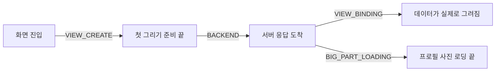

화면에 사진 한 장이 늦게 뜨면 누구나 먼저 "사진이 커서"라고 생각한다. 나도 그랬다. 앱의 마이페이지에서 프로필 사진이 화면이 쓸 수 있게 되기까지 걸린 시간의 78%를 차지했고, 받아 오는 파일은 촬영 원본 1500×2000, 454KB였다. 48dp 동그라미 하나를 그리려고 필요한 픽셀의 100배가 넘는 양을 받고 있었으니 썸네일이 답이라고 확신했다.

썸네일을 준다고 가정하고 실제로 재 보니 p95가 70ms 줄었다. 6%다. 사진 크기를 거의 그대로 두고 요청 경로만 바꿨을 때는 35%가 줄었다. 이 글은 그 사이에서 내가 틀린 지점과, 이미지가 느릴 때 무엇부터 세야 하는지를 정리한다.

작업한 앱은 [RuleUp-ASM/Android](https://github.com/RuleUp-ASM/Android) 이다. 안드로이드 이야기지만 웹이든 iOS든 "API가 준 이미지 주소를 받아서 그린다"는 구조라면 똑같이 읽어도 된다.

## 용어를 셋만 맞추고 가자

TTI(Time To Interactive)는 화면에 들어온 순간부터 사용자가 그 화면을 제대로 쓸 수 있게 되기까지의 시간이다. 여기서는 네 구간의 합으로 쟀다. 콜드 스타트는 앱 프로세스를 완전히 죽였다가 다시 띄우는 것으로, 메모리 캐시도 맺어 둔 네트워크 연결도 없이 시작한다. p95는 30번 재서 느린 순으로 줄 세웠을 때 뒤에서 두 번째 값이다. 평균보다 가끔 겪는 느린 경험에 가깝다.

## 먼저 구간을 자를 수 있어야 했다

처음 TTI는 "데이터가 오고 두 프레임 뒤"를 끝으로 잡고 있었고, 이미지는 아예 재지 않고 있었다. 그래서 구간 경계부터 다시 정했다.



서버 응답 구간(BACKEND)은 로딩 플래그가 false로 바뀌는 재구성 시점에 닫는다. "데이터가 그려짐"(VIEW_BINDING)은 데이터 영역의 첫 draw에서 닫는데, 이건 Compose의 [Modifier.Node](https://developer.android.com/develop/ui/compose/custom-modifiers) 로 만들었다. `drawContent()` 를 부른 직후가 곧 UI 스레드가 그 영역을 처음 그린 순간이다.

```kotlin
// 데이터 영역에 붙이면 첫 draw 에서 "그려짐" 구간을 닫는다
fun Modifier.ttiContentDrawn(): Modifier = this then TtiContentDrawnElement

private class TtiContentDrawnNode :
    Modifier.Node(),
    DrawModifierNode,
    CompositionLocalConsumerModifierNode {
    override fun ContentDrawScope.draw() {
        drawContent()
        currentValueOf(LocalTtiPage)?.contentDrawn()
    }
}
```

사진 구간은 이미지 쪽에서 스스로 등록하게 했다. 사진이 화면에 올라오면 구간을 열고, 로더가 성공이든 실패든 끝났다고 알리면 닫는다. 사진이 없는 화면은 등록할 게 없으니 0ms로 지나간다.

```kotlin
val onImageSettled = rememberTtiLargeContent()
AsyncImage(
    model = home.profileImageUrl,
    contentDescription = "프로필 이미지",
    onSuccess = { onImageSettled() },
    onError = { onImageSettled() },
)
```

이렇게 하고 콜드 스타트를 30번 돌렸다. 매번 앱을 종료하고 이미지 디스크 캐시까지 지워서, 사진을 처음 보는 사용자와 같은 조건을 만들었다. 전체 p95는 1,496ms였고 그중 사진 구간이 78%였다.

디스크 캐시를 남겨 두고 다시 재면 사진 구간은 22~30ms로 떨어졌다. 파일을 읽고 디코드하는 건 느리지 않다는 뜻이다. 나머지 수백 ms는 전부 네트워크에서 나오고 있었다.

## 내가 틀린 지점

네트워크라는 걸 알고 나서 파일을 열어 보니 1500×2000, 454KB였다. 여기서 바로 "썸네일을 주면 제일 크게 줄어든다"고 결론 냈다. 개선안에 순위를 매기면서 썸네일을 1순위에 올렸다.

같은 사진을 256px로 줄여 같은 경로로 올리고, 앱이 그 주소를 쓰게 한 임시 빌드로 다시 쟀다. 파일은 20KB가 됐는데 p95는 1,135ms에서 1,065ms로 70ms 줄었다. 파일 크기를 20분의 1로 줄였는데도 사진 구간 최솟값은 354ms 아래로 내려가지 않았다. 크기와 상관없이 매번 붙는 비용이 있었다.

하나 더 걸리는 게 있었다. 같은 원본을 40분 간격으로 두 번 쟀더니 p95가 1,496ms와 1,135ms로 달랐다. 네트워크 상태가 바뀌는 폭이 내가 확인하려던 효과보다 컸다. 시나리오 A를 30번 재고 B를 30번 재는 방식으로는 둘의 차이인지 시간대 차이인지 가를 수 없다.

## 번갈아 재야 시간대가 상쇄된다

그래서 방식을 바꿨다. 한 빌드에 시나리오를 바꾸는 스위치를 두고, 한 바퀴에 모든 시나리오를 한 번씩 돌리는 걸 30바퀴 반복했다. 네트워크가 느려지는 순간이 오면 모든 시나리오가 같이 느려진다.

```bash
# 한 바퀴에 시나리오 A~E 를 한 번씩, 30바퀴. 매 회 콜드 스타트 + 이미지 캐시 삭제
for round in $(seq 1 30); do
  for s in A B C D E; do
    adb shell am force-stop "$PKG"
    adb shell run-as "$PKG" rm -rf cache/coil3_disk_cache
    set_scenario "$s"          # 앱 전용 폴더의 제어 파일로 이미지 주소·연결 방식을 바꾼다
    adb logcat -c
    adb shell am start -n "$PKG/.MainActivity" --es deeplink "app://me"
    wait_for_tti_log "$s" "$round"   # 로그캣에서 이번 회차 TTI 한 줄을 받아 적는다
  done
done
```

비교한 시나리오는 다섯 가지다.

| 시나리오 | 사진을 받는 방식 | 파일 |
|---|---|---|
| 기준 | API 주소 → 302 리다이렉트 → 파일 저장소 | 454KB |
| ② 리다이렉트 제거 | 서명된 저장소 주소로 바로 | 454KB |
| ③ CDN | 서울 엣지 캐시에서 바로 | 446KB |
| ④ 연결 공유 | 기준과 같은 주소, 이미지 로더가 앱의 HTTP 연결을 같이 씀 | 454KB |
| ①+③ | CDN 에서 썸네일 | 17KB |

③과 ①+③은 사용자 사진을 공개 CDN에 올릴 수 없어서 크기가 같은 공개 풍경 사진으로 대신했다.

## 결과: 경로만 바꿨는데 3분의 1이 됐다

150번을 돌려 149번이 유효했다(④에서 한 번은 20초 안에 기록이 안 남아 뺐다).

| 시나리오 | 사진 구간 p50 | 전체 p95 | 기준 대비 |
|---|---|---|---|
| 기준 | 534ms | 955ms | |
| ② 리다이렉트 제거 | 201ms | 617ms | −338ms (35%) |
| ③ CDN | 147ms | 634ms | −321ms (34%) |
| ④ 연결 공유 | 369ms | 801ms | −154ms (16%) |
| ①+③ CDN 썸네일 | 88ms | 441ms | −514ms (54%) |

②는 파일 크기를 그대로 두고 경로만 줄였는데 사진 구간이 534ms에서 201ms가 됐다. 기준에서 시간을 먹던 게 무엇인지는 요청 흐름을 그려 보면 보인다.

<iframe src="/assets/diagrams/2026-09-30-image-latency-is-round-trips.html"
        title="프로필 사진을 받는 세 가지 경로 시퀀스 다이어그램"
        loading="lazy" width="100%" height="620"
        style="border:1px solid var(--main-border-color); border-radius:6px;"></iframe>

> 잘려 보이면 [전체 화면으로 열기](/assets/diagrams/2026-09-30-image-latency-is-round-trips.html).
{: .prompt-tip }

API가 준 사진 주소로 요청하면 사진이 아니라 302 응답이 온다. 서버가 요청마다 파일 저장소용 [서명된 임시 주소](https://docs.aws.amazon.com/AmazonS3/latest/userguide/ShareObjectPreSignedURL.html)를 새로 만들어 그리로 보내는 것이다. 응답에는 `cache-control: no-store` 가 붙어 있어서 API 앞단 CDN도 캐시하지 않는다. 응답 헤더의 `cf-cache-status: BYPASS` 는 [원본 응답 헤더 때문에 캐시하지 않았다](https://developers.cloudflare.com/cache/concepts/cache-responses/)는 뜻이다. 앱은 그 302를 받은 뒤에야 저장소로 새 연결을 맺는다.

구간을 나눠 보는 데는 curl의 [`-w` 출력](https://everything.curl.dev/usingcurl/verbose/writeout.html)이면 충분했다.

```bash
# 리다이렉트 한 번에 걸리는 시간과 전체 시간을 따로 본다
curl -sL -o /dev/null \
  -w "redirect=%{time_redirect} total=%{time_total} size=%{size_download}\n" \
  "https://api.example.com/files/<id>.jpg"
# redirect=0.279215 total=0.541683 size=453665
```

맥에서 재도 리다이렉트 한 번이 250~280ms였고, 454KB짜리든 20KB짜리든 거의 같았다.

그리고 요청 흐름을 보다가 하나를 더 찾았다. API 앞단 CDN이 어느 엣지에서 요청을 받았는지는 [`/cdn-cgi/trace`](https://developers.cloudflare.com/fundamentals/reference/cdn-cgi-endpoint/) 로 볼 수 있다. 한국에서 보낸 요청이 `colo=HKG`, 홍콩 엣지에서 처리되고 있었다. 연결 한 번 맺는 데 서울에 있는 저장소나 이미지 CDN은 약 15ms, API 앞단은 46~70ms가 걸렸다. 이건 사진뿐 아니라 모든 API 호출에 붙는 비용이다.

## 썸네일은 순서가 뒤였을 뿐이다

①+③이 가장 빨랐다. 앞선 실험에서 썸네일만 적용했을 때는 70ms밖에 안 줄었지만, CDN으로 고정 비용을 걷어 낸 뒤에 썸네일을 얹으니 사진 구간이 147ms에서 88ms로 한 번 더 줄었다. 매 요청마다 붙는 수백 ms가 남아 있는 동안에는 몇십 ms짜리 전송 시간을 줄여 봐야 티가 안 났던 것이다. 그리고 이번 측정은 빠른 Wi-Fi에서 했다. 느린 셀룰러에서는 썸네일의 몫이 더 클 수 있고, 데이터 사용량도 줄어든다.

## 앱만 고칠 수 있다면

②, ③은 서버와 인프라를 바꿔야 한다. 앱에서 혼자 할 수 있는 건 ④였다. 이미지 로더 [Coil](https://coil-kt.github.io/coil/network/)은 따로 설정하지 않으면 자기 HTTP 클라이언트를 새로 만든다. 그러면 앱이 방금 API 호출로 맺어 둔 연결을 이미지 요청이 다시 쓰지 못하고, 멀리 있는 홍콩 엣지와 연결을 처음부터 다시 맺는다.

```kotlin
// 앱의 OkHttpClient 에서 연결 풀만 공유하는 이미지 전용 클라이언트
val imageClient = appOkHttpClient.newBuilder()
    .apply { interceptors().clear() }     // 인증·로깅 인터셉터는 이미지 요청에 필요 없다
    .authenticator(Authenticator.NONE)
    .build()

SingletonImageLoader.setSafe { context ->
    ImageLoader.Builder(context)
        .components { add(OkHttpNetworkFetcherFactory(callFactory = { imageClient })) }
        .build()
}
```

이것만으로 p95가 154ms 줄었다. 처음엔 몇십 ms쯤으로 봤는데, 다시 맺지 않아도 되는 그 연결이 홍콩까지 가는 연결이라 효과가 예상보다 컸다.

> Coil 3은 기본적으로 `Cache-Control` 헤더를 무시하고 [응답을 항상 디스크 캐시에 저장한다](https://coil-kt.github.io/coil/network/). 302가 `no-store` 인데도 두 번째 진입부터 사진이 25ms 안팎으로 뜬 이유다. 느린 경우는 사진을 처음 볼 때, 캐시가 비었을 때, 사진을 바꾼 직후로 좁혀진다.
{: .prompt-info }

## 이 방법이 통하는 조건

이미지 개선을 크기부터 시작하지 말고 왕복부터 세야 하는 경우는 이렇다.

- 디스크 캐시가 있을 때와 없을 때의 차이가 크다. 캐시가 있을 때 빠르면 디코드가 아니라 네트워크 문제다.
- 이미지 주소가 리다이렉트를 거치거나, 요청마다 서명·권한 확인 같은 서버 작업이 붙는다.
- 이미지 호스트가 API와 다르거나, 앞단 CDN의 엣지가 사용자와 멀다.
- 측정마다 결과가 흔들린다. 이때는 시나리오를 따로 몰아서 재지 말고 번갈아 재야 한다.

반대로 이미지 여러 장이 한 화면에 쏟아지는 목록 화면이나 느린 망이 주 사용 환경이라면 크기도 같이 봐야 한다. 그래도 순서는 같다. 매번 붙는 고정 비용을 먼저 걷어 내고, 그다음에 크기를 줄인다.

지난번 글 [느릴 때는 코드보다 네트워크를 먼저 갈라 봐라](/posts/measure-network-before-blaming-code/) 와 이어지는 이야기다. 그때는 네트워크를 갈라 보는 데서 끝났는데, 이번에는 네트워크 시간 안에서 바이트를 받는 시간과 왕복에 드는 시간을 한 번 더 나눠야 했다.

## 참고 자료

- [Compose: Create custom modifiers (Modifier.Node, DrawModifierNode)](https://developer.android.com/develop/ui/compose/custom-modifiers)
- [Coil: Network images (custom OkHttpClient, Cache-Control)](https://coil-kt.github.io/coil/network/)
- [Coil: Image Loaders](https://coil-kt.github.io/coil/image_loaders/)
- [Amazon S3: Sharing objects with presigned URLs](https://docs.aws.amazon.com/AmazonS3/latest/userguide/ShareObjectPreSignedURL.html)
- [Cloudflare: Cache responses (cf-cache-status)](https://developers.cloudflare.com/cache/concepts/cache-responses/)
- [Cloudflare: /cdn-cgi/ endpoint](https://developers.cloudflare.com/fundamentals/reference/cdn-cgi-endpoint/)
- [Everything curl: --write-out](https://everything.curl.dev/usingcurl/verbose/writeout.html)
- [Android: App startup time](https://developer.android.com/topic/performance/vitals/launch-time)
